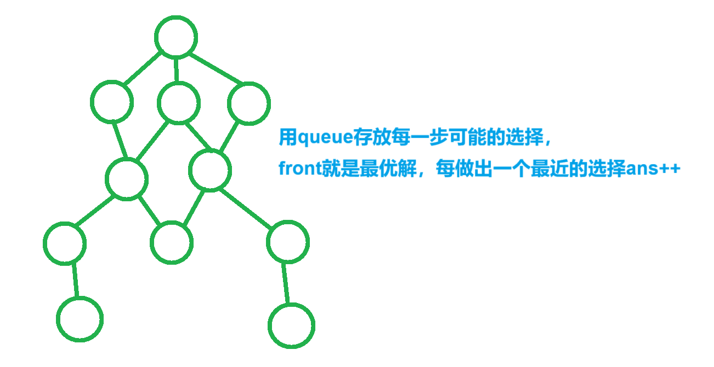

[F-水题！！！！！！_牛客周赛 Round 83](https://ac.nowcoder.com/acm/contest/102896/F)


碰到障碍物时会分叉，此外，遇到水流可以直接落下

摧毁障碍物需要h，再过1秒才可流下


分析：


用node存储每个点的信息，f表示当前点水流流动方向（1向下，0向上）

st数组记录当前状态是否第一次被访问

按照t从大到小排列，距离相等的前提下，优先考虑早完成的情况


```cpp
struct node
{
    int x,y,t;
    bool f;
    bool operator<(const node& w)const
    {    
        return t>w.t;
    }
};
int main()
{
    cin>>n>>m>>h;

    for(int i=1;i<=n;i++)
    {
        for(int j=1;j<=m;j++)
        {
            cin>>g[i][j];

            if(g[i][j]=='*')be={i,j,0,1};
            else if(g[i][j]=='%')ed={i,j,0,0}; // 一定要写，不然会报错（排序比较）
        }
    }
    priority_queue<node>q;
    q.push(be);

    while(!q.empty())
    {
        v=q.top();
        q.pop();

        xx=v.x,yy=v.y,tt=v.t,ff=v.f;

        if(xx==ed.x&&yy==ed.y)
        {
            cout<<tt<<endl; return;
        }

        if(st[xx][yy][ff])continue;

        st[xx][yy][ff]=true;

        if(xx+1<=n&&g[xx+1][yy]=='#')
        {
            if(ff&&!st[xx+1][yy][ff])q.push({xx+1,yy,tt+h+1,ff});

            if(yy-1>=1&&g[xx][yy-1]!='#')q.push({xx,yy-1,tt+1,0});
            if(yy+1<=m&&g[xx][yy+1]!='#')q.push({xx,yy+1,tt+1,0});
        }
        else if(xx+1<=n)
        {
            q.push({xx+1,yy,tt+1,1});
        }
    }
    cout<<-1<<endl;
}
```


[L3-004 肿瘤诊断 - 团体程序设计天梯赛-练习集 (pintia.cn)](https://pintia.cn/problem-sets/994805046380707840/exam/problems/type/7?page=1&problemSetProblemId=994805052626026496)


统计所有肿瘤体积和


分析：


切片张数是高

三维连通图，bfs统计每个肿瘤体积


```cpp
struct node
{
    int x,y,z;
};

const int d[6][3]={
    {0,0,1},{0,0,-1},
    {0,1,0},{0,-1,0},
    {1,0,0},{-1,0,0}
};

queue<node>q;

void bfs(int x,int y,int z)
{
    st[x][y][z]=true;

    q.push({x,y,z});

    node t;

    while(!q.empty())
    {
        t=q.front(); q.pop();

        for(int i=0;i<6;i++)
        {
            xx=t.x+d[i][0];
            yy=t.y+d[i][1];
            zz=t.z+d[i][2];

            if(xx>=1&&xx<=n&&yy>=1&&yy<=m&&zz>=1&&zz<=h&&!st[xx][yy][zz]&&g[xx][yy][zz])
            {
                q.push({xx,yy,zz});

                v++;

                st[xx][yy][zz]=true;
            }
        }
    }
}

void solve()
{
    cin>>n>>m>>h>>t;

    for(int i=1;i<=h;i++)
    {
        for(int j=1;j<=n;j++)
        {
            for(int k=1;k<=m;k++)
            {
                cin>>g[j][k][i];
            }
        }
    }

    for(int i=1;i<=n;i++)
    {
        for(int j=1;j<=m;j++)
        {
            for(int k=1;k<=h;k++)
            {
                if(!st[i][j][k]&&g[i][j][k])
                {
                    v=1; bfs(i,j,k); if(v>=t)ans+=v;
                }
            }
        }
    }

    cout<<ans<<endl;
}
```


[RC-u4 相对论大师 - 2023 睿抗机器人开发者大赛CAIP-编程技能赛-本科组（省赛） (pintia.cn)](https://pintia.cn/problem-sets/1680597991209951232/exam/problems/type/7?problemSetProblemId=1680598077168017411&page=0)


求能推出的最短悖论


分析：


用mp记录string对应的idx，mmp记录当前idx对应的string


e数组记录当前序号对应的能达到的所有边


用bfs查找最短路，st数组记录是否被查过

pre数组记录当前序号之前的序号，用于回溯查找路径

最后通过序号对结果进行输出，

输出时需要将每条论述句完整输出


悖论总是连着，存储悖论时序号相邻，方便查找序号

问题规模为$10^3$，复杂度为$O(10^6)$


```cpp
vector<int> bfs(int be,int ed)
{
    memset(st,0,sizeof(st));

    pre[ed]=-1;  // pre[ed]初始为-1，用于判断是否有be到ed的路径

    queue<int>q;
    q.push(be); st[be]=true;

    int t;

    while(!q.empty())
    {
        t=q.front();

        q.pop();

        if(t==ed)break;

        for(auto u:e[t])
        {
            if(st[u])continue; st[u]=true;

            pre[u]=t;
            q.push(u);
        }
    }

    vector<int>ans;

    if(pre[ed]==-1)return ans;  // 无法到达

    int cur=ed;

    while(cur!=be)  // 逆序回溯
    {
        ans.push_back(cur); cur=pre[cur];
    }

    ans.push_back(cur);

    reverse(alls(ans));

    return ans;
}

void solve()
{
    cin>>n;

    for(int i=1;i<=n;i++)
    {
        cin>>s>>a>>ss>>b;

        if(!mp.count(s+" 0"))  // 给结论编号
        {
            mmp[idx]=s+" 0";
            mp[s+" 0"]=idx++;

            mmp[idx]=s+" 1";
            mp[s+" 1"]=idx++;
        }

        if(!mp.count(ss+"0"))
        {
            mmp[idx]=ss+" 0";
            mp[ss+" 0"]=idx++;

            mmp[idx]=ss+" 1";
            mp[ss+" 1"]=idx++;
        }

        s+=' '+a; ss+=' '+b;

        e[mp[s]].emplace_back(mp[ss]);  // 加入路径
    }

    vector<int>ans(10010,0);

    for(int i=0;i<idx;i+=2)
    {
        v1=bfs(i,i+1); v2=bfs(i+1,i);  // 获取两个方向的悖论路径

        if(!v1.empty()&&v1.size()<ans.size())ans=v1;

        if(!v2.empty()&&v2.size()<ans.size())ans=v2;
    }

    for(int i=0;i<ans.size()-1;i++)
        cout<<mmp[ans[i]]<<' '<<mmp[ans[i+1]]<<' '; // 将每个论述句连起来

    cout<<"= "<<mmp[ans.front()]<<' '<<mmp[ans.back()];
}
```


```cpp
#include <bits/stdc++.h>

using namespace std;

const int N = 1e4 + 10;

int n;
int idx;
string s, ss, a, b;

// mp通过string映射到序号idx 
// mmp通过序号idx映射到string

map<string, int>mp;
map<int, string>mmp;

vector<int>e[N];

vector<int>ans(N, 0);
int pre[N];
bool st[N];

// pre数组记录当前位置先前的位置

vector<int> bfs(int be, int ed)
{
    memset(st, 0, sizeof(st));

    queue<int>q;

    q.push(be);
    st[be] = true;

    pre[ed] = -1;

    int t;

    while (!q.empty()) // bfs找最短路
    {
        t = q.front();

        q.pop();

        if (t == ed)break;

        for (auto u : e[t])
        {
            if (st[u])continue;

            st[u] = true;

            pre[u] = t;

            q.emplace(u);
        }
    }

    vector<int>vec;

    if (pre[ed] == -1)return vec;  // 当前be不能通向ed

    int cur = ed;

    while (cur != be)  // 从后往前通过pre数组回溯
    {
        vec.emplace_back(cur);

        cur = pre[cur];
    }

    vec.emplace_back(cur);

    reverse(vec.begin(), vec.end());

    return vec;
}

int main()
{
    cin >> n;

    for (int i = 1; i <= n; i++)
    {
        cin >> s >> a >> ss >> b;

        if (!mp.count(s + " 0"))
        {
            mmp[idx] = s + " 0";
            mp[s + " 0"] = idx++;

            mmp[idx] = s + " 1";
            mp[s + " 1"] = idx++;
        }

        if (!mp.count(ss + " 0"))
        {
            mmp[idx] = ss + " 0";
            mp[ss + " 0"] = idx++;

            mmp[idx] = ss + " 1";
            mp[ss + " 1"] = idx++;
        }

        s += ' ' + a;
        ss += ' ' + b;

        e[mp[s]].emplace_back(mp[ss]);  // e数组记录当前序号能通向的序号
    }

    vector<int>v1, v2;

    for (int i = 0; i < idx; i += 2)
    {
        v1 = bfs(i, i + 1);  // 两种悖论
        v2 = bfs(i + 1, i);

        if (!v1.empty() && v1.size() < ans.size())
        {
            ans = v1;
        }

        if (!v2.empty() && v2.size() < ans.size())
        {
            ans = v2;
        }
    }

    for (int i = 0; i < ans.size() - 1; i++)
    {
        cout << mmp[ans[i]] << ' ' << mmp[ans[i + 1]] << ' ';
    }

    cout << "= " << mmp[ans.front()] << ' ' << mmp[ans.back()];

    return 0;
}
```


[0扩散 - 蓝桥云课 (lanqiao.cn)](https://www.lanqiao.cn/problems/1019/learning/)


问2020秒之后能有多少个颜色黑色的方块


分析：


坐标可能为负，加上偏移量dx=2030


a数组记录当前坐标是第秒的结果，初始值置为-1


```cpp
const int dx[]={1,-1,0,0};
const int dy[]={0,0,1,-1};

const int d=2030,N=9e3;  // 偏移量，坐标可能为负

typedef long long ll;

struct node
{
    int x,y;
};

int mp[N][N];

ll ans;

void bfs()
{
    queue<node>q;

    q.push({d,d}); mp[d][d]=0;
    q.push({2020+d,11+d}); mp[2020+d][11+d]=0;
    q.push({11+d,14+d}); mp[11+d][14+d]=0;
    q.push({2000+d,2000+d}); mp[2000+d][2000+d]=0;

    node t; int xx,yy;

    ans=4;

    while(!q.empty())
    {
        t=q.front(); q.pop();

        if(mp[t.x][t.y]==2020)continue;  // 当前点已经走到了最后一秒

        for(int i=0;i<4;i++)
        {
            xx=dx[i]+t.x,yy=dy[i]+t.y;

            if(mp[xx][yy]==-1)
            {
                mp[xx][yy]=mp[t.x][t.y]+1;  // 时间从当前点转移过来

                ans++;
            }
        }
    }
}

int main()
{
    memset(mp,-1,sizeof(mp));

    bfs();

    cout<<ans<<endl;

    return 0;
}
```


```cpp
#include <bits/stdc++.h>

using namespace std;

typedef long long ll;

const int d=2030;  // 偏移量，防止坐标为负 
const int N=1e4+10;

const int dx[]={0,0,1,-1};
const int dy[]={1,-1,0,0};

struct node
{
    int x,y;
};

ll ans;
int a[N][N];
queue<node>q;

// 0,0 , 2020,11 , 11,14 , 2000,2000

void bfs()
{
    ans=4;

    q.push({d,d});
    q.push({2020+d,11+d});
    q.push({11+d,14+d});
    q.push({2000+d,2000+d});

    a[d][d]=0;
    a[2020+d][11+d]=0;
    a[11+d][14+d]=0;
    a[2000+d][2000+d]=0;

    node t;

    int xx,yy;

    while(!q.empty())
    {
        t=q.front();

        q.pop();

        if(a[t.x][t.y]==2020)continue;  // 当前点已经走到了2020秒 

        for(int i=0;i<4;i++)
        {
            xx=dx[i]+t.x,yy=dy[i]+t.y;

            if(a[xx][yy]==-1)
            {
                a[xx][yy]=a[t.x][t.y]+1;  // 时间从当前点转移而来 

                q.push({xx,yy});

                ans++;
            }
        }
    }
}

int main()
{
    memset(a,-1,sizeof(a));

    bfs();

    cout<<ans<<endl;

    return 0;
}
```


[0AB路线 - 蓝桥云课 (lanqiao.cn)](https://www.lanqiao.cn/problems/17109/learning/)


要求连续走k个A，再连续走k个B，交替进行，

问从(1,1)走到(n,m)的最少步数是多少


分析：


因为连续走k个，每个位置可能作为序列中1~k个次序被访问，

node存放当前x，y，d，

当d为k时AB互换


用queue存放当前满足要求的所有路径，

每轮找最近的路走，更新下次可以走的路，ans++


```cpp
const int dx[]={1,-1,0,0};
const int dy[]={0,0,1,-1};

struct node
{
    int x,y,d;
}

void solve()
{
    cin>>n>>m>>k;

    for(int i=1;i<=n;i++)
    {
        for(int j=1;j<=m;j++)cin>>g[i][j];
    }

    queue<node>q;

    q.push({1,1,1}); st[1][1][1]=true;

    while(!q.empty())
    {
        sz=q.size();

        while(sz--)
        {
            x=q.top().x,y=q.top().y,d=q.top().d;

            q.pop();

            if(x==n&&y==m)
            {
                cout<<ans<<endl; return;
            }

            if(d==k)
            {
                for(int i=0;i<4;i++)
                {
                    xx=x+dx[i],yy=y+dy[i],dd=1;

                    if(xx>=1&&xx<=n&&yy>=1&&yy<=m&&g[x][y]!=g[xx][yy]&&!st[xx][yy][1])
                    {
                        q.push({xx,yy,dd});
                    }
                }
            }
            else
            {
                for(int i=0;i<4;i++)
                {
                    xx=x+dx[i],yy=y+dy[i],dd=d+1;

                    if(xx>=1&&xx<=n&&yy>=1&&yy<=m&&g[x][y]==g[xx][yy]&&!st[xx][yy][dd])
                    {
                        q.push({xx,yy,dd});
                    }
                }
            }
        }

        ans++;
    }

    puts("-1");
}
```



```cpp
#include <bits/stdc++.h>
#include <functional>

#define alls(a) a.begin(),a.end()
#define emb emplace_back
#define pub push_back
#define pob pop_back
#define puf push_front
#define pof pop_front
#define fi first
#define se second
#define No puts("No")
#define Yes puts("Yes")
#define NO puts("NO")
#define YES puts("YES")

using namespace std;
typedef long long ll;
//typedef __int128 lll; // G++(32位)不支持
typedef unsigned long long ull;
typedef pair<int, int> pii;

const int N = 1e3 + 10, M = 20;
const int mo = 1e9 + 7;

const int dx[] = { 0,0,1,-1 };
const int dy[] = { 1,-1,0,0 };

struct node
{
    int x, y, d;
};

int n, m, k;
int sz;
int ans;
char g[N][N];
bool st[N][N][M];

void solve()
{
    cin >> n >> m >> k;

    for (int i = 1; i <= n; i++)
    {
        for (int j = 1; j <= m; j++)
        {
            cin >> g[i][j];
        }
    }

    int x, xx, y, yy, d, dd;

    node t;

    queue<node>q;

    q.push({ 1,1,1 });

    st[1][1][1] = true;

    while (!q.empty())
    {
        sz = q.size();

        while (sz--)  // 查找当前队头下一步走的最近的选择
        {
            t = q.front();

            q.pop();

            x = t.x, y = t.y, d = t.d;

            if (x == n && y == m)
            {
                cout << ans << endl;

                return;
            }

            if (d == k)
            {
                for (int i = 0; i < 4; i++)
                {
                    xx = x + dx[i], yy = y + dy[i];

                    if (xx >= 1 && xx <= n && yy >= 1 && yy <= m && g[xx][yy] != g[x][y] && !st[xx][yy][1])
                    {
                        st[xx][yy][1] = true;

                        q.push({ xx,yy,1 });
                    }
                }
            }
            else
            {
                for (int i = 0; i < 4; i++)
                {
                    xx = x + dx[i], yy = y + dy[i], dd = d + 1;

                    if (xx >= 1 && xx <= n && yy >= 1 && yy <= m && g[xx][yy] == g[x][y] && !st[xx][yy][dd])
                    {
                        st[xx][yy][dd] = true;

                        q.push({ xx,yy,dd });
                    }
                }
            }
        }

        ans++;
    }

    puts("-1");
}

int main()
{
    int t;

    //cin >> t;

    t = 1;

    while (t--)solve();

    return 0;
}
```


[D - Medicines on Grid (atcoder.jp)](https://atcoder.jp/contests/abc348/tasks/abc348_d)


问是否能从S点出发走到T点


分析：


f数组存放了走到当前点最大的剩余生命值，

e数组存放了走到当前点会设置的生命值，

st数组存放当前点是否在队列内，避免同一点重复入队，如果当前能更新更大的f值才考虑入队


```cpp
const int dx[]={0,0,1,-1};
const int dy[]={1,-1,0,0};

void solve()
{
    cin>>h>>w;

    for(int i=1;i<=h;i++)
    {
        for(int j=1;j<=w;j++)
        {
            cin>>g[i][j];

            f[i][j]=-1;
        }
    }

    cin>>n;

    for(int i=1;i<=n;i++)
    {
        cin>>r>>c;

        cin>>e[r][c];

        if(g[r][c]=='S'){f[r][c]=e[r][c],q.push({r,c}),st[r][c]=true;}
    }

    node t;
    int x,y,xx,yy;

    while(!q.empty())
    {
        t=q.front(); q.pop();

        x=t.x,y=t.y;

        st[x][y]=false;  // 出队

        if(f[x][y]<=0)continue;

        for(int i=0;i<4;i++)
        {
            xx=x+dx[i],yy=y+dy[i];

            if(xx>=1&&xx<=h&&yy>=1&&yy<=w&&g[xx][yy]!='#')
            {
                if(f[x][y]-1>f[xx][yy])
                {
                    f[xx][yy]=max(f[x][y]-1,e[xx][yy]);

                    if(g[xx][yy]=='T')break;

                    if(!st[xx][yy]){q.push({xx,yy}),st[xx][yy]=true;}  // 避免重复入队
                }
            }
        }
    }

    for(int i=1;i<=h;i++)
    {
        for(int j=1;j<=w;j++)
        {
           if(g[i][j]=='T')
           {
               if(f[i][j]>=0){Yes;exit(0);}  // 可以走到
           }
        }
    }

    No;
}
```


```cpp
#include <bits/stdc++.h>
#include <functional>

#define alls(a) a.begin(),a.end()
#define emb emplace_back
#define pub push_back
#define pob pop_back
#define puf push_front
#define pof pop_front
#define fi first
#define se second
#define No puts("No")
#define Yes puts("Yes")
#define NO puts("NO")
#define YES puts("YES")

using namespace std;
typedef long long ll;
//typedef __int128 lll; // G++(32位)不支持
typedef unsigned long long ull;
typedef pair<int, int> pii;

const int N = 210;

const int dx[] = { 0,0,1,-1 };
const int dy[] = { 1,-1,0,0 };

struct node
{
    int x, y;
};

int h, w, n;
int r, c;
char g[N][N];
int f[N][N], e[N][N];
bool st[N][N];
queue<node>q;

void solve()
{
    cin >> h >> w;

    for (int i = 1; i <= h; i++)for (int j = 1; j <= w; j++)
    {
        cin >> g[i][j];

        f[i][j] = -1;
    }

    cin >> n;

    for (int i = 1; i <= n; i++)
    {
        cin >> r >> c;

        cin >> e[r][c];

        if (g[r][c] == 'S')
        {
            st[r][c] = true;

            q.push({ r,c });

            f[r][c] = e[r][c];
        }
    }

    node t;
    int x, y;
    int xx, yy;

    while (!q.empty())
    {
        t = q.front(), q.pop();

        x = t.x, y = t.y;

        st[x][y] = false;

        if (f[x][y] <= 0)continue;

        for (int i = 0; i < 4; i++)
        {
            xx = x + dx[i], yy = y + dy[i];

            if (xx >= 1 && xx <= h && yy >= 1 && yy <= w && g[xx][yy] != '#')
            {
                if (f[xx][yy] < f[x][y] - 1)
                {
                    f[xx][yy] = max(f[x][y] - 1, e[xx][yy]);

                    if (g[xx][yy] == 'T')break;

                    if (!st[xx][yy])q.push({ xx,yy }), st[xx][yy] = true;
                }
            }
        }
    }

    for (int i = 1; i <= h; i++)
    {
        for (int j = 1; j <= w; j++)
        {
            if (g[i][j] == 'T' && f[i][j] >= 0)
            {
                Yes; exit(0);
            }
        }
    }

    No;
}

int main()
{
    int t;

    //cin >> t;

    t = 1;

    while (t--)solve();

    return 0;
}
```


[E-魔法之森的蘑菇_牛客周赛 Round 37 (nowcoder.com)](https://ac.nowcoder.com/acm/contest/77231/E)


求从S走到T的最少步数


分析：


用dist数组表示到$(i,j)$当前方向为$op$的最少步数，st数组表示到$(i,j)$方向为$op$是否有被走到过


如果当前节点：

1. 坐标在合法范围内

2. 没被走过

3. 能走，不是`#`

4. 走过但是能通过更少步数到达，`dist[xx][yy][opp]>dist[x][y][op]+1`

我们才将当前节点放入队列中


当遇到`*`时，能掉头/直走，

此时为了方便，直接将dx和dy数组设置为：

```cpp
const int dx[]={0,-1,0,1};
const int dy[]={-1,0,1,0};
```

能走的方向为`opp=(op+i+4)%4`


```cpp
const int dx[]={0,-1,0,1};  // 坐标向量，遇到蘑菇时只能转向或者沿着相同方向前进
const int dy[]={-1,0,1,0};

struct node
{
    int x,y,op;
}

void solve()
{
    cin>>n>>m;

    for(int i=1;i<=n;i++)
    {
        for(int j=1;j<=m;j++)
        {
            cin>>g[i][j];

            if(g[i][j]=='S')be={i,j};
            else if(g[i][j]=='T')ed={i,j};

            for(int k=0;k<4;k++)dist[i][j][k]=inf,st[i][j][k]=false;
        }
    }

    queue<node>q;

    for(int i=0;i<4;i++)dist[be.fi][be.se][i]=0,st[be.fi][be.se][i]=true,q.push(node{be.fi,be.se,i});

    node t;

    int xx,yy,opp;

    while(!q.empty())
    {
        t=q.front(); q.pop();

        if(t.x<1||t.x>n||t.y<1||t.y<m||st[t.x][t.y][t.op]||pii{t.x,t.y}==ed)continue;

        if(g[t.x][t.y]=='.')
        {
            xx=t.x+dx[t.op],yy=t.y+dy[t.op];

            if(xx>=1&&xx<=n&&yy>=1&&yy<=m&&!st[xx][tt][t.op]&&g[xx][yy]!='#'&&dist[x][y][t.op]+1<dist[xx][yy][t.op])
            {
                q.push(node{xx,yy,t.op});

                dist[xx][yy][t.op]=dist[x][y][t.op]+1;  // 有办法更新更小，才放入队列中更新邻结点

                st[xx][yy][t.op]=true;
            }
        }
        else if(g[t.x][t.y]=='*')
        {
            for(int i=-1;i<=1;i++)
            {
                opp=(t.op+i+4)%4;

                xx=t.x+dx[opp],yy=t.y+dy[opp];

                if(xx>=1&&xx<=n&&yy>=1&&yy<=m&&!st[xx][yy][opp]&&g[xx][yy]!='#'&&dist[xx][yy][opp]>dist[t.x][t.y][t.op]+1)
                {
                    q.push(node{xx,yy,opp});

                    dist[xx][yy][opp]=dist[t.x][t.y][t.op]+1;

                    st[xx][yy][opp]=true;
                }
            }
        }
    }

    ans=inf;

    for(int i=0;i<4;i++)ans=min(ans,dist[ed.x][ed.y][i]);

    if(ans==-1)puts("-1"); else cout<<ans<<endl;
}
```


```cpp
#include <bits/stdc++.h>
#include <functional>

#define alls(a) a.begin(),a.end()
#define emb emplace_back
#define pub push_back
#define pob pop_back
#define puf push_front
#define pof pop_front
#define fi first
#define se second
#define No puts("No")
#define Yes puts("Yes")
#define NO puts("NO")
#define YES puts("YES")

using namespace std;
typedef long long ll;
//typedef __int128 lll; // G++(32位)不支持
typedef unsigned long long ull;
typedef pair<int, int> pii;

const int N = 1010;
const int mo = 1e9 + 7;
const int inf = 2e9 + 10;

struct node {
    int x, y, op;
};

const int dx[] = { 0,0,1,-1 };
const int dy[] = { 1,-1,0,0 };

int n, m;
int ans;
char a[N][N];
bool st[N][N][4];
int dist[N][N][4];
pii be, ed;

void solve()
{
    cin >> n >> m;

    for (int i = 1; i <= n; i++)
    {
        for (int j = 1; j <= m; j++)
        {
            cin >> a[i][j];

            if (a[i][j] == 'S')be = { i,j };
            else if (a[i][j] == 'T')ed = { i,j };

            for (int k = 0; k < 4; k++)dist[i][j][k] = inf, st[i][j][k] = false;
        }
    }

    queue<node>q;

    for (int i = 0; i < 4; i++)
    {
        auto [x, y] = be;  // 通过引用简化

        st[x][y][i] = true;
        dist[x][y][i] = 0;

        q.push(node{ x,y,i });
    }

    int xx, yy;

    while (!q.empty())
    {
        auto [x, y, op] = q.front();

        q.pop();

        if (pii{ x,y } == ed)continue;

        xx = x + dx[op], yy = y + dy[op];

        if (xx < 1 || xx > n || yy<1 || yy > m || st[xx][yy][op] || a[xx][yy] == '#' || dist[xx][yy][op] < dist[x][y][op])continue;

        dist[xx][yy][op] = dist[x][y][op] + 1;

        st[xx][yy][op] = true;

        q.push(node{ xx,yy,op });

        if (a[xx][yy] == '*')
        {
            if (op <= 1)
            {
                if (!st[xx][yy][2])
                {
                    st[xx][yy][2] = true;

                    dist[xx][yy][2] = dist[x][y][op] + 1;

                    q.push(node{ xx,yy,2 });
                }

                if (!st[xx][yy][3])
                {
                    st[xx][yy][3] = true;

                    dist[xx][yy][3] = dist[x][y][op] + 1;

                    q.push(node{ xx,yy,3 });
                }
            }
            else
            {
                if (!st[xx][yy][0])
                {
                    st[xx][yy][0] = true;

                    dist[xx][yy][0] = dist[x][y][op] + 1;

                    q.push(node{ xx,yy,0 });
                }

                if (!st[xx][yy][1])
                {
                    st[xx][yy][1] = true;

                    dist[xx][yy][1] = dist[x][y][op] + 1;

                    q.push(node{ xx,yy,1 });
                }
            }
        }
    }

    ans = inf;

    for (int i = 0; i < 4; i++)ans = min(ans, dist[ed.fi][ed.se][i]);

    if (ans == inf)puts("-1");
    else cout << ans << endl;
}

int main()
{
    int t;

    cin >> t;

    //t = 1;

    while (t--)solve();

    return 0;
}
```
