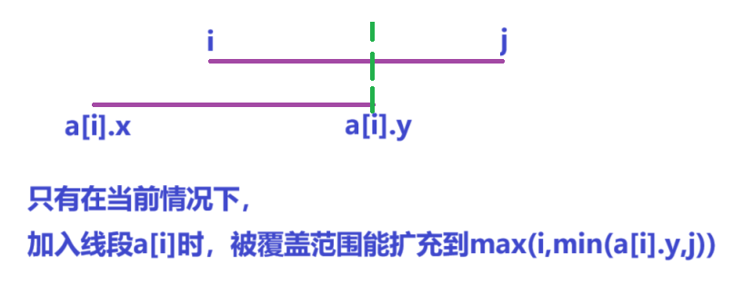

[F-小A的线段（hard version）_牛客小白月赛90 (nowcoder.com)](https://ac.nowcoder.com/acm/contest/78306/F)


问能将1~n全部覆盖有多少种选择方案


分析：


n范围1e5，m范围200，离散化将范围缩小至400，

`f[k][i][j]`表示当前走到第k条线段，0~i至少被覆盖2次，i~j至少被覆盖一次，j+1~n-1未被覆盖的方案数


对于每个线段`[l,r]`——>`[l-1,r)`，`[--a[i].fi,a[i].se)`

`[1,n]` ——> `[0,n-1]` `n`，n作为右边界不能被取得，

最终答案为`f[m][n-1][n-1]`


```cpp
void add(int& x,int y)
{
    x+=y;

    if(x>=mo)x-=mo;
}

int get(int x)
{
    return lower_bound(alls(v),x)-v.begin();
}

void solve()
{
    cin>>n>>m;

    for(int i=1;i<=m;i++)
    {
        cin>>a[i].fi>>a[i].se;

        v.push_back(--a[i].fi),v.push_back(a[i].se);
    }

    v.push_back(0),v.push_back(n);

    sort(alls(v));

    v.erase(unique(alls(v),v.end());

    for(int i=1;i<=m;i++)
    {
        a[i].fi=get(a[i].fi);

        a[i].se=get(a[i].se);
    }

    sort(a+1,a+m+1);

    n=v.size();

    f[0][0][0]=1;

    for(int i=1;i<=m;i++)
    {
        for(int i=0;i<n;i++) // l [0,n-1]
        {
            for(int j=i;j<n;j++)  // r [i,n-1]
            {
                add(f[k][i][j],f[k-1][i][j]);  // 尝试从上一个状态加入当前线段

                if(a[k].fi<=i)add(f[k][max(i,min(a[k].se,j))][max(j,a[k].se)],f[k-1][i][j]);
            }
        }
    }

    cout<<f[m][n-1][n-1]<<endl;
}
```



```cpp
#include <bits/stdc++.h>
#include <functional>

#define alls(a) a.begin(),a.end()
#define emb emplace_back
#define pub push_back
#define pob pop_back
#define puf push_front
#define pof pop_front
#define fi first
#define se second
#define No puts("No")
#define Yes puts("Yes")
#define NO puts("NO")
#define YES puts("YES")

using namespace std;
typedef long long ll;
//typedef __int128 lll; // G++(32位)不支持
typedef unsigned long long ull;
typedef pair<int, int> pii;

const int N = 2e2 + 10;
const int mo = 998244353;
const int inf = 2e9 + 10;

int n, m;
pii a[N];
ll f[N][2 * N][2 * N];
vector<int>v;

// f[k][i][j]表示到第k个线段，0~i可以被覆盖至少两次，i+1~j可以被覆盖至少一次，j+1~n-1不能被覆盖

void add(ll& a, ll b)
{
	a += b;

	if (a >= mo)a -= mo;
}

int get(int x)
{
	return lower_bound(v.begin(), v.end(), x) - v.begin();
}

void solve()
{
	cin >> n >> m;

	for (int i = 1; i <= m; i++)
	{
		cin >> a[i].first >> a[i].second;

		a[i].first--;

		v.push_back(a[i].fi);  // 1~x -> 0~x-1 x
		v.push_back(a[i].se);
	}

	v.push_back(0), v.push_back(n);  // 0~n，需要覆盖的范围是0~n-1

	sort(alls(v));

	v.erase(unique(alls(v)), v.end());

	int x, y;

	for (int i = 1; i <= m; i++)   //  离散化
	{
		x = a[i].first, y = a[i].second;

		a[i].first = get(x);

		a[i].second = get(y);
	}

	sort(a + 1, a + m + 1);

	n = v.size();  // 0~n-1 n

	f[0][0][0] = 1;

	for (int k = 1; k <= m; k++)
	{
		for (int i = 0; i < n; i++)  // l
		{
			for (int j = i; j < n; j++)  // r
			{
				add(f[k][i][j], f[k - 1][i][j]);

				if (a[k].first <= i)  // 可以尝试覆盖
				{
					add(f[k][max(i, min(j, a[k].second))][max(j, a[k].second)], f[k - 1][i][j]);
				}
			}
		}
	}

	cout << f[m][n - 1][n - 1] << endl;
}

int main()
{
	int t;

	//cin >> t;

	t = 1;

	while (t--)solve();

	return 0;
}
```
