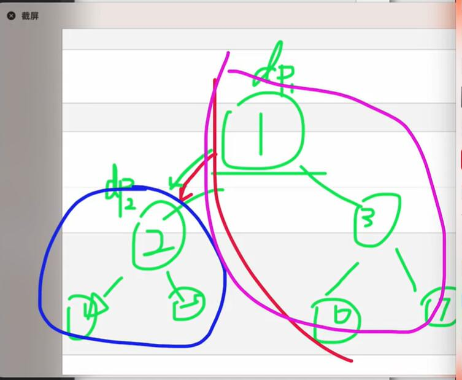

[E - Minimize Sum of Distances (atcoder.jp)](https://atcoder.jp/contests/abc348/tasks/abc348_e)


求每个节点权值之和最小值


分析：


`f[i]`表示当前以i为根节点的权值


从当前节点走向子节点，

所有当前子节点子树深度-1，因此权值`-=sum[v]`，

除这些节点之外，深度+1，权值`+=(tot-sum[v])`，

`f[v]=f[cur]-sum[v]+(tot-sum[v])`


dfs先处理出根节点1的f值，

顺便求出每个包含当前节点的子树权值和和tot，

dfss再通过sum数组，tot值求f数组

```cpp
void dfs(int cur,int fa,int dep)
{
    f[1]+=1ll*c[cur]*dep;  // f[1]加上当前节点权值*深度

    sum[cur]=c[cur];  // 初始化当前子树权值和

    for(auto v:e[cur])
    {
        if(fa==v)continue;

        dfs(v,cur,dep+1);  // 求当前节点子树权值和

        sum[cur]+=sum[v];  // 加上当前节点所有子树权值和
    }

    tot+=c[cur];  // 记录权值总和
}

void dfss(int cur,int fa)
{
    for(auto v:e[cur])
    {
        if(v==fa)continue;

        f[v]=f[cur]-sum[v]+(tot-sum[v]);  // 通过cur节点更新当前v节点

        dfss(v,cur);  // 通过v节点更新子节点
    }
}

void solve()
{
    cin>>n;

    for(int i=1;i<=n-1;i++)
    {
        cin>>u>>v; e[u].push_back(v); e[v].push_back(u);
    }

    for(int i=1;i<=n;i++)cin>>c[i];

    dfs(1,0,0);  // 以节点1为根节点

    dfss(1,0);  // 通过f[1]推别的f[i]

    ans=f[1];

    for(int i=2;i<=n;i++)ans=min(ans,f[i]);

    cout<<ans<<endl;
}
```



```cpp
#include <bits/stdc++.h>
#include <functional>

#define alls(a) a.begin(),a.end()
#define emb emplace_back
#define pub push_back
#define pob pop_back
#define puf push_front
#define pof pop_front
#define fi first
#define se second
#define No puts("No")
#define Yes puts("Yes")
#define NO puts("NO")
#define YES puts("YES")

using namespace std;
typedef long long ll;
//typedef __int128 lll; // G++(32位)不支持
typedef unsigned long long ull;
typedef pair<int, int> pii;

const int N = 1e5 + 10;
const int mo = 1e9 + 7;
const int inf = 2e9 + 10;

int n;
int u, v, c[N];
ll f[N], sum[N];
ll tot, ans;
vector<int>e[N];

void dfs(int cur, int fa, int dep)
{
    f[1] += 1ll * c[cur] * dep;  // 将节点1权值加上当前节点的贡献

    sum[cur] = c[cur];

    for (auto v : e[cur])
    {
        if (v == fa)continue;

        dfs(v, cur, dep + 1);

        sum[cur] += sum[v];  // 当前节点的总权值
    }

    tot += c[cur];  // 总权值
}

void dfss(int cur,int fa)
{
    for (auto v : e[cur])
    {
        if (v == fa)continue;

        f[v] = f[cur] - sum[v] + (tot - sum[v]);  // 从当前节点转移而来

        dfss(v, cur);
    }
}

void solve()
{
    cin >> n;

    for (int i = 1; i <= n - 1; i++)
    {
        cin >> u >> v;

        e[u].push_back(v), e[v].push_back(u);
    }

    for (int i = 1; i <= n; i++)cin >> c[i];

    dfs(1, 0, 0);

    dfss(1, 0);

    ans = f[1];

    for (int i = 2; i <= n; i++)ans = min(ans, f[i]);

    cout << ans << endl;
}

int main()
{
    int t;

    //cin >> t;

    t = 1;

    while (t--)solve();

    return 0;
}
```
