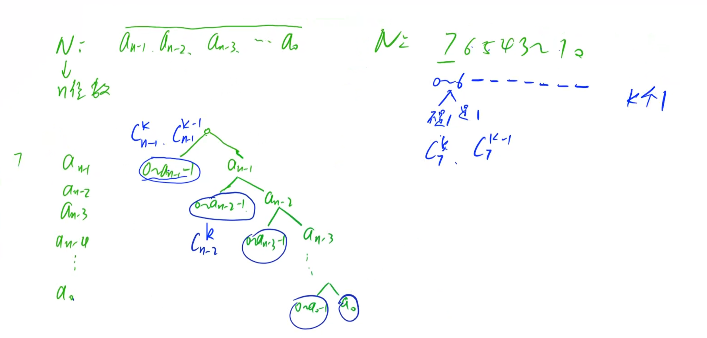
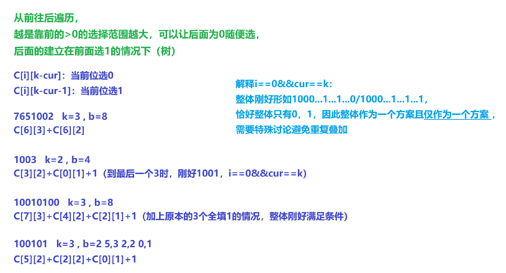

[1085. 不要62 - AcWing题库](https://www.acwing.com/problem/content/description/1087/)


分析：


f[i][j]表示当前最高位为j，一共i位的方案数

1. ini

2. 处理所有情况
   
   > 处理所有位数：更少位数 = 有前导零，固定前面位是0（00...）


```cpp
void ini()
{
    for(int i=0;i<=9;i++)f[1][i]=1;

    f[1][4]=0;

    for(int i=2;i<N;i++)
    {
        for(int j=0;j<=9;j++)
        {
            for(int k=0;k<=9;k++)
            {
                if(j==4||k==4||j==6&&k==2)continue;

                f[i][j]+=f[i-1][k];
            }
        }
    }
}

int dp(int x)
{
    if(x==0)return 1;

    a.clear();

    ans=0;    pre=0;

    while(x)a.emplace_back(x%10),x/=10;

    for(int i=a.size()-1;i>=0;i--)
    {
        for(int j=0;j<a[i];j++)
        {
            if(j==4||pre==6&&j==2)continue;

            ans+=f[i+1][j];
        }

        if(pre==6&&a[i]==2||a[i]==4)break;

        pre=a[i];

        if(i==0)ans++;    // 数字本身满足条件
    }

    return ans;
}

void solve()
{
    while(cin>>n>>m,n||m)
    {
        cout<<dp(m)-dp(n-1)<<endl;
    }
}
```


[1084. 数字游戏 II - AcWing题库](https://www.acwing.com/problem/content/1086/)


问当前范围内各个位数和为 n 倍数的数有多少个


分析：


`f[i][j][k]` 表示当前有 i 位，最高位为 j ，数位和 %n 余数为 k 的数个数


```cpp
int mo(int x,int p){
    return (x%p+p)%p;
}

void ini(){
    for(int i=0;i<=9;i++)f[1][i][mo(i,p)]=1;

    for(int i=2;i<N;i++)
    {
        for(int j=0;j<=9;j++)
        {        
            for(int k=0;k<=p-1;k++)    // 枚举当前余数 0~p-1
            {
                for(int x=0;x<=9;x++)
                {
                    f[i][j][k]+=f[i-1][x][mo(k-j,p)];
                }
            }
        }
    }
}

int dp(int x)
{
    if(x==0)return 1;

    v.clear();

    while(x)v.emplace_back(x%10),x/=10;

    ans=0,pre=0;

    for(int i=v.size()-1;i>=0;i--)
    {
        for(int j=0;j<=v[i]-1;j++)
        {
            ans+=f[i+1][j][mo(0-pre,p)];    // 0~v[i]-1
        }

        pre+=v[i];    // 固定v[i]

        if(i==0&&pre%p==0)ans++;
    }

    return ans;
}

void solve()
{
    while(cin>>a>>b>>p)
    {
        ini();

        cout<<dp(b)-dp(a-1)<<endl;
    }
}
```


[1083. Windy数 - AcWing题库](https://www.acwing.com/problem/content/1085/)


要求相邻两位差值至少为2


分析：


和数字游戏思路一样，

f[i][j]表示当前共有i位数字，最高位为j的方案数


求总方案数分类讨论： 1. 当前有n位  2. 当前不足n位


```cpp
void ini()
{
    for(int i=0;i<=9;i++)f[1][i]=1;    // 初始化，便于后续接数字使用

    for(int i=1;i<=15;i++)
    {
        for(int j=0;j<=9;j++)
        {
            for(int k=0;k<=9;k++)
            {
                if(abs(j-k)>=2)f[i][j]+=f[i-1][k];
            }
        }
    }
}

int dp(int x)
{
    if(x==0)return 0;    // 不含前导零

    v.clear();

    while(x)v.emplace_back(x%10),x/=10;

    pre=-1,ans=0;

    // 1. 固定位数为v.size()

    for(int i=v.size()-1;i>=0;i--)
    {
        for(int j=(i==v.size()-1);j<=v[i]-1;j++)    // 不含前导零 (j=0也ok，pre初始值-1)
        {
            if(abs(j-pre)>=2)ans+=f[i+1][j];
        }

        if(abs(v[i]-pre)>=2)pre=v[i]; else break;

        if(i==0)ans++;    // 所有位固定也满足要求，方案数++
    }

    // 2. 位数<v.size()

    for(int i=1;i<=v.size()-1;i++)
    {
        for(int j=1;j<=9;j++)ans+=f[i][j];    // 不含前导零
    }

    return ans;
}

void solve()
{
    ini();

    cin>>a>>b;

    cout<<dp(b)-dp(a-1)<<endl;
}
```


[1082. 数字游戏 - AcWing题库](https://www.acwing.com/problem/content/description/1084/)


给定区间，求不降数个数


分析：


`f[i][j]`表示当前有i位，最高位为j有多少个不降数，

分类讨论：当前位`pre~c[i]-1`，当前位固定`c[i]`

当`pre>c[i]`时，不能固定`c[i]`，break

当走到最后一位时，加上所有位数字固定的一种方案


```cpp
void ini()
{
    for(int i=0;i<=9;i++)f[1][i]=1;    // 当前1位，非降序列1种

    for(int i=2;i<15;i++)
    {
        for(int j=0;j<=9;j++)
        {
            for(int k=j;k<=9;k++)f[i][j]+=f[i-1][k];    
            // 当前最高位为j，非降序列要求下一位>=j
        }
    }
}

int dp(int c)
{
    if(c==0)return 1;    // 0，方案数为1

    ans=0; pre=0;

    v.clear();

    while(c)v.push_back(c%10),c/=10;

    for(int i=c.size()-1;i>=0;i--)    // 从最高位向后接非降序序列 <
    {
        if(pre>c[i])break;

        for(int j=pre;j<c[i];j++)
        {
            ans+=f[i+1][j];
        }

        if(i==0)ans++;

        pre=c[i];
    }

    return ans;
}

void solve()
{
    ini();

    while(cin>>a>>b)
    {
        cout<<dp(b)-dp(a-1)<<endl;
    }
}
```


[1081. 度的数量 - AcWing题库](https://www.acwing.com/problem/content/1083/)


给定区间[x,y]，

求区间内有多少个数满足恰好有b的k个不同次方之和


分析：


$A=b^{i_1}+b^{i_2}+\cdots +b^{i_k}$，

问A有多少个值，

相当于b进制下选择k个位置放1，其余位置放0，

总和在区间[x,y]内，有多少种方案


设f[i]表示区间[0,i]内的方案数，

`f[x~y]=f[y]-f[x-1]`


> 1. $a_i\ge 1$
>    
>    
> 
> 1. 当前位选为0
>    剩余位1均可随便选，方案数为$C_i^{k-cur}$
>    
>    
> 
> 2. 当前位选为1
>    
>    1. $a_i>1$
>       剩余所有位1可随便放不会超范围，方案数为$C_i^{k-cur-1}$，
>       所有位情况考虑完，break
>    
>    2. $a_i==1$
>       固定当前位为1，继续往下求方案数
>       
>       
> 
> 2. 临界情况
>    `i==0&&cur==k`时，所有位0/1，
>    所有1固定作为一种方案
>    （$C_i^j$都是指将1放在除当前遍历到固定位剩余位置的方案数）
>    
>    
>    
>    
> 
> 10001001，c[0][1]为0
> 
> 100010010，c[1][1]指的是100010001
> 
> 
> 
> 遇到$a_i>1$，相当于直接简化计算，
> 
> 后面所有位置随便选


```cpp
void ini()
{
    for(int i=0;i<=35;i++)    // C[0][0]，100103，k=3，b=4
    {
        for(int j=0;j<=i;j++)
        {
            if(!j||j==i)c[i][j]=1;
            else c[i][j]=c[i-1][j]+c[i][j-1];
        }
    }
}

ll f(int n)
{
    vector<int>a;

    while(n)
    {
        a.emplace_back(n%b); n/=b;
    }

    ll ans=0;
    int cur=0;

    for(int i=a.size()-1;i>=0;i--)
    {
        if(a[i])
        {
            ans+=c[i][k-cur];    // 当前位为0

            if(a[i]>1)    // >1，从这一位开始可以往后随便选
            {
                if(k-cur-1>=0)ans+=c[i][k-cur-1];    // 选择当前位为1，后面随便选

                break;
            }
            else
            {
                cur++;    // 当前这位固定为1

                if(cur>k)break;
            }
        }

        if(i==0&&cur==k)ans++;  // 数字本身就是一个满足要求的值，最右分支未被画出来
    }

    return ans;
}

void solve()
{
    cin>>x>>y>>k>>b;

    cout<<f(y)-f(x-1)<<endl;
}
```





```cpp
#include <bits/stdc++.h>

using namespace std;

const int N = 40;

int l, r;
int k, b;
int cur, ans;
int c[N][N];

void ini()
{
    for (int i = 0; i < N; i++)
    {
        for (int j = 0; j <= i; j++)
        {
            if (j == 0)c[i][j] = 1;
            else c[i][j] = c[i - 1][j] + c[i - 1][j - 1];
        }
    }
}

int calc(int x)
{
    if (x == 0)return 0;

    vector<int>a;

    ans = 0;
    cur = 0;

    while (x)
    {
        a.emplace_back(x % b);
        x /= b;
    }

    for (int i = a.size() - 1; i >= 0; i--)
    {
        if (a[i])
        {
            ans += c[i][k - cur]; //0  7651002 k=3,b=8

            if (a[i] > 1)
            {
                if (k - cur - 1 >= 0)ans += c[i][k - cur - 1]; //1 1003 k=2,b=4

                break;                                            
            }
            else
            {
                cur++;

                if (cur > k)break;
            }
        }

        if (i == 0 && cur == k)ans++;  
        // 10010100 k=3,b=8  
        // 100101 5,3 2,2 0,1
    }

    return ans;
}

int main()
{
    ini();

    cin >> l >> r >> k >> b;

    cout << calc(r) - calc(l - 1) << endl;

    return 0;
}
```


[0二进制问题 - 蓝桥云课 (lanqiao.cn)](https://www.lanqiao.cn/problems/1593/learning/)


求1 到 N 中有多少个数满足其二进制表示中恰好有 K 个 1


分析：


$C_i^k=C_{i-1}^k+C_{i-1}^{k-1}$，当前位选或者不选，剩余的$i-1$位还要选k/k-1个


分解当前数字n的每个二进制位，

如果当前位为1，就能选择变为1或0，否则就只能为0


```cpp
void ini()
{
    for(int i=1;i<=50;i++)
    {
        for(int j=0;j<=i;j++)
        {
            if(j==0||j==i)f[i][j]=0; else f[i][j]=f[i-1][j-1]+f[i-1][j];
        }
    }
}

void solve()
{
    ini();

    int cur=0;

    cin>>n>>k;

    vector<int>v;

    while(n)v.emplace_back(n%2),n>>=1;

    for(int i=v.size()-1;i>=0;i--)  // 最低位为0，每次除去当前位剩下还有i个位置
    {
        if(v[i])
        {
            ans+=f[i][k-cur];  // 当前位选0，接下来的i个位置还剩k-cur个1选

            cur++;

            if(cur>k)break;
        }

        if(i==0&&cur==k)ans++;  

        // 刚好到最后一个位置为1，一共原数就是k个1，cur++因此不会被算入一种情况
    }

    cout<<ans<<endl;
}
```


```cpp
#include <bits/stdc++.h>

using namespace std;

typedef long long ll;

const int N = 110;

ll n;
ll ans, f[N][N];
int k;

void ini()
{
    for (int i = 0; i <= 60; i++)
    {
        for (int j = 0; j <= i; j++)
        {
            if (j == 0 || j == i)f[i][j] = 1;
            else f[i][j] = f[i - 1][j - 1] + f[i - 1][j];
        }
    }
}

int main()
{
    cin >> n >> k;

    ini();

    vector<int>a;

    while (n)
    {
        a.push_back(n % 2); n >>= 1;
    }

    int cnt = 0;

    for (int i = a.size() - 1; i >= 0; i--)
    {
        if (a[i] == 1)
        {
            ans += f[i][k - cnt];  // 第i位选0，剩下位可以随便选k个

            cnt++;  // 当前位选1

            if (cnt > k)break;
        }

        if (i == 0 && cnt == k)ans++;  // 到最后一个位置刚好全部放满，并且前面k个1用完，n能直接被凑出来
    }

    cout << ans << endl;

    return 0;
}
```
