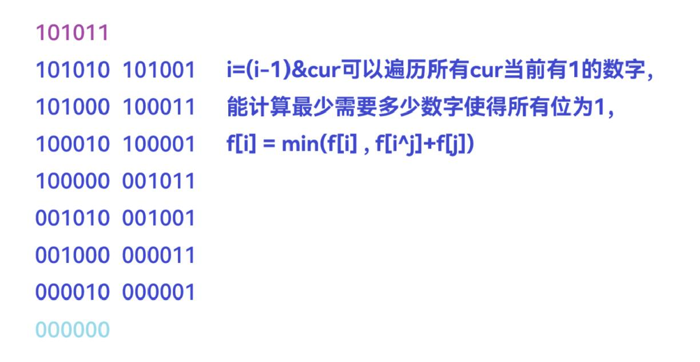

[F-三途川的摆渡人_牛客周赛 Round 37 (nowcoder.com)](https://ac.nowcoder.com/acm/contest/77231/F)


问最多能删除多少人使得剩下的人&运算值为0


分析：


&运算值为0的逆否命题：调换所有01，|运算所有位为1

问题转化为，调换所有01，求|运算所有位为1的最少个数


`f[i]`表示恰好|运算凑出`i`至少需要多少个数

`i=(i-1)&cur`，能遍历所有能利用1的数字


```cpp
for(int i=1;i<=256-1;i++)
{
    if(f[i]==1)continue;

    for(int j=i;j;j=(j-1)&i)  // 遍历所有挖掉1的情况
    {
        f[i]=min(f[i],f[i^j]+f[j]);  // 利用挖掉1的数字更新i
    }
}
```


```cpp
void solve()
{
    cin>>n;

    for(int i=1;i<=256-1;i++)f[i]=inf;

    f[0]=0;

    for(int i=1;i<=n;i++)
    {
        cin>>a[i];

        a[i]^=(256-1);  // 按位取反

        for(int j=a[i];j;j=(j-1)&a[i])f[j]=1;  // 可以得到
    }

    for(int i=1;i<=256-1;i++)
    {
        if(f[i]==1)continue;  // 无法个数更小

        for(int j=i;j;j=(j-1)&i)  // 扣去1
        {
            f[i]=min(f[i],f[i^j]+f[j]);  // 更新最少需要多少个数填充i
        }
    }

    if(f[256-1]<inf)cout<<n-f[256-1]<<endl;  // 最多能删除多少数字
    else puts("-1");
}
```



```cpp
#include <bits/stdc++.h>
#include <functional>

#define alls(a) a.begin(),a.end()
#define emb emplace_back
#define pub push_back
#define pob pop_back
#define puf push_front
#define pof pop_front
#define fi first
#define se second
#define No puts("No")
#define Yes puts("Yes")
#define NO puts("NO")
#define YES puts("YES")

using namespace std;
typedef long long ll;
//typedef __int128 lll; // G++(32位)不支持
typedef unsigned long long ull;
typedef pair<int, int> pii;

const int N = 2e5 + 10;
const int mo = 1e9 + 7;
const int inf = 2e9 + 10;

const int maxx = (1 << 8) - 1;

int n, sum;
ll a[N], f[maxx + 10];

void solve()
{
    cin >> n;

    sum = 0;

    for (int i = 0; i <= maxx; i++)f[i] = inf;

    for (int i = 1; i <= n; i++)
    {
        cin >> a[i];

        a[i] ^= maxx;  // 取反

        sum |= a[i];

        for (int j = a[i]; j != 0; j = (j - 1) & a[i])f[j] = 1;  // 所有为1的位都能选择这个数字
    }

    //for (int i = 0; i <= maxx; i++)cout << f[i] << ' ';

    //puts("");

    if (sum < maxx)puts("-1");
    else
    {
        for (int i = 1; i <= maxx; i++)
        {
            if (f[i] == 1)continue;  // 无法更小

            for (int j = i; j != 0; j = (j - 1) & i)
            {
                f[i] = min(f[i], f[i ^ j] + f[j]);
            }
        }

        cout << n - f[maxx] << endl;  // f[maxx]为& = 1需要的最少数量，此时抛弃最多人
    }
}

int main()
{
    int t;

    cin >> t;

    //t = 1;

    while (t--)solve();

    return 0;
}
```


[Problem - G - Codeforces](https://codeforces.com/contest/1950/problem/G)


分析：


`f[i][j]`表示当状态为`i`时可行，此时`j`也在选定范围之内

`st[i][j]`表示当前`i`和`j`能放在一起


`__builtin_popcount(i)`内置函数记录`i`二进制有多少个1


```cpp
void solve()
{
    cin>>n;

    for(int i=0;i<n;i++)cin>>g[i]>>w[i];

    for(int i=0;i<n;i++)  // 记录当前是否能放在一起
    {
        for(int j=0;j<n;j++)
        {    
            if(g[i]==g[j]||w[i]==w[j])st[i][j]=true; else st[i][j]=false;
        }
    }

    for(int i=0;i<(1<<n);i++)for(int j=0;j<n;j++)f[i][j]=false;

    for(int i=0;i<n;i++)f[1<<i][i]=true;

    ans=n;

    for(int i=1;i<(1<<n);i++)
    {
        for(int j=0;j<n;j++)  // 枚举可以扩展放置的节点
        {
            if(f[i][j])
            {
                ans=min(ans,n-__builtin_popcount(i));  // __builtin_popcount(i)记录i的二进制有多少1

                for(int k=0;k<n;k++)
                {
                    if(!((i>>k)&1)&&st[j][k])f[i|(1<<k)][k]=true; // 插入可以放在一起
                }
            }
        }
    }

    cout<<ans<<endl;
}
```


```cpp
#include <bits/stdc++.h>
#include <functional>

#define alls(a) a.begin(),a.end()
#define emb emplace_back
#define pub push_back
#define pob pop_back
#define puf push_front
#define pof pop_front
#define fi first
#define se second
#define No puts("No")
#define Yes puts("Yes")
#define NO puts("NO")
#define YES puts("YES")

using namespace std;
typedef long long ll;
//typedef __int128 lll; // G++(32位)不支持
typedef unsigned long long ull;
typedef pair<string, string> pii;

const int N = 20;
const int mo = 1e9 + 7;
const int inf = 2e9 + 10;

int n;
int ans;
bool st[N][N], f[1 << N][N];
string g[N], w[N];

// f[i][j]表示当前状态为i时，j被选中

void solve()
{
    cin >> n;

    for (int i = 0; i < n; i++)cin >> g[i] >> w[i];

    for (int i = 0; i < n; i++)
    {
        for (int j = 0; j < n; j++)
        {
            if (g[i] == g[j] || w[i] == w[j])st[i][j] = true;  // i->j
            else st[i][j] = false;
        }
    }

    for (int i = 0; i < (1 << n); i++)for (int j = 0; j < n; j++)f[i][j] = false;

    for (int i = 0; i < n; i++)f[1 << i][i] = true;

    ans = n;

    for (int i = 1; i < (1 << n); i++)
    {
        for (int j = 0; j < n; j++)
        {
            if (f[i][j])  // 当前能通过j延展
            {
                ans = min(ans, n - __builtin_popcount(i));  //

                for (int k = 0; k < n; k++)
                {
                    if (!((i >> k) & 1) && st[j][k])  //  j->k i->k
                    {
                        f[i | (1 << k)][k] = true;
                    }
                }
            }
        }
    }

    cout << ans << endl;
}

int main()
{
    int t;

    cin >> t;

    //t = 1;

    while (t--)solve();

    return 0;
}
```
