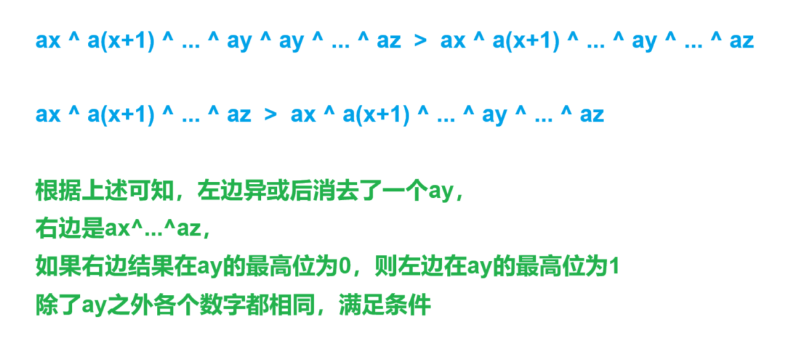
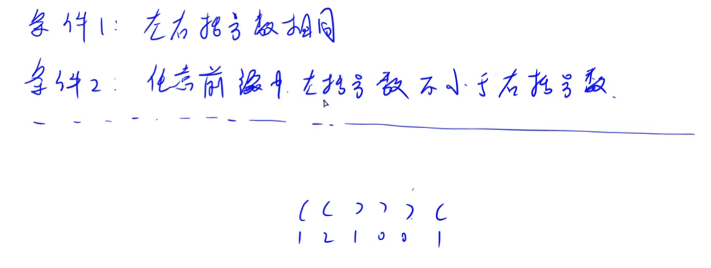

[02022 - 蓝桥云课 (lanqiao.cn)](https://www.lanqiao.cn/problems/2186/learning/)


求10个不同的数字之和为2022有多少种表示方法


分析：


`f[i][j]`表示用j个不同数字总和为i的方案数

`f[i+j][k+1]+=f[j][k]`


```cpp
void solve()
{
    n=2022;

    for(int i=1;i<=n;i++)  // 加入当前i，更新f
    {
        for(int j=n;j>=1;j--)  // 枚举上一轮的和
        {
            for(int k=9;k>=1;k--)
            {
                f[i+j][k+1]+=f[j][k];  // 用上一轮没更新过的方案数更新这一轮
            }        
        }

        f[i][1]=1;  // 加入当前数
    }

    cout<<f[n][10]<<endl;
}
```


```cpp
#include <bits/stdc++.h>

using namespace std;

typedef long long ll;

const int N = 5e3 + 10, M = 20;

int n;
ll f[N][M];

// f[i][j]表示用j个数字凑出和为i的方案数

int main()
{
    n = 2022;

    for (int i = 1; i <= n; i++)  // 考虑用第i个数字更新
    {
        // 枚举和为j

        for (int j = n; j >= 1; j--)  // i+j从大到小，j从大到小，保证用的是没更新过的
        {
            for (int k = 9; k >= 1; k--)
            {
                f[i + j][k + 1] += f[j][k];  // 加上当前第i个数
            }
        }

        f[i][1] = 1;  // 只有i一个数字的时候
    }

    cout << f[2022][10] << endl;

    return 0;
}
```


[Problem - C - Codeforces](https://codeforces.com/contest/1957/problem/C)


分析：


每次放了`(r,c)`都放`(c,r)`，

`r==c`时`i*i ——> (i-1)*(i-1)`

否则`i*i ——> (i-2)*(i-2)`，可以选择放置`(r,c)`的选择为`i-1`种（对称），

放完之后变成`(i-2)*(i-2)`，

每种可以是人放也可以是机器放`2`种


`f[i]`表示当前有i行/列可以放置时的总方案数，

`f[i]=(f[i-1]+(i-1)*f[i-2]*2)%mo`


```cpp
void ini()
{
    f[0]=f[1]=1;

    for(int i=2;i<=3e5;i++)
    {
        f[i]=(f[i-1]+(i-1)*f[i-2]*2)%mo;
    }
}

void solve()
{
    cin>>n>>k;

    for(int i=1;i<=n;i++)st[i]=false;

    while(k--)
    {
        cin>>r>>c; st[r]=st[c]=true;
    }

    cnt=0;

    for(int i=1;i<=n;i++)if(!st[i])cnt++;

    cout<<f[cnt]<<endl;
}
```


```cpp
#include <bits/stdc++.h>

using namespace std;

const int N = 3e5 + 10;
const int mo = 1e9 + 7;

typedef long long ll;

int n, k;
int r, c, cnt;
bool st[N];
ll f[N];

void ini()
{
    f[0] = f[1] = 1;

    for (int i = 2; i < N; i++)
    {
        f[i] = (f[i - 1] + (i - 1ll) * f[i - 2] * 2) % mo;
    }
}

void solve()
{
    cin >> n >> k;

    for (int i = 1; i <= n; i++)st[i] = false;

    while (k--)
    {
        cin >> r >> c;

        st[r] = true;
        st[c] = true;
    }

    cnt = 0;

    for (int i = 1; i <= n; i++)
    {
        if (!st[i])cnt++;
    }

    cout << f[cnt] << endl;
}

int main()
{
    ini();

    int t;

    cin >> t;

    while (t--)solve();

    return 0;
}
```


[Problem - D - Codeforces](https://codeforces.com/contest/1957/problem/D)


分析：


$k\oplus k=0<k$，不满足题给式子要求，三点重合不合法


左边式子相当于比右边多异或一个$a_y$，

如果左边>右边，右边式子在$a_y$的最高位异或值为0，


`f[i][j][k]`表示到第i个数为止在第j个位置上状态为k时的连续区间个数

情况：

1. 中间包含`a[i]`

2. 两端包含`a[i]`
   
   

```cpp
void solve()
{
    cin>>n;

    for(int i=1;i<=n;i++)cin>>a[i];

    for(int i=0;i<=n+1;i++)
    {
        for(int j=0;j<=32;j++)
        {
            f[i][j][0]=f[i][j][1]=ff[i][j][0]=ff[i][k][1]=0;
        }
    }

    for(int i=1;i<=n;i++)
    {
        for(int j=0;j<32;j++)
        {
            if((a[i]>>j)&1)
            {
                f[i][j][1]=1+f[i-1][j][0];  // 包含当前这个点

                f[i][j][0]=f[i-1][j][1];
            }
            else
            {
                f[i][j][0]=1+f[i-1][j][0];

                f[i][j][1]=f[i-1][j][1];
            }
        }
    }

    for(int i=n;i>=1;i--)
    {
        for(int j=32-1;j>=0;j--)
        {
            if((a[i]>>j)&1)
            {
                ff[i][j][1]=1+ff[i+1][j][0];  // 0^1=1

                ff[i][j][0]=ff[i+1][j][1];    // 1^1=0
            }
            else
            {
                ff[i][j][0]=1+ff[i+1][j][0];  // 0^0=0

                ff[i][j][1]=ff[i+1][j][1];    // 1^0=1
            }
        }
    }

    ans=0;

    for(int i=1;i<=n;i++)
    {
        for(int j=32-1;j>=0;j--)
        {
            if((a[i]>>j)&1)  // 找到最高位的1
            {
                // 包含在中间

                ans+=f[i-1][j][0]*ff[i+1][j][1];
                ans+=f[i-1][j][1]*ff[i+1][j][0];

                // 包含在两边

                ans+=f[i-1][j][1];
                ans+=ff[i+1][j][1];

                break;
            }
        }
    }

    cout<<ans<<endl;
}
```



```cpp
#include <bits/stdc++.h>
#include <functional>

#define alls(a) a.begin(),a.end()
#define emb emplace_back
#define pub push_back
#define pob pop_back
#define puf push_front
#define pof pop_front
#define fi first
#define se second
#define No puts("No")
#define Yes puts("Yes")
#define NO puts("NO")
#define YES puts("YES")

using namespace std;
typedef long long ll;
//typedef __int128 lll; // G++(32位)不支持
typedef unsigned long long ull;
typedef pair<int, int> pii;

const int N = 1e5 + 10, M = 40;

int n, a[N];
ll ans;
int f[N][M][2], ff[N][M][2];

// f[i][j][0]表示到第i个数字为止，带上第i个数字，二进制位第j位为0的连续区间数

void solve()
{
    cin >> n;

    for (int i = 0; i <= n + 1; i++)
    {
        for (int j = 0; j < 32; j++)
        {
            f[i][j][0] = f[i][j][1] = ff[i][j][0] = ff[i][j][1] = 0;
        }
    }

    for (int i = 1; i <= n; i++)cin >> a[i];

    for (int i = 1; i <= n; i++)
    {
        for (int j = 0; j < 32; j++)
        {
            if ((a[i] >> j) & 1)
            {
                f[i][j][1] = f[i - 1][j][0] + 1;  // 0^1=1，自成一个当前位为1的区间

                f[i][j][0] = f[i - 1][j][1];  // 1^1=0
            }
            else
            {
                f[i][j][1] = f[i - 1][j][1];

                f[i][j][0] = f[i - 1][j][0] + 1;
            }
        }
    }

    for (int i = n; i >= 1; i--)
    {
        for (int j = 0; j < 32; j++)
        {
            if ((a[i] >> j) & 1)  // 当前位为1
            {
                ff[i][j][1] = ff[i + 1][j][0] + 1;  // 0^1=1，自成一个当前位为1的区间

                ff[i][j][0] = ff[i + 1][j][1];  // 1^1=0
            }
            else
            {
                ff[i][j][1] = ff[i + 1][j][1];  // 1^0=1

                ff[i][j][0] = ff[i + 1][j][0] + 1;  // 0^0=0
            }
        }
    }

    ans = 0;

    for (int i = 1; i <= n; i++)
    {
        for (int j = 32 - 1; j >= 0; j--)
        {
            if ((a[i] >> j) & 1)
            {
                // 被前后包含，a[i]夹在中间

                ans += 1ll * f[i - 1][j][0] * ff[i + 1][j][1];

                ans += 1ll * f[i - 1][j][1] * ff[i + 1][j][0];

                // 被前面区间包含
                // 被后面区间包含

                ans += f[i - 1][j][1];  // 前

                ans += ff[i + 1][j][1];  // 后

                break;
            }
        }
    }

    cout << ans << endl;
}

int main()
{
    int t;

    cin >> t;

    //t = 1;

    while (t--)solve();

    return 0;
}
```


[P2039 - [蓝桥杯2022初赛] 李白打酒加强版 - New Online Judge (ecustacm.cn)](http://oj.ecustacm.cn/problem.php?id=2039)


分析：


`f[i][j][k]`表示到第`i`个位置，遇见`j`朵花，有`k`斗酒的方案数

最后一次遇到的是花，最终状态为`f[n+m-1][m-1][1]`，

刚好走到`n+m-1`位置，剩余一斗酒，在`n+m`处被喝光


```cpp
void solve()
{
    memset(f,0,sizeof(f));

    f[0][0][2]=1;

    cin>>n>>m;

    for(int i=0;i<=n+m-1;i++)
    {
        for(int j=0;j<=m-1;j++)
        {
            for(int k=0;k<=m;k++)
            {    
                if(k%2==0)
                {
                    f[i][j][k]=(f[i][j][k]+f[i-1][j][k/2])%mo;  // 当前遇到店，酒*2
                }    

                if(j>=1)
                {
                    f[i][j][k]=(f[i][j][k]+f[i-1][j-1][k+1])%mo; // 当前遇到花，酒-1
                }
            }
        }
    }

    cout<<f[n+m-1][m-1][1]<<endl;
}
```


```cpp
#include <bits/stdc++.h>

using namespace std;
typedef long long ll;

const int mo = 1000000007;
const int N = 110;

int n, m;
ll f[2 * N][N][N];  // 走到第i个位置，遇到j朵花，有k斗酒

void solve()
{
    cin >> n >> m;

    memset(f, 0, sizeof(f));

    f[0][0][2] = 1;

    for (int i = 1; i <= n + m - 1; i++)  // 走到了第i个位置
    {
        for (int j = 0; j < m; j++)  // 花
        {
            for (int k = 0; k <= m; k++)  // 酒
            {
                if (k % 2 == 0)
                {
                    f[i][j][k] = (f[i][j][k] + f[i - 1][j][k / 2]) % mo;  // 当前遇到的是店，加倍
                }

                if (j >= 1)
                {
                    f[i][j][k] = (f[i][j][k] + f[i - 1][j - 1][k + 1]) % mo;  // 当前遇到的是花，-1
                }
            }
        }
    }

    cout << f[n + m - 1][m - 1][1] << endl;
}

int main()
{
    int t;

    cin >> t;

    while (t--)solve();

    return 0;
}
```


[P1561 - [蓝桥杯2021初赛] 括号序列 - New Online Judge (ecustacm.cn)](http://oj.ecustacm.cn/problem.php?id=1561)


问在添括号最少的情况下，

让当前序列变成合法序列有几种方案


分析：


一个括号序列从前往后遍历，合法条件是`(`数量多于`)`数量


`f[i][j]`表示当前遍历到第i个字符时，加了括号后`(`比`)`多j个的方案数，

只要在此前提下合法的方案都能加进去


添加`(`能直接正着求，

添加`)`就是`reverse(alls(s))`之后将左右括号互换，于是就将求`)`变成了求`(`，

左右括号独立存在，`a*b%mo`为方案总数


```cpp
memset(f,0,sizeof(f));

f[0][0]=1;  // 什么都不加，方案数为1

for(int i=1;i<=n;i++)
{
    if(s[i]=='(')  // 当前是'('，继续保持上次的合法方案
    {
        for(int j=1;j<=n;j++)f[i][j]=f[i-1][j-1];
    }
    else  // 当前是')'
    {
        f[i][0]=(f[i-1][0]+f[i-1][1])%mo;  

        // 1. 上一次相同，延续到这次继续刚好继续为0 2. 上次正好多一个'('和当前')'匹配 

        for(int j=1;j<=n;j++)
        {
            f[i][j]=(f[i][j-1]+f[i-1][j+1])%mo;

            // 1. '('多一个刚好和当前')'抵消
            // 2. 所有f[i-1][x]，x范围为0~j，
            // 能在加上')'的前提下，添加任意个'('变成f[i][j]
            // f[i][j-1]=sum(f[i-1][0~j])，正好满足式子
        }
    }
}

for(int i=0;i<=n;i++)
{
    if(f[n][i])return f[n][i];  // 找到最少需要添加括号的方案数，返回
}

return -1;
```



```cpp
#include <bits/stdc++.h>

#define alls(x) x.begin(),x.end()

using namespace std;

typedef long long ll;

const int N = 5e3 + 10;
const int mo = 1000000007;

int n;
string s;
ll a, b;
ll f[N][N];

// f[i][j]表示到第i个位置为止，'('比')'多j个时添加')'方案数

ll solve()
{
    memset(f, 0, sizeof(f));

    f[0][0] = 1;

    for (int i = 1; i <= n; i++)
    {
        if (s[i] == '(')
        {
            for (int j = 1; j <= n; j++)
            {
                f[i][j] = f[i - 1][j - 1]; // ')('唯一
            }
        }
        else
        {
            f[i][0] = (f[i - 1][0] + f[i - 1][1]) % mo;  // 1. 没有括号 2. 前一个位置和现在的')'刚好抵消

            for (int j = 1; j <= n; j++)
            {
                f[i][j] = (f[i][j - 1] + f[i - 1][j + 1]) % mo;  // 1. 序列非法，加上所有f[i-1][x]表示至少需要添加x个左括号才能合法，所有f[i-1][x]的和为f[i][j-1]  2. 序列刚好合法，')'消除了一个'('
            }
        }
    }

    for (int i = 0; i <= n; i++)  // 从小到大找最少需要添加的')'数目
    {
        if (f[n][i])return f[n][i];
    }

    return -1;
}

int main()
{
    cin >> s;

    n = s.size();

    s = " " + s;

    a = solve();

    reverse(alls(s));

    s = " " + s;

    for (auto& u : s)
    {
        if (u == '(')u = ')';
        else u = '(';
    }

    b = solve();

    cout << a * b % mo << endl;

    return 0;
}
```


