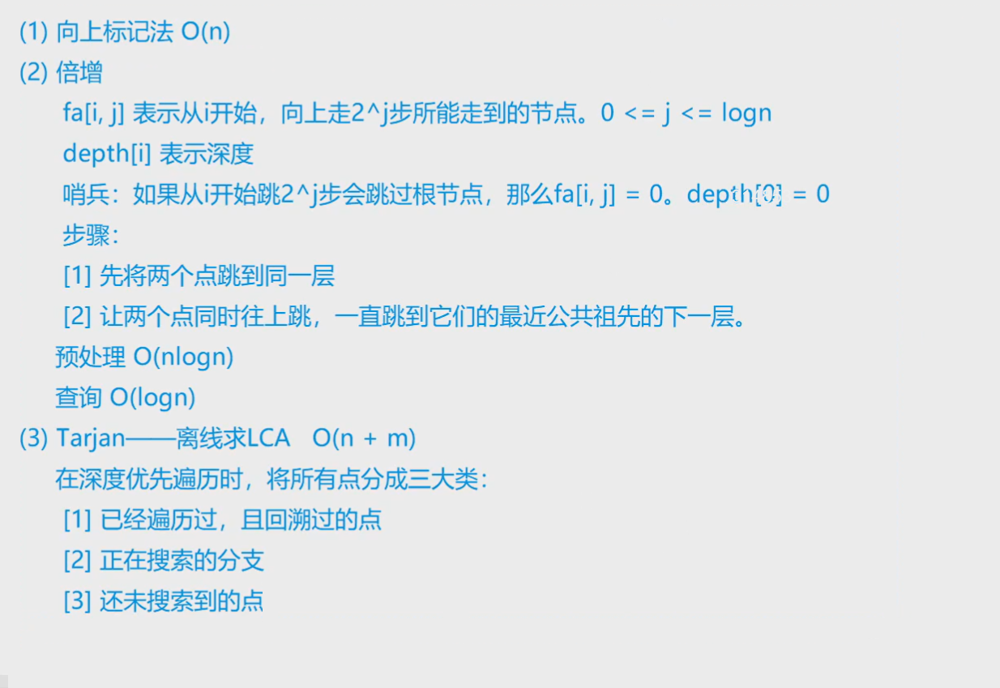
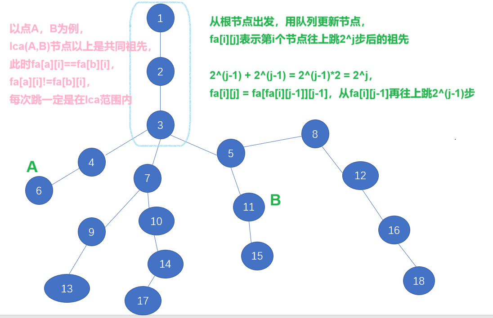
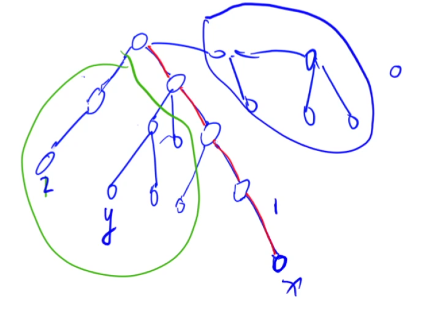
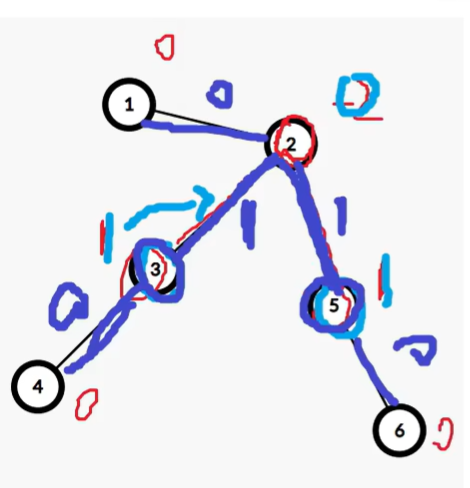
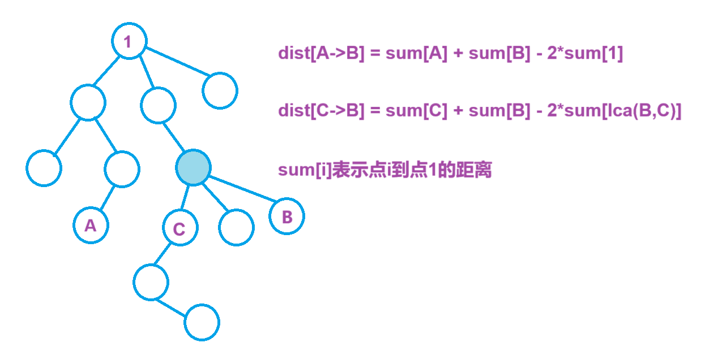
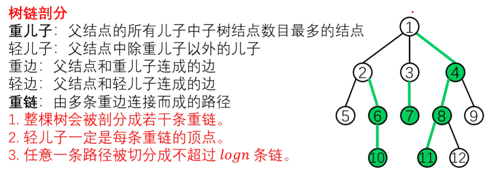
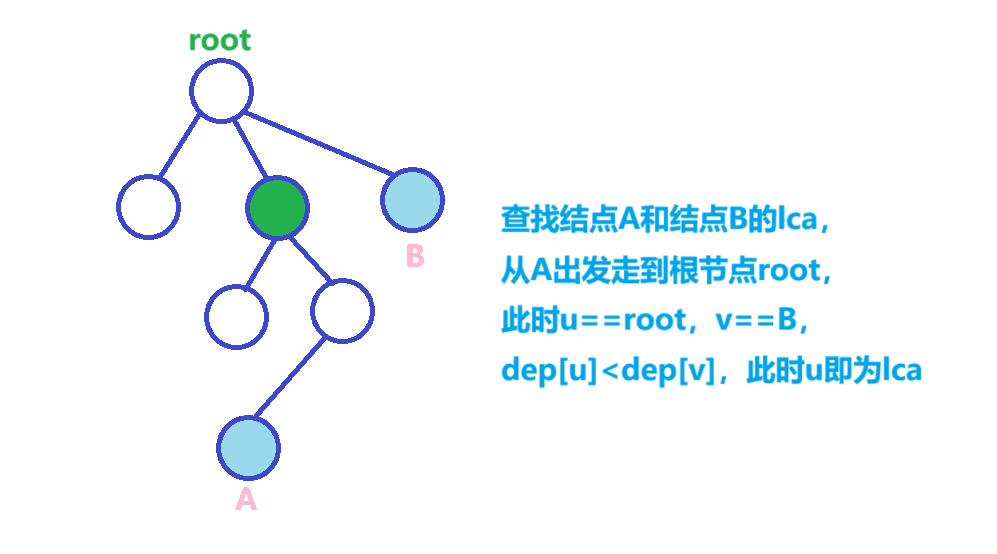

## 倍增：

$O(NlogN)$

用bfs预处理出所有节点跳$2^j$的结点序号，

用dep数组记录每个节点的深度，dep[0]=0表示越界，

先让两个节点跳到同一深度，之后两个节点一起跳，

跳到刚好往上一步就能变成lca


在线查询


[1172. 祖孙询问 - AcWing题库](https://www.acwing.com/problem/content/1174/)


询问a和b的lca


分析：


fa[i][j]表示节点i向上跳$2^j$步后的节点

dep数组记录当前节点深度


从根节点开始，dfs处理所有fa[i][j]，

每次求lca，让a和b跳到同一深度，之后一起往上跳，

直到fa[a][0]==fa[b][0]，返回fa[a][0]，即最近公共祖先


`fa[u][i]=fa[fa[u][i-1]][i-1]`


```cpp
void bfs(int root)
{
    queue<int>q;

    q.push(root);

    int u,v;

    while(!q.empty())
    {
        u=q.front(); q.pop();

        for(int i=h[u];~i;i=ne[i])  // 用u更新邻接点
        {
            v=e[i];

            if(dep[v]>dep[u]+1)  // 用dep数组判断当前点是否被更新过
            {
                dep[v]=dep[u]+1;

                fa[v][0]=u;

                for(int i=1;i<=15;i++)fa[v][i]=fa[fa[v][i-1]][i-1];

                q.push(v);
            }
        }
    }
}

int lca(int a,int b)
{
    if(dep[a]<dep[b])swap(a,b);

    for(int i=15;i>=0;i--)
    {
        if(dep[fa[a][i]]>=dep[b])a=fa[a][i];
    }

    if(a==b)return a;

    for(int i=15;i>=0;i--)
    {
        if(fa[a][i]!=fa[b][i])a=fa[a][i],b=fa[b][i];
    }

    return fa[a][0];
}

void add(int a,int b)
{
    e[idx]=b,ne[idx]=h[a],h[a]=idx++;
}

void solve()
{
    cin>>n>>m;

    memset(h,-1,sizeof(h));

    for(int i=1;i<=n;i++)
    {    
        cin>>a>>b;

        if(b==-1)root=a;
        else
        {
            add(a,b),add(b,a);
        }
    }

    memset(dep,0x3f,sizeof(dep));

    dep[0]=0,dep[root]=1;  // 将0设置为边界，只要跳出边界，dep就为0，不更新

    bfs(root);

    for(int i=1;i<=m;i++)
    {
        cin>>a>>b; pa=lca(a,b);

        if(pa==a)puts("1"); else if(pa==b)puts("2"); else puts("0");
    }
}
```



```cpp
#include <bits/stdc++.h>

using namespace std;

const int N = 4e4 + 10;

int n, m;
int root;
int a, b;

int h[N], e[2 * N], ne[2 * N], idx;

int dep[N], fa[N][20];

void add(int a, int b)
{
    e[idx] = b, ne[idx] = h[a], h[a] = idx++;
}

void bfs(int root)
{
    memset(dep, 0x3f, sizeof(dep));

    dep[0] = 0;  // 默认超出范围深度为0

    dep[root] = 1;  // 根节点深度为1，深度从1开始

    queue<int>q;

    q.push(root);

    int u, v;

    while (!q.empty())
    {
        u = q.front();

        q.pop();

        for (int i = h[u]; i != -1; i = ne[i])
        {
            v = e[i];

            if (dep[v] > dep[u] + 1)  // 当前节点没被更新过
            {
                dep[v] = dep[u] + 1;
                fa[v][0] = u;

                q.push(v);

                for (int j = 1; j <= 15; j++)  // 从当前位置开始往上跳
                {
                    fa[v][j] = fa[fa[v][j - 1]][j - 1];
                }
            }
        }
    }
}

int lca(int a, int b)
{
    if (dep[a] < dep[b])swap(a, b);

    // 让a从更深处往上跳，跳到和b同一层

    for (int i = 15; i >= 0; i--)
    {
        if (dep[fa[a][i]] >= dep[b])a = fa[a][i];
    }

    if (a == b)return a;

    for (int i = 15; i >= 1; i--)
    {
        if (fa[a][i] != fa[b][i])   // 直到跳到父节点相同为止
        {
            a = fa[a][i], b = fa[b][i];
        }
    }

    return fa[a][0];
}

int main()
{
    cin >> n;

    memset(h, -1, sizeof(h));

    for (int i = 1; i <= n; i++)
    {
        cin >> a >> b;

        if (b == -1)root = a;
        else
        {
            add(a, b);
            add(b, a);
        }
    }

    bfs(root);

    cin >> m;

    int pa;

    for (int i = 1; i <= m; i++)
    {
        cin >> a >> b;

        pa = lca(a, b);

        if (pa == a)puts("1");
        else if (pa == b)puts("2");
        else puts("0");
    }

    return 0;
}
```


## tarjan：

$O(n+m)$

用st数组存储当前节点状态，

三个状态：

1表示当前节点正在处理，

2表示当前节点已经处理过，

0表示当前节点还没被遍历过

并查集中祖先节点为当前节点往上走和另一个连通块相交的结点，

如果当前节点搜过，就直接返回pa=find(v)，这就是u和v的祖宗节点


一种离线算法，可以将所有询问读入之后再进行处理，ans数组存放答案


[1171. 距离 - AcWing题库](https://www.acwing.com/problem/content/description/1173/)


给出m次询问，问点a和点b的最短距离


分析：


```cpp
void add(int a,int b,int k)
{
    e[idx]=b,w[idx]=k,ne[idx]=h[a],h[a]=idx++;
}

void find(int x)
{
    if(x!=p[x])p[x]=find(p[x]);

    return p[x];
}

void dfs(int u,int fa)
{
    int v,pa;

    for(int i=h[u];~i;i=ne[i])
    {
        v=e[i];

        if(v==fa)continue;

        dist[u]=dist[v]+w[i];  // 更新每个节点到节点1的距离

        dfs(v,u);
    }
}

void tarjan(int u)
{
    st[u]=1;

    int v,id,pa;

    for(int i=h[u];~i;i=ne[i])
    {
        v=e[i];

        if(!st[v])  // 当前点没被遍历过
        {
            tarjan(v); p[v]=u;   // 1. 遍历更新当前点 2. 将当前点加入当前并查集
        }
    }

    for(auto it:qur[u])
    {
        v=it.fi,id=it.se;

        if(st[v]==2)  // 当前点已经被查完，属于另一个连通区域
        {
            pa=find(v);

            ans[id]=dist[v]+dist[u]-2*dist[pa];  // 存放答案
  
            // 两个节点的距离 = 到点1的距离之和减去2倍的lca到点1的距离
        }
    }

    st[u]=2;  // 当前点被清算完毕
}

void solve()
{
    cin>>n>>m;

    memset(h,-1,sizeof(h));

    for(int i=1;i<=n;i++)p[i]=i;

    for(int i=1;i<=n-1;i++)
    {
        cin>>a>>b>>k; add(a,b,k); add(b,a,k);
    }

    for(int i=1;i<=m;i++)
    {
        cin>>a>>b;

        qur[a].push_back({b,i});
        qur[b].push_back({a,i});
    }

    dfs(1,-1);  // 预处理所有节点到点1的距离

    tarjan(1);  // 预处理所有询问的答案

    for(int i=1;i<=m;i++)cout<<ans[i]<<endl;
}
```



```cpp
#include <bits/stdc++.h>

#define fi first
#define se second

using namespace std;

const int N = 1e4 + 10, M = 2 * N;

typedef pair<int, int> pii;

int n, m;
int a, b, k;

int p[N];
int dist[N];
int st[N];

int h[N], e[M], ne[M], w[M], idx;

int ans[M];

vector<pii>qur[M];

void add(int a, int b, int k)
{
	e[idx] = b, ne[idx] = h[a], w[idx] = k, h[a] = idx++;
}

int find(int x)
{
	if (p[x] != x)p[x] = find(p[x]);

	return p[x];
}

// 处理dist

void dfs(int u, int fa)
{
	int v;

	for (int i = h[u]; i != -1; i = ne[i])
	{
		v = e[i];

		if (v == fa)continue;

		dist[v] = dist[u] + w[i];  // 更新到根节点距离

		dfs(v, u);
	}
}

// st值：
// 1表示当前节点在处理中 
// 2表示当前节点已经被处理过 
// 0表示当前节点没有被遍历过

void tarjan(int u)
{
	st[u] = 1;

	int v, id, pa;

	for (int i = h[u]; i != -1; i = ne[i])
	{
		v = e[i];

		if (!st[v])
		{
			tarjan(v);  // 先遍历一遍子节点

			p[v] = u;   // 父节点为u
		}
	}

	for (auto it : qur[u])
	{
		v = it.first, id = it.second;

		if (st[v] == 2)  // 相邻询问的结点有被遍历过
		{
			pa = find(v);  // 找到中间的最近公共祖先

			ans[id] = dist[u] + dist[v] - 2 * dist[pa];
		}
	}

	st[u] = 2;
}

int main()
{
	cin >> n >> m;

	memset(h, -1, sizeof(h));

	for (int i = 1; i <= n - 1; i++)
	{
		cin >> a >> b >> k;

		add(a, b, k);
		add(b, a, k);
	}

	// 预存所有询问

	for (int i = 1; i <= m; i++)
	{
		cin >> a >> b;

		if (a == b)continue;

		qur[a].push_back({ b,i });
		qur[b].push_back({ a,i });
	}

	for (int i = 1; i <= n; i++)p[i] = i;

	// 预处理所有答案
	
	dfs(1, -1);

	tarjan(1);

	for (int i = 1; i <= m; i++)cout << ans[i] << endl;

	return 0;
}
```


[P2086 - [蓝桥杯2023初赛] 砍树 - New Online Judge (ecustacm.cn)](http://oj.ecustacm.cn/problem.php?id=2086)


分析：


差分+lca


`(ai,bi)`给端点`ai`+1，`bi`+1，给`lca(ai,bi)`-2，

通过子树权值和求出当前节点权值，

对应当前边`(i,fa[i])`被去除能有多少线段被破坏


根——>子树为先序，前缀和从根值开始向子树累加，

差分从子树开始向根值累加还原根节点值


```cpp
// 树链剖分，计算lca

void dfs(int u,int pa)
{
    sz[u]=1;

    fa[u]=pa; dep[u]=dep[pa]+1;

    for(auto v:e[u])
    {
        if(v==pa)continue;

        dfs(v,u);

        sz[u]+=sz[v];

        if(sz[v]>sz[son[u]])son[u]=v;
    }
}

void dfss(int u,int t)
{
    top[u]=t;

    if(!son[u])continue;

    dfss(son[u],t);

    for(auto v:e[u])
    {
        if(v==son[u]||v==fa[u])continue;

        dfss(v,v);
    }
}

int lca(int u,int v)
{
    while(top[u]!=top[v])
    {
        if(dep[top[u]]<dep[top[v]])swap(u,v);

        u=fa[top[u]];
    }

    if(dep[u]<dep[v])return u; else return v;
}

// 差分计算当前点权

void calc(int u)
{
    for(auto v:e[u])
    {
        if(v==fa[u])continue;

        calc(v);

        w[u]+=w[v];
    }
}

void solve()
{
    cin>>n>>m;

    for(int i=1;i<=n-1;i++)
    {
        cin>>u>>v;

        e[u].push_back(v),e[v].push_back(u);

        mp[{u,v}]=mp[{v,u}]=i;  // 记录每条边的编号
    }

    for(int i=1;i<=m;i++)
    {
        cin>>u>>v;

        w[u]++,w[v]++,w[lca(u,v)]-=2;  // 差分记录需要分开的边
    }

    calc(1);

    ans=-1;

    for(int i=1;i<=n;i++)
    {
        if(w[i]==m)  // 满足要求，m条边都被分开
        {
            ans=max(ans,mp[{i,fa[i]}]);
        }
    }

    cout<<ans<<endl;
}
```



```cpp
#include <bits/stdc++.h>
#include <functional>

#define alls(a) a.begin(),a.end()
#define emb emplace_back
#define pub push_back
#define pob pop_back
#define puf push_front
#define pof pop_front
#define fi first
#define se second
#define No puts("No")
#define Yes puts("Yes")
#define NO puts("NO")
#define YES puts("YES")

using namespace std;
typedef long long ll;
//typedef __int128 lll; // G++(32位)不支持
typedef unsigned long long ull;
typedef pair<int, int> pii;

const int N = 1e5 + 10;
const int mo = 1e9 + 7;
const int inf = 2e9 + 10;

int ans;
int n, m;
int u, v;
vector<int> e[N];
map<pii, int>mp;
int w[N];
int sz[N], fa[N], dep[N], top[N], son[N];

void dfs(int u, int pa)
{
    dep[u] = dep[pa] + 1, fa[u] = pa, sz[u] = 1;

    for (auto v : e[u])
    {
        if (v == pa)continue;

        dfs(v, u);

        sz[u] += sz[v];

        if (sz[v] > sz[son[u]])son[u] = v;
    }
}

void dfss(int u, int t)
{
    top[u] = t;

    if (!son[u])return;

    dfss(son[u], t);

    for (auto v : e[u])
    {
        if (v == fa[u] || v == son[u])continue;

        dfss(v, v);
    }
}

// 树链剖分计算lca

int lca(int u, int v)
{
    while (top[u] != top[v])
    {
        if (dep[top[u]] < dep[top[v]])swap(u, v);

        u = fa[top[u]];
    }

    if (dep[u] < dep[v])return u;
    else return v;
}

void calc(int u, int pa)
{
    for (auto v : e[u])
    {
        if (v == pa)continue;

        calc(v, u);

        w[u] += w[v];  // 差分计算，父节点加上子树权值总和
    }
}

void solve()
{
    cin >> n >> m;

    for (int i = 1; i <= n - 1; i++)
    {
        cin >> u >> v;

        mp[{u, v}] = mp[{v, u}] = i;

        e[u].push_back(v);
        e[v].push_back(u);
    }

    dfs(1, 0);
    dfss(1, 1);

    for (int i = 1; i <= m; i++)
    {
        cin >> u >> v;

        w[u]++, w[v]++, w[lca(u, v)] -= 2;  // 同时包含当前边节点时权值为0
    }

    calc(1, 0);  // 通过差分计算每个点能满足的边数

    ans = -1;

    for (int i = 1; i <= n; i++)
    {
        if (w[i] == m)
        {
            ans = max(ans, mp[{i, fa[i]}]);
        }
    }

    cout << ans << endl;
}

int main()
{
    int t;

    //cin >> t;

    t = 1;

    while (t--)solve();

    return 0;
}
```


[P2085 - [蓝桥杯2023初赛] 景区导游 - New Online Judge (ecustacm.cn)](http://oj.ecustacm.cn/problem.php?id=2085)


分析：


`sum[i]`表示第i个结点到第1个结点的距离，

`sum[a->b]=sum[a]+sum[b]-2*sum[lca(a,b)]`


```cpp
void dfs(int u,int pa)
{
    fa[u]=pa,sz[u]=1;

    dep[u]=dep[pa]+1;

    for(auto v:e[u])
    {
        if(v==pa)continue;

        dfs(v,u);

        sz[u]+=sz[v];

        if(sz[v]>sz[son[u]])son[u]=v;
    }
}

void dfss(int u,int t)
{
    top[u]=t;

    if(!son[u])continue;

    dfss(son[u],t);

    for(auto v:e[u])
    {
        if(v==son[u]||v==fa[u])continue;

        dfss(v,v);
    }
}

int lca(int u,int v)
{
    while(top[u]!=top[v])
    {
        if(dep[top[v]]>dep[top[u]])swap(u,v);

        u=fa[top[u]];
    }

    if(dep[v]<dep[u])return v;
    else return u;
}

// 树链剖分的唯一作用在于logN找到lca

void calc(int u)  // 从前往后计算到节点i为止的边权前缀和
{
    for(auto v:e[u])
    {
        if(v.fi==fa[u])continue;

        sum[v.fi]+=sum[u]+v.se;

        calc(v.fi);  // 计算子树前缀和
    }
}

void solve()
{
    cin>>n>>k;

    for(int i=1;i<=n-1;i++)
    {
        cin>>u>>v>>w;

        e[u].push_back({v,w}); e[v].push_back({u,w});
    }

    dfs(1,0);
    dfss(1,1);

    for(int i=1;i<=k;i++)
    {
        cin>>a[i];
    }

    calc(1);

    for(int i=1;i<=k-1;i++)  // 计算初始总和
    {
        cur+=sum[a[i]]+sum[a[i+1]]-2*sum[lca(a[i],a[i+1])];
    }

    for(int i=1;i<=k;i++)
    {
        ans=cur;  // 计算减去当前节点的总和

        if(i==1)
        {
            ans-=sum[a[i]]+sum[a[i+1]]-2*sum[lca(a[i],a[i+1])];
        }
        else if(i==k)
        {
            ans-=sum[a[i]]+sum[a[i-1]]-2*sum[lca(a[i],a[i-1])];
        }
        else
        {    
            ans-=sum[a[i]]+sum[a[i-1]]-2*sum[lca(a[i],a[i-1])];
            ans-=sum[a[i]]+sum[a[i+1]]-2*sum[lca(a[i],a[i+1])];

            ans+=sum[a[i-1]]+sum[a[i+1]]-2*sum[lca(a[i-1],a[i+1])];
        }

        cout<<ans<<' ';
    }
}
```



```cpp
#include <bits/stdc++.h>
#include <functional>

#define alls(a) a.begin(),a.end()
#define emb emplace_back
#define pub push_back
#define pob pop_back
#define puf push_front
#define pof pop_front
#define fi first
#define se second
#define No puts("No")
#define Yes puts("Yes")
#define NO puts("NO")
#define YES puts("YES")

using namespace std;
typedef long long ll;
//typedef __int128 lll; // G++(32位)不支持
typedef unsigned long long ull;
typedef pair<int, int> pii;

const int N = 1e5 + 10;
const int mo = 1e9 + 7;
const int inf = 2e9 + 10;

int n, k;
int u, v, w;
int a[N];
ll sum[N];
ll cur, ans;
vector<pii>e[N];
int fa[N], sz[N], dep[N], son[N], top[N];

void dfs(int u, int pa)
{
    fa[u] = pa;
    sz[u] = 1;
    dep[u] = dep[pa] + 1;

    for (auto v : e[u])
    {
        if (v.fi == pa)continue;

        dfs(v.fi, u);

        sz[u] += sz[v.fi];

        if (sz[v.fi] > sz[son[u]])son[u] = v.first;
    }
}

void dfss(int u, int t)
{
    top[u] = t;

    if (!son[u])return;

    dfss(son[u], t);

    for (auto v : e[u])
    {
        if (v.first == fa[u] || v.first == son[u])continue;

        dfss(v.first, v.fi);
    }
}

int lca(int u, int v)
{
    while (top[u] != top[v])
    {
        if (dep[top[u]] < dep[top[v]])swap(u, v);

        u = fa[top[u]];
    }

    if (dep[u] > dep[v])return v;
    else return u;
}

void calc(int u)
{
    int s, w;

    for (auto v : e[u])
    {
        if (v.first == fa[u])continue;

        s = v.first, w = v.second;

        sum[s] = sum[u] + w;  // 求树上前缀和

        calc(s);
    }
}

void solve()
{
    cin >> n >> k;

    for (int i = 1; i <= n - 1; i++)
    {
        cin >> u >> v >> w;

        e[u].push_back({ v,w });
        e[v].push_back({ u,w });
    }

    for (int i = 1; i <= k; i++)cin >> a[i];

    dfs(1, 0); dfss(1, 1);

    calc(1);

    for (int i = 1; i <= k - 1; i++)
    {
        cur += sum[a[i]] + sum[a[i + 1]] - 2 * sum[lca(a[i], a[i + 1])];
    }

    for (int i = 1; i <= k; i++)
    {
        ans = cur;

        if (i == 1)
        {
            ans -= sum[a[i]] + sum[a[i + 1]] - 2 * sum[lca(a[i], a[i + 1])];
        }
        else if (i == k)
        {
            ans -= sum[a[i]] + sum[a[i - 1]] - 2 * sum[lca(a[i], a[i - 1])];
        }
        else
        {
            ans -= sum[a[i]] + sum[a[i + 1]] - 2 * sum[lca(a[i], a[i + 1])];
            ans -= sum[a[i]] + sum[a[i - 1]] - 2 * sum[lca(a[i], a[i - 1])];
            ans += sum[a[i - 1]] + sum[a[i + 1]] - 2 * sum[lca(a[i - 1], a[i + 1])];
        }

        cout << ans << ' ';
    }
}

int main()
{
    int t;

    //cin >> t;

    t = 1;

    while (t--)solve();

    return 0;
}
```


## 树链剖分求LCA：



用dfs初始化sz数组记录每个节点加上当前节点子树总结点个数，

dep数组记录每个节点深度，fa数组记录每个节点父节点，

求每个节点对应的重儿子

```cpp
void dfs(int u,int pa)
{
    sz[u]=1; // 当前子树只包含这一个结点

    fa[u]=pa; dep[u]=dep[pa]+1;  // 深度为父节点深度+1

    for(auto v:e[u])
    {
        if(v==fa)continue;

        dfs(v,u);

        sz[u]+=sz[v];  // 加上子树节点个数

        if(sz[v]>sz[son[u]])son[u]=v; // 更新重儿子
    }
}
```


用dfss求每条重链的top数组，

轻儿子本身就是自己的top，发现每条重链top都是轻节点

```cpp
void dfss(int u,int t)
{
    top[u]=t;

    if(!son[u])continue;

    dfss(son[u],t);  // 更新重儿子，重儿子top就是t

    for(auto v:e[u])
    {
        if(v==fa[u]||v==son[u])continue;  // 已经被更新过

        dfss(v,v);  // 轻节点衍生新的重链
    }
}
```


求解lca，

当不在一条重链中时，就走`dep[top[x]]`更深的那一条，交替查找，更新`u=fa[top[u]]`，

`if(top[u]==top[v])if(dep[u]>dep[v])return v; else return u;`，同一个重链中找到u和v的公共祖先

```cpp
int lca(int u,int v)
{
    while(top[u]!=top[v])
    {
        if(dep[top[u]]<dep[top[v]])swap(u,v); u=fa[top[u]];  // 走到满足要求的重链上去
    }

    if(dep[u]>dep[v])return v; else return u;
}
```



[P3379 【模板】最近公共祖先（LCA） - 洛谷 | 计算机科学教育新生态 (luogu.com.cn)](https://www.luogu.com.cn/problem/P3379)


```cpp
#include <bits/stdc++.h>

using namespace std;

const int N = 5e5 + 10;

int n, m, s;
int a, b;
int sz[N], dep[N], top[N], fa[N], son[N];
vector<int>e[N];

void dfs(int u, int pa)
{
    dep[u] = dep[pa] + 1;  // 深度
    sz[u] = 1;  // 初始化节点个数
    fa[u] = pa;

    for (auto v : e[u])
    {
        if (v == pa)continue;

        dfs(v, u);

        sz[u] += sz[v];

        if (sz[v] > sz[son[u]])son[u] = v;  // 更新重儿子
    }
}

void dfss(int u,int t)
{
    top[u] = t;

    if (!son[u])return;

    dfss(son[u], t);  // 重儿子的top就是t

    for (auto v : e[u])
    {
        if (v == son[u] || v == fa[u])continue;

        dfss(v, v);  // 轻节点本身自成一链
    }
}

int lca(int u, int v)
{
    while (top[u] != top[v]) // 不在一条重链
    {
        if (dep[top[u]] < dep[top[v]])swap(u, v);

        u = fa[top[u]];  // 深度更深的走到重链前一个结点去，交替查找
    }

    if (dep[u] > dep[v])return v;  // 取u和v的祖先
    else return u;
}

int main()
{
    cin >> n >> m >> s;

    for (int i = 1; i <= n - 1; i++)
    {
        cin >> a >> b;

        e[a].push_back(b);
        e[b].push_back(a);
    }

    dfs(s, 0);
    dfss(s, s);

    for (int i = 1; i <= m; i++)
    {
        cin >> a >> b;

        cout << lca(a, b) << endl;
    }

    return 0;
}
```
