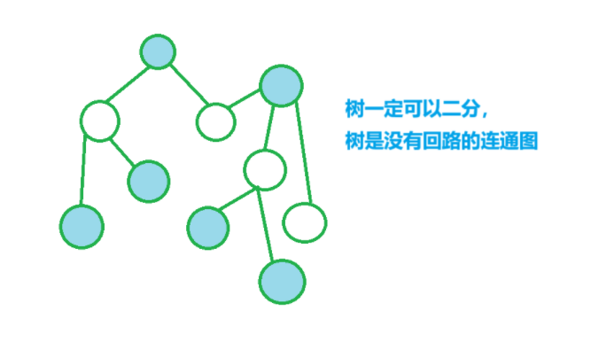

[RC-u5 树与二分图 - 2022 RoboCom 世界机器人开发者大赛-本科组（省赛） (pintia.cn)](https://pintia.cn/problem-sets/1546071017977008128/exam/problems/type/7?problemSetProblemId=1546071170892947459&page=0)


给出一棵树的n-1条边，

问添加任一条边使得当前树仍为二分图有多少种方案


分析：


用染色法dfs标记每个点的颜色，

cnt记录有多少点被染色，

总的可以连线数为$(n-cnt)\cdot cnt$

可额外添加的边数为$(n-cnt)\cdot cnt-(n-1)$


```cpp
void dfs(int u,bool color)
{
    st[u]=true;

    if(color)cnt++;

    int v;

    for(int i=h[u];~i;i=ne[i])
    {
        v=e[i];

        if(!st[v])dfs(v,!color);
    }
}

void add(int a,int b)
{
    e[idx]=b,ne[idx]=h[a],h[a]=idx++;
}

void solve(){
    cin>>n;

    for(int i=0;i<=n;i++)h[i]=-1;

    for(int i=1;i<=n-1;i++)
    {
        cin>>a>>b; add(a,b); add(b,a);
    }

    dfs(1,true);

    ans=1ll*(n-cnt)*cnt-(n-1);

    cout<<ans;
}
```



```cpp
#include <bits/stdc++.h>

using namespace std;

typedef long long ll;

const int N = 2e6 + 10;

ll ans;

int n, a, b;
int h[N], e[N], ne[N], idx;

int cnt;
bool st[N];

void add(int a, int b)
{
	e[idx] = b, ne[idx] = h[a], h[a] = idx++;
}

void dfs(int u, bool color)
{
	st[u] = true;

	if (color)cnt++;	// 记录红色的有多少个端点

	int v;

	for (int i = h[u]; ~i; i = ne[i])
	{
		v = e[i];

		if (!st[v])  //  同一个线段上的两个端点颜色不同
		{
			dfs(v, !color);
		}
	}
}

int main()
{
	cin.tie(0);

	cin.sync_with_stdio(false);

	cin >> n;

	for (int i = 1; i <= n; i++)h[i] = -1;

	for (int i = 1; i <= n - 1; i++)
	{
		cin >> a >> b;

		add(a, b), add(b, a);	// 用邻接表无向图存树
	}

	dfs(1, 1);

	ans = 1ll * (n - cnt) * cnt - (n - 1);  
	
	// 每两个颜色各异的点都能连边，减去树中原有的n-1条边

	cout << ans << endl;

	return 0;
}
```
