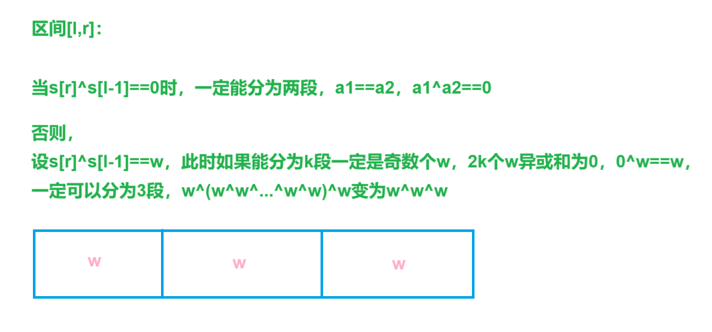

## 位运算前缀和：

`s[r]^s[l-1]==0`时，`[l,r]`区间内一定能分成2块异或和为w，`w^w==0`

`s[r]^s[l-1]==w`时，`[l,r]`区间内一定能分成3块异或和为w，`w^w^w==w`


[Problem - 1968F - Codeforces](https://codeforces.com/problemset/problem/1968/F)


给定一个大小为n的数组a，

给定q和询问，每次询问给定一个区间`[l,r]`，`l<r`，

问当前区间能否分成k个异或前缀和相同的段


分析：


如果当前满足`s[r]^s[l-1]==0`，

由于`l<r`，因此一定能分成两段`w^w==0`


否则`s[r]^s[l-1]==w`，如果k存在，能找到三段满足`w^w^w==w`，

设三段区间分别为`[l,x-1],[x,y],[y+1,r]`，`s[y]^s[l-1]==0,s[r]^s[x-1]==0`


```cpp
void solve()
{
    cin>>n>>q;

    for(int i=1;i<=n;i++)
    {
        cin>>a[i];

        s[i]=s[i-1]^a[i];

        mp[s[i]].emplace_back(i);
    }

    while(q--)
    {
        cin>>l>>r;

        if((s[r]^s[l-1])==0)puts("YES");   // ^优先级低于==
        else
        {
            auto it=lower_bound(alls(mp[s[r]]),l);

            if(it==mp[r].end())puts("NO");
            else
            {
                x=*it+1;

                auto itt=lower_bound(alls(mp[s[l-1]]),x);

                if(itt==mp[s[l-1]].end())puts("NO");
                else
                {
                    y=*itt;

                    if(y<r&&x<r)puts("YES"); else puts("NO");
                }
            }
        }
    }

    puts("");
}
```




```cpp
#include <bits/stdc++.h>

#define alls(x) x.begin(),x.end()

using namespace std;

const int N = 2e5 + 10;

int n, q;
int l, r;
int x, y;
int a[N], s[N];
map<int, vector<int>>mp;

void solve()
{
	cin >> n >> q;

	mp.clear();

	for (int i = 1; i <= n; i++)
	{
		cin >> a[i];

		s[i] = s[i - 1] ^ a[i];

		mp[s[i]].emplace_back(i);
	}

	//for (int i = 1; i <= n; i++)cout << s[i] << endl;

	while (q--)
	{
		cin >> l >> r;

		if ((s[r] ^ s[l - 1]) == 0)  // ^ 优先级比 == 低，s[r]^s[l-1]==0就是s[r]^(s[l-1]==0)
		{
			puts("YES");
		}
		else
		{
			auto it = lower_bound(alls(mp[s[r]]), l);

			if (it == mp[s[r]].end())
			{
				puts("NO");
			}
			else
			{
				x = (*it) + 1;

				auto itt = lower_bound(alls(mp[s[l - 1]]), x);

				if (itt == mp[s[l - 1]].end())
				{
					puts("NO");
				}
				else
				{
					y = *itt;

					if (x < r && y < r)puts("YES");
					else puts("NO");
				}
			}
		}
	}

	puts("");
}

int main()
{
	int t;

	cin >> t;

	while (t--)solve();

	return 0;
}
```
