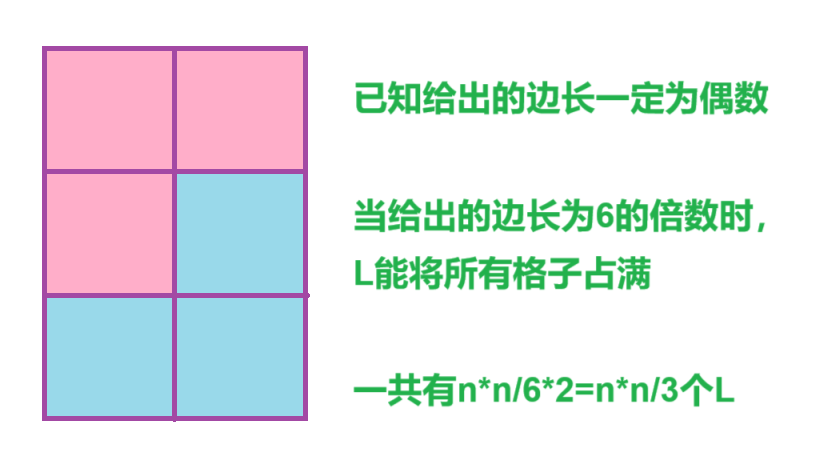
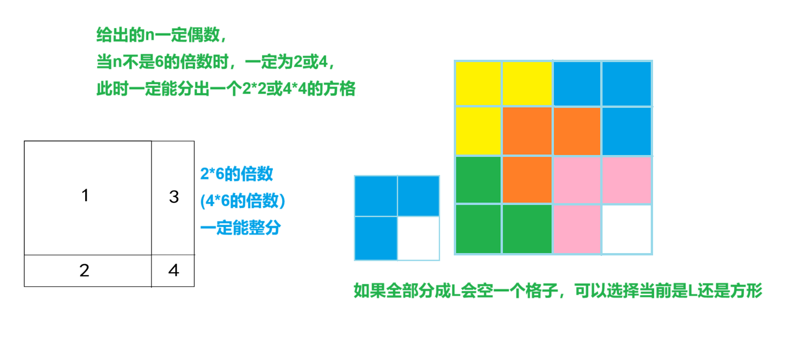
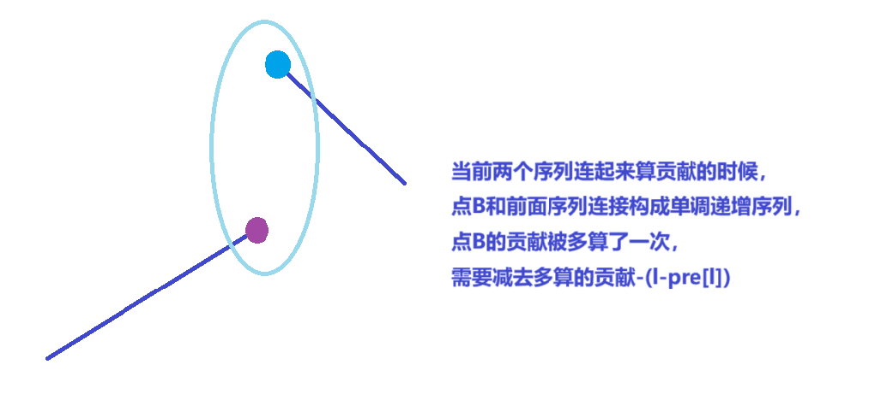
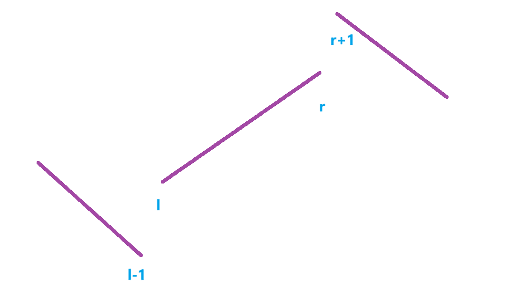
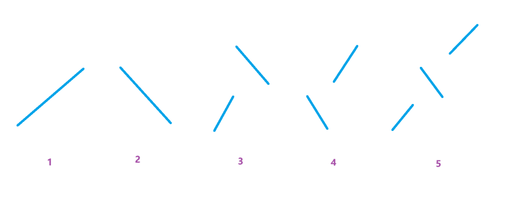

[Problem - B - Codeforces](https://codeforces.com/contest/2022/problem/B)


分析：


将不同颜色的车子间隔排成一列

1. 当x>=颜色总数，次数为max{a[i]}

2. 否则，当x<颜色总数，次数为(sum+x-1)/x
   
   > 每一段x都是不同颜色，总段数为(sum+x-1)/x


> 在第一种情况：max{a[i]}>(sum+x-1)/x
> 
> 第二种情况：(sum+x-1)/x>max{a[i]}
> 
> 两种情况都是max( max{a[i]} , (sum+x-1)/x )


```cpp
void solve()
{
    cin>>n>>x;

    maxx=0;

    sum=0;    // ll 10^{14}

    for(int i=1;i<=n;i++)cin>>a[i];

    for(int i=1;i<=n;i++)
    {
        maxx=max(maxx,a[i]);

        sum+=a[i];
    }

    cout<<max(maxx,(sum+x-1)/x)<<endl;
}
```


[E-小红的矩阵划分_牛客周赛 Round 40 (nowcoder.com)](https://ac.nowcoder.com/acm/contest/80259/E)


分析：


n为偶数


1. n为6的倍数时，能选择全部分为L或者全部分为2*2，所有方格都能被用完

2. n不为6的倍数时候，一定能被分为`6k+2`或`6k+4`，此时`2*6k`或`4*6k`一定能全为L或全为2*2
   剩余的`2*2`和`4*4`一定会空出一个格子，可以把多余的一角选择变成L还是变成2*2





```cpp
void solve()
{
    cin>>n>>x>>y;

    if(n%3==0)
    {
        ans=max(n*n/3*x,n*n/4*y);
    }
    else
    {
        ans=max(max(n*n/3*x-x+y,n*n/3*x),n*n/4*y);
    }

    cout<<ans<<endl;
}
```


```cpp
#include <bits/stdc++.h>

using namespace std;

typedef long long ll;

ll n, x, y;
ll ans;

void solve()
{
    cin >> n >> x >> y;

    if (n % 6 == 0)
    {
        ans = max(n * n / 3 * x, n * n / 4 * y);
    }
    else
    {
        ans = max(max(n * n / 3 * x, n * n / 3 * x - x + y), n * n / 4 * y);
    }

    cout << ans << endl;
}

int main()
{
    solve();

    return 0;
}
```


[G-小红不想做平衡树_牛客周赛 Round 39 (nowcoder.com)](https://ac.nowcoder.com/acm/contest/78904/G)


问有多少个子区间满足将一个子区间翻转后升序


分析：


发现单调下降的区间翻转一次就能单调上升，

一个区间内最多只能有一个下降区间


1. 单调上升

2. 单调下降

3. 上升+下降

4. 下降+上升

5. 上升+下降+上升
   
   

当进行连接的时候，考虑第一个连接点，

如：下降+上升，

此时下降的最后一个点和后面上升的所有点构成一个上升序列，此时和情况1重复，

在考虑情况3和情况4时，要从区间`[l,r]`第二个点开始考虑


```cpp
void calc(int l,int r)
{
    ll len=r-l+1;

    ans+=(len-1)*len/2;  // 单调递减所有子区间

    for(int i=l+1;i<=r;i++)  // 递增+递减
    {
        if(a[i]<=a[l-1]||l==1)break;
        else ans+=(l-pre[l]); // pre[l]~l-1
    }

    for(int i=r-1;i>=l;i--)  // 递减+递增
    {
        if(a[i]>=a[r+1]||r==n)break;
        else ans+=(suf[r]-r);  // r+1~suf[r]
    }

    if(l>1&&r<n&&a[l-1]<a[r]&&a[r+1]>a[l])ans+=(suf[r]-r)*(l-pre[l]);  // 递增+递减+递增
}

void solve()
{
    cin>>n;

    for(int i=1;i<=n;i++)cin>>a[i];

    for(int i=1;i<=n;i++)  // 以i为末尾的单调上升
    {
        if(i>1&&a[i]>a[i-1])pre[i]=pre[i-1]; else pre[i]=i;

        ans+=i-pre[i]+1;  // 递增
    }

    for(int i=n;i>=1;i--)  // 以i为开头的单调上升
    {
        if(i<n&&a[i]<a[i+1])suf[i]=suf[i+1]; else suf[i]=i;
    }

    int j;

    for(int i=1;i<=n;i++)
    {
        j=i;

        while(j<n&&a[j]>a[j+1])j++;

        if(j>i)calc(i,j);

        i=j;
    }

    cout<<ans<<endl;
}
```







```cpp
#include <bits/stdc++.h>
#include <functional>

#define alls(a) a.begin(),a.end()
#define emb emplace_back
#define pub push_back
#define pob pop_back
#define puf push_front
#define pof pop_front
#define fi first
#define se second
#define No puts("No")
#define Yes puts("Yes")
#define NO puts("NO")
#define YES puts("YES")

using namespace std;
typedef long long ll;
//typedef __int128 lll; // G++(32位)不支持
typedef unsigned long long ull;
typedef pair<int, int> pii;

const int N = 2e5 + 10;
const int mo = 1e9 + 7;
const int inf = 2e9 + 10;

int n, a[N];
ll pre[N], suf[N];  // 升序 降序
ll ans;

void calc(int l, int r)
{
    for (int i = l + 1; i <= r; i++)  // 升+降
    {
        if (a[i] <= a[l - 1] || l == 1)break;
        else ans += (l - pre[l]);
    }

    for (int i = r - 1; i >= l; i--)  // 降+升
    {
        if (a[i] >= a[r + 1] || r == n)break;
        else ans += (suf[r] - r);
    }

    ll len = r - l + 1;

    ans += len * (len - 1) / 2;  // 单调降序

    if (l > 1 && r<n && a[r]>a[l - 1] && a[r + 1] > a[l])  // 升+降+升
    {
        ans += (l - pre[l]) * (suf[r] - r);
    }
}

void solve()
{
    cin >> n;

    for (int i = 1; i <= n; i++)cin >> a[i];

    for (int i = 1; i <= n; i++)
    {
        if (i > 1 && a[i] > a[i - 1])pre[i] = pre[i - 1];
        else pre[i] = i;

        // 固定当前端点往前挑区间起始点

        ans += i - pre[i] + 1;  // 单调升序
    }

    for (int i = n; i >= 1; i--)
    {
        if (i<n && a[i + 1]>a[i])suf[i] = suf[i + 1];
        else suf[i] = i;
    }

    int j;

    for (int i = 1; i < n; i++)
    {
        j = i;

        while (j < n && a[j] > a[j + 1])j++;

        if (j > i)calc(i, j);  // 降序

        i = j;
    }

    cout << ans << endl;
}

int main()
{
    int t;

    //cin >> t;

    t = 1;

    while (t--)solve();

    return 0;
}
```
