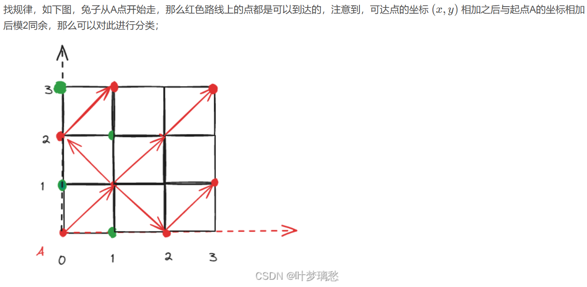
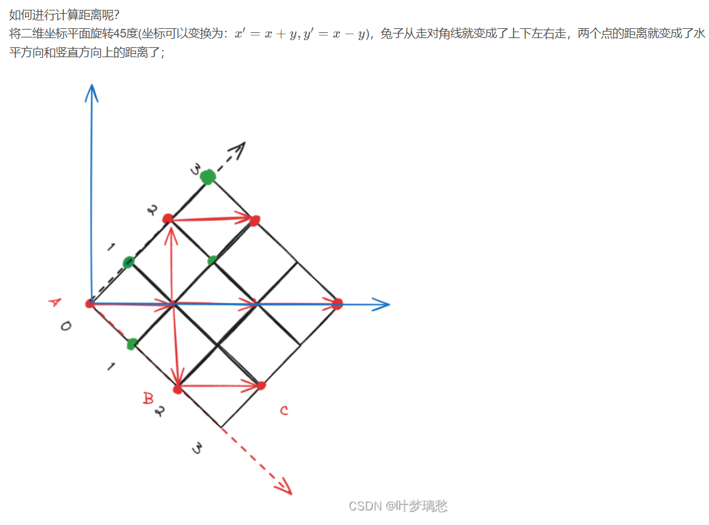

[E - Jump Distance Sum (atcoder.jp)](https://atcoder.jp/contests/abc351/tasks/abc351_e)


分析：


能到达的点`x+y`奇偶性相同，

沿45度方向转之后，映射到`xx=x+y,yy=x-y`，此时每走一步`xx/yy  +2/-2`

按`xx`和`yy`奇偶性归类，将xx，yy放入vector数组中


当前位置x到先前所有x的距离和为`k*x-s1`，y同理，

一步走两个单位，`ans/=2`即为最终答案


```cpp
void solve()
{
    cin>>n;

    for(int i=1;i<=n;i++)
    {
        cin>>x[i]>>y[i];

        xx[(x[i]+y[i])%2][abs(x[i]-y[i])%2].push_back(x[i]+y[i]);
        yy[(x[i]+y[i])%2][abs(x[i]-y[i])%2].push_back(x[i]-y[i]);
    }

    for(int i=0;i<2;i++)
    {
        for(int j=0;j<2;j++)
        {
            if(xx[i][j].empty())continue;

            sort(alls(xx[i][j]));
            sort(alls(yy[i][j]));

            s1=xx[i][j][0],s2=yy[i][j][0];

            for(int k=1;k<xx[i][j].size();k++)
            {
                ans+=k*xx[i][j][k]-s1; s1+=xx[i][j][k];
            }

            for(int k=1;k<yy[i][j].size();k++)
            {
                ans+=k*yy[i][j][k]-s1; s2+=yy[i][j][k];
            }
        }
    }

    cout<<ans/2<<endl;
}
```





```cpp
#include <bits/stdc++.h>
#include <functional>

#define alls(a) a.begin(),a.end()
#define emb emplace_back
#define pub push_back
#define pob pop_back
#define puf push_front
#define pof pop_front
#define fi first
#define se second
#define No puts("No")
#define Yes puts("Yes")
#define NO puts("NO")
#define YES puts("YES")

using namespace std;
typedef long long ll;
//typedef __int128 lll; // G++(32位)不支持
typedef unsigned long long ull;
typedef pair<int, int> pii;

const int N = 2e5 + 10;
const int mo = 1e9 + 7;
const int inf = 2e9 + 10;

int n, m;
int x[N], y[N];
ll ans;
vector<int>xx[2][2], yy[2][2];

void solve()
{
	cin >> n;

	for (int i = 1; i <= n; i++)
	{
		cin >> x[i] >> y[i];

		// x，y相同奇偶性的才能相互到达

		xx[(x[i] + y[i]) % 2][abs(x[i] - y[i]) % 2].emplace_back(x[i] + y[i]);  // 存放映射后的xx

		yy[(x[i] + y[i]) % 2][abs(x[i] - y[i]) % 2].emplace_back(x[i] - y[i]);  // 映射后的yy
	}

	ll s1, s2;

	for (int i = 0; i < 2; i++)
	{
		for (int j = 0; j < 2; j++)
		{
			n = xx[i][j].size(), m = yy[i][j].size();

			if (!n)continue;

			sort(alls(xx[i][j]));
			sort(alls(yy[i][j]));

			s1 = xx[i][j][0], s2 = yy[i][j][0];

			for (int k = 1; k < n; k++)
			{
				ans += 1ll * k * xx[i][j][k] - s1;  // 所有之前的点跳到现在的距离和

				s1 += xx[i][j][k];
			}

			for (int k = 1; k < m; k++)
			{
				ans += 1ll * k * yy[i][j][k] - s2;

				s2 += yy[i][j][k];
			}
		}
	}

	cout << ans / 2 << endl;  // 每次跳都能跳两个单位
}

int main()
{
	int t;

	//cin >> t;

	t = 1;

	while (t--)solve();

	return 0;
}
```
