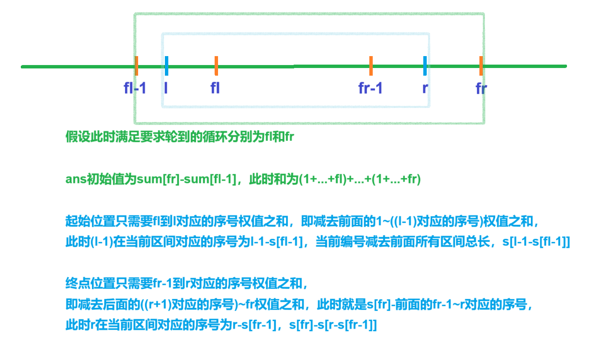
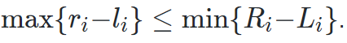
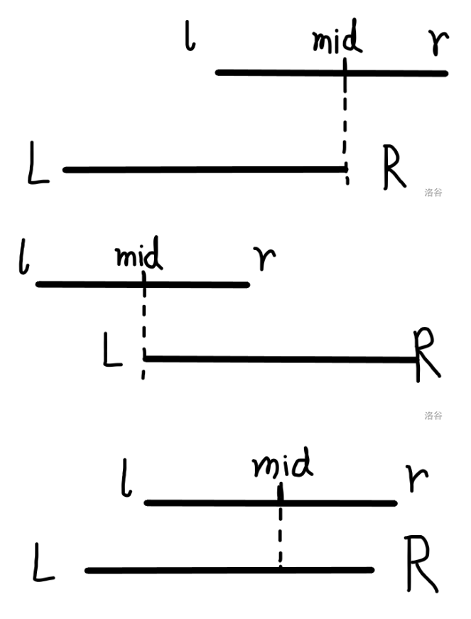
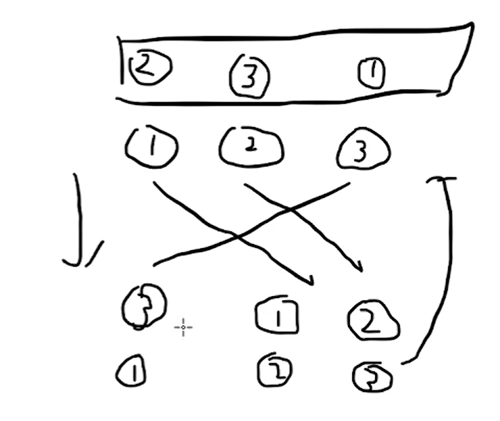
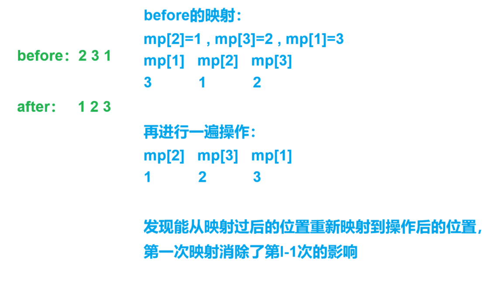

[99. 激光炸弹 - AcWing题库](https://www.acwing.com/problem/content/101/)


求最多能炸掉地图上价值多少的目标


分析：


r有可能很大，将它限制在x，y范围内，即5001范围内


```cpp
void add()
{
    for(int i=1;i<=n;i++)
    {
        cin>>x>>y>>w; s[x][y]+=w;  // 前缀和一开始操作时只需要对当前点+=w
    }

    for(int i=1;i<=5001;i++)
    {
        for(int j=1;j<=5001;j++)
        {
            s[i][j]+=s[i-1][j]+s[i][j-1]-s[i-1][j-1]; // 第二次操作时才需要这样求和
        }
    }
}
```


```cpp
#include <bits/stdc++.h>

using namespace std;

typedef long long ll;

const int N = 5e3 + 10;

int ans;
int n, r;
int x, y, w;
int s[N][N];

void solve()
{
	cin >> n >> r;

	for (int i = 1; i <= n; i++)
	{
		cin >> x >> y >> w;

		s[x + 1][y + 1] += w;
	}

	for (int i = 1; i <= 5001; i++)
	{
		for (int j = 1; j <= 5001; j++)
		{
			s[i][j] += s[i - 1][j] + s[i][j - 1] - s[i - 1][j - 1];
		}
	}

	ans = -1;

	if (r >= 5001)cout << s[5001][5001] << endl;
	else
	{
		for (int i = 0; i <= 5001 - r; i++)
		{
			for (int j = 0; j <= 5001 - r; j++)
			{
				ans = max(ans, s[i + r][j + r] - s[i + r][j] - s[i][j + r] + s[i][j]);
			}
		}

		cout << ans << endl;
	}
}

int main()
{
	solve();

	return 0;
}
```


[0123 - 蓝桥云课 (lanqiao.cn)](https://www.lanqiao.cn/problems/1591/learning/)


T 行，每行包含一组询问，

其中第 i 行包含两个整数 li​ 和 ri​，表示询问数列中第 li​ 个数到第 ri​ 个数的和。


分析：


用sum数组统计到第i个循环为止累计一共有多少数字

用s数组统计当前第i个循环区间权值总和为多少


先用lower_bound确定fl和fr，

区间$fl\sim fr$能将需要的所有区间包含，

之后再减去开头和结尾多出的部分，即$f_l-1\sim idx_{l-1}$和$idx_{r}\sim fr$的区间和


$idx_{l-1}=s[l-1-s[fl-1]]$

$idx_{r}=s[r-s[f_{r-1}]]$


这里范围为：$\dfrac {n(n+1)}2>10^{12}$，

得：$n=1.5\times 10^6$



```cpp
void ini()
{
    for(int i=1;i<N-5;i++)
    {
        s[i]=s[i-1]+i; sum[i]=sum[i-1]+s[i];
    }
}

void solve()
{
    cin>>l>>r;

    fl=lower_bound(s+1,s+N-5,l)-s; 
    fr=lower_bound(s+1,s+N-5,r)-s; 

    ans=sum[fr]-sum[fl-1];

    ans-=s[l-1-s[fl-1]];

    ans-=s[fr]-s[r-s[fr-1]];

    cout<<ans<<endl;
}
```


```cpp
#include <bits/stdc++.h>

using namespace std;

const int N = 15e5 + 10;

typedef long long ll;

ll l, r;
ll s[N], sum[N];
ll fl, fr, ans;

void ini()
{
    for (int i = 1; i < N; i++)
    {
        s[i] = s[i - 1] + i;

        sum[i] = sum[i - 1] + s[i];
    }
}

void solve()
{
    cin >> l >> r;

    fl = lower_bound(s + 1, s + N, l) - s;

    fr = lower_bound(s + 1, s + N, r) - s;

    ans = sum[fr] - sum[fl - 1];

    ans -= s[l - 1 - s[fl - 1]];

    ans -= s[fr] - s[r - s[fr - 1]];

    cout << ans << endl;
}

int main()
{
    ini();

    int t;

    cin >> t;

    while (t--)solve();

    return 0;
}
```


[0抓娃娃 - 蓝桥云课 (lanqiao.cn)](https://www.lanqiao.cn/problems/17110/learning/)


分析：


由于，

不能包含一半的情况只有`[l,r]`区间中点在区间外，此时区间内少于一半


此时(l+r)/2可能为小数，将l，r都扩大两倍消除小数点，

`s[l+r]++`，将中点加入区间内


```cpp
void solve()
{
    cin>>n>>m;

    for(int i=1;i<=n;i++)cin>>l>>r,s[l+r]++;

    for(int i=1;i<N;i++)s[i]+=s[i-1];

    for(int i=1;i<=m;i++)
    {
        cin>>l>>r;

        l*=2,r*=2;

        cout<<s[r]-s[l-1]<<endl;
    }
}
```



```cpp
#include <bits/stdc++.h>

using namespace std;

const int N = 2e6 + 10;

int n, m;
int l, r,  s[N];

int main()
{
    cin >> n >> m;

    for (int i = 1; i <= n; i++)
    {
        cin >> l >> r;

        s[l + r]++;
    }

    for (int i = 1; i < N; i++)s[i] += s[i - 1];

    for (int i = 1; i <= m; i++)
    {
        cin >> l >> r;

        r *= 2, l *= 2;

        cout << s[r] - s[l - 1] << endl;
    }

    return 0;
}
```


## 前缀和的意义：

s[r]-s[l-1]，消除前l-1个操作，得到l~r操作的和


[F-牛牛的猜球游戏_牛客竞赛数据结构专题班前缀和练习题 (nowcoder.com)](https://ac.nowcoder.com/acm/contest/19483/F)


分析：


用`f[i][j]`表示第`i`次操作，得到第`j`个球的编号


```cpp
void solve()
{
    cin>>n>>m;

    for(int i=0;i<10;i++)a[0][i]=i;

    for(int i=1;i<=n;i++)
    {
        for(int j=0;j<10;j++)a[i][j]=a[i-1][j];  // 存放正常操作状态下的局面

        cin>>u>>v;

        swap(a[i][u],a[i][v]);
    }

    for(int i=1;i<=m;i++)
    {
        cin>>l>>r;

        for(int i=0;i<10;i++)ans[a[l-1][i]]=i;  // 逆映射，消除前l-1次操作的影响

        for(int i=0;i<10;i++)cout<<ans[a[r][i]]<<' ';   // 在消除影响状态下进行操作

        puts("");
    }
}
```





```cpp
#include <bits/stdc++.h>

using namespace std;

const int N = 20, M = 1e5 + 10;

int n, m;
int u, v, l, r;
int a[M][N], ans[N];

int main()
{
    cin >> n >> m;

    for (int i = 0; i < 10; i++)a[0][i] = i;

    for (int i = 1; i <= n; i++)
    {
        for (int j = 0; j < 10; j++)a[i][j] = a[i - 1][j];

        cin >> u >> v;

        swap(a[i][u], a[i][v]);
    }

    // 每一轮通过数组ans将前l-1轮交换过的数字换回来
    // 之后通过原数组的映射关系输出答案ans

    while (m--)
    {
        cin >> l >> r;

        for (int i = 0; i < 10; i++)ans[a[l - 1][i]] = i;  // 消除前i-1次交换的影响

        for (int i = 0; i < 10; i++)cout << ans[a[r][i]] << ' ';  // 按照当前交换次序输出仅进行操作l~r之后的数组

        puts("");
    }

    return 0;
}
```


[99. 激光炸弹 - AcWing题库](https://www.acwing.com/problem/content/101/)


分析：


r不能超过数组范围，rr和cc两个端点需要大于边长r，


注意当前x和y范围包含$0$，前缀和从下标1开始，`x++,y++`


```cpp
void solve()
{
    cin>>n>>r;

    r=min(r,5001);  // 边长不能超过数组最大范围

    rr=cc=r;  // 端点必须超过边长

    for(int i=1;i<=n;i++)
    {
        cin>>x>>y>>w;

        x++,y++; rr=max(rr,x),cc=max(cc,y);  // 下标从1开始

        s[x][y]+=w;
    }

    for(int i=1;i<=rr;i++)
    {
        for(int j=1;j<=cc;j++)
        {
            s[i][j]+=s[i-1][j]+s[i][j-1]-s[i-1][j-1];
        }    
    }

    for(int i=rr;i>=r;i--)
    {
        for(int j=cc;j>=r;j--)
        {
            ans=max(ans,s[i][j]-s[i-r][j]-s[i][j-r]+s[i-r][j-r]);
        }
    }

    cout<<ans<<endl;
}
```


```cpp
#include <bits/stdc++.h>
#include <functional>

#define alls(a) a.begin(),a.end()
#define emb emplace_back
#define pub push_back
#define pob pop_back
#define puf push_front
#define pof pop_front
#define fi first
#define se second
#define No puts("No")
#define Yes puts("Yes")
#define NO puts("NO")
#define YES puts("YES")

using namespace std;
typedef long long ll;
//typedef __int128 lll; // G++(32位)不支持
typedef unsigned long long ull;
typedef pair<int, int> pii;

const int N = 5e3 + 10;
const int mo = 1e9 + 7;
const int inf = 2e9 + 10;

int n, r;
int rr, cc;
int s[N][N], ans;
int x, y, w;

void solve()
{
    cin >> n >> r;

    r = min(r, 5001);  // 范围不能超过数组边界

    rr = cc = r;  // 端点不能小于边长

    for (int i = 1; i <= n; i++)
    {
        cin >> x >> y >> w;

        x++, y++;

        rr = max(rr, x), cc = max(cc, y);

        s[x][y] += w;
    }

    for (int i = 1; i <= rr; i++)
    {
        for (int j = 1; j <= cc; j++)
        {
            s[i][j] += s[i - 1][j] + s[i][j - 1] - s[i - 1][j - 1];
        }
    }

    ans = -1;

    for (int i = r; i <= rr; i++)
    {
        for (int j = r; j <= cc; j++)
        {
            ans = max(ans, s[i][j] - s[i - r][j] - s[i][j - r] + s[i - r][j - r]);
        }
    }

    cout << ans << endl;
}

int main()
{
    int t;

    //cin >> t;

    t = 1;

    while (t--)solve();

    return 0;
}
```
