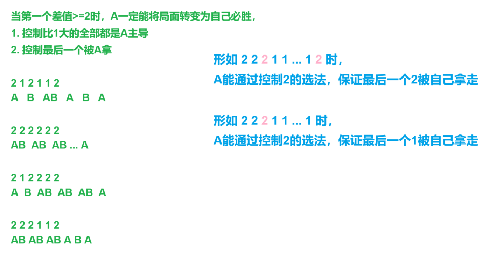

[Problem - C - Codeforces](https://codeforces.com/contest/1966/problem/C)


每次都能挑<=所有石头堆中最小个数的数目k，k>=1，

从所有剩余堆中拿走k个石子，无法操作时失败，

问最终A和B谁会赢


分析：


k>=1，当x>=2时，当前选手一定能选择：

1. 全拿 

2. 自己操作一次，让k==1对方操作一次


当`v[0]>=2`时，A一定赢，

否则遇到1当前选手就一直只能拿1，第一个遇到非1的人掌握主动权/拿到最后一个1的人赢


```cpp
void solve()
{
    cin>>n;

    for(int i=1;i<=n;i++)cin>>a[i],st.insert(a[i]);

    pre=0;

    for(auto u:st)
    {
        v.push_back(u-pre);  pre=u;
    }

    if(v[0]>=2)puts("Alice");
    else
    {
        for(int i=0;i<v.size();i++)
        {
            if(v[i]!=1)
            {
                if((i+1)%2)puts("Alice"); else puts("Bob");

                return;
            }
        }

        if(v.size()%2)puts("Alice"); else puts("Bob");
    }
}
```



```cpp
#include <bits/stdc++.h>
#include <functional>

#define alls(a) a.begin(),a.end()
#define emb emplace_back
#define pub push_back
#define pob pop_back
#define puf push_front
#define pof pop_front
#define fi first
#define se second
#define No puts("No")
#define Yes puts("Yes")
#define NO puts("NO")
#define YES puts("YES")

using namespace std;
typedef long long ll;
//typedef __int128 lll; // G++(32位)不支持
typedef unsigned long long ull;
typedef pair<int, int> pii;

const int N = 2e5 + 10;
const int mo = 1e9 + 7;
const int inf = 2e9 + 10;

int n, a[N];

void solve()
{
	set<int>st;
	vector<int>v;

	cin >> n;

	for (int i = 1; i <= n; i++)
	{
		cin >> a[i];

		st.insert(a[i]);
	}

	int pre = 0;

	for (auto u : st)
	{
		v.push_back(u - pre);

		pre = u;
	}

	if (v[0] >= 2)puts("Alice");
	else
	{
		for (int i = 0; i < v.size(); i++)
		{
			if (v[i] != 1)
			{
				if ((i + 1) % 2)puts("Alice");
				else puts("Bob");

				return;
			}
		}

		if (v.size() % 2)puts("Alice");
		else puts("Bob");
	}
}

int main()
{
	int t;

	cin >> t;

	//t = 1;

	while (t--)solve();

	return 0;
}
```


[D-迷途之家的大贤者_牛客周赛 Round 37 (nowcoder.com)](https://ac.nowcoder.com/acm/contest/77231/D)


分析：


最终无法移动的局面一定是只剩一个字符


如果小红想要$2\sim n-1$第$i$个位置的字符，

那么一定只能分两次取，一次取走$2\sim i-1$，一次取$i+1\sim n-1$，此时小紫一定能将第$i$个字符取走，

所有$2\sim n-1$的字符都没可能被小红取走，

因此小红只能一开始就选择$s_1$和$s_n$中较大的字符


```cpp
void solve()
{
    cin>>n>>s;

    cout<<max(s[0],s[n-1])<<endl;
}
```


```cpp
#include <bits/stdc++.h>
#include <functional>

#define alls(a) a.begin(),a.end()
#define emb emplace_back
#define pub push_back
#define pob pop_back
#define puf push_front
#define pof pop_front
#define fi first
#define se second
#define No puts("No")
#define Yes puts("Yes")
#define NO puts("NO")
#define YES puts("YES")

using namespace std;
typedef long long ll;
//typedef __int128 lll; // G++(32位)不支持
typedef unsigned long long ull;
typedef pair<int, int> pii;

const int N = 2e5 + 10;
const int mo = 1e9 + 7;
const int inf = 2e9 + 10;

int n;
string s;

void solve()
{
    cin >> n >> s;

    cout << max(s.front(), s.back()) << endl;
}

int main()
{
    int t;

    //cin >> t;

    t = 1;

    while (t--)solve();

    return 0;
}
```
