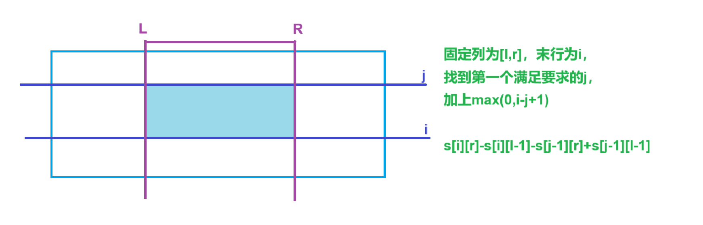

[0合并数列 - 蓝桥云课 (lanqiao.cn)](https://www.lanqiao.cn/problems/17106/learning/)


分析：


双指针，一定是从左往右合并小的追上大的


```cpp
void solve()
{
    cin>>n>>m;

    for(int i=1;i<=n;i++)cin>>a[i];
    for(int i=1;i<=m;i++)cin>>b[i];

    for(int i=1,j=1;i<=n&&j<=m;i++,j++)
    {
        if(a[i]==b[j])continue;

        while(i<=n&&j<=m&&a[i]!=b[j])
        {
            while(i<=n&&a[i]<b[j])
            {
                i++;

                ans++;

                a[i]+=a[i-1];
            }

            while(j<=m&&a[i]>b[j])
            {
                j++;

                ans++;

                b[j]+=b[j-1];
            }
        }
    }

    cout<<ans<<endl;
}
```


```cpp
#include <bits/stdc++.h>

using namespace std;

const int N = 1e5 + 10;

int n, m;
int ans;
int a[N], b[N];

int main()
{
    cin >> n >> m;

    for (int i = 1; i <= n; i++)cin >> a[i];
    for (int j = 1; j <= m; j++)cin >> b[j];

    for (int i = 1, j = 1; i <= n && j <= m; i++, j++)
    {
        if (a[i] == b[j])continue;

        while (i <= n && j <= m && a[i] != b[j])
        {
            while (a[i] < b[j])
            {
                i++;

                a[i] += a[i - 1];

                ans++;
            }

            while (a[i] > b[j])
            {
                j++;

                b[j] += b[j - 1];

                ans++;
            }

            //cout << a[i] << ' ' << b[j] << endl;
        }
    }

    cout << ans << endl;

    return 0;
}
```


[P2036 - [蓝桥杯2022初赛] 统计子矩阵 - New Online Judge (ecustacm.cn)](http://oj.ecustacm.cn/problem.php?id=2036)


分析：


固定列范围`[l,r]`，

枚举末行`i`，从前往后找到满足要求的起始行`j`，

`[j,i]`都满足要求，加上当前贡献`max(0,i-j+1)`


```cpp
void solve()
{
    cin>>n>>m>>k;

    for(int i=1;i<=n;i++)
    {
        for(int j=1;j<=m;j++)
        {
            cin>>s[i][j]; s[i][j]+=s[i-1][j]+s[i][j-1]-s[i-1][j-1];
        }
    }

    for(int l=1;l<=m;l++)
    {
        for(int r=l;r<=m;r++)
        {
            for(int i=1,j=1;i<=n;i++)
            {
                while(j<=i&&s[i][r]-s[j-1][r]-s[i][l-1]+s[j-1][l-1])j++;

                ans+=max(0,i-j+1);
            }
        }
    }

    cout<<ans<<endl;
}
```



```cpp
#include <bits/stdc++.h>

using namespace std;

typedef long long ll;

const int N = 510;

int n, m;
ll s[N][N];
ll k, ans;

int main()
{
    cin >> n >> m >> k;

    for (int i = 1; i <= n; i++)
    {
        for (int j = 1; j <= m; j++)
        {
            cin >> s[i][j];

            s[i][j] += s[i - 1][j] + s[i][j - 1] - s[i - 1][j - 1];
        }
    }

    for (int l = 1; l <= m; l++)  // l，r固定列范围
    {
        for (int r = l; r <= m; r++)
        {
            for (int i = 1, j = 1; i <= n; i++) // i固定末行，用j找到第一个<=i满足要求的位置
            {
                while (j <= i && s[i][r] - s[i][l - 1] - s[j - 1][r] + s[j - 1][l - 1] > k)j++;

                ans += max(0, i - j + 1);
            }
        }
    }

    cout << ans << endl;

    return 0;
}
```


[4405. 统计子矩阵 - AcWing题库](https://www.acwing.com/problem/content/4408/)


给定一个矩阵，

统计有多少个子矩阵满足矩阵中所有数的和不超过k


分析：


用数组s统计当前列的前缀和，

枚举行区间`[i,j]`，查找符合要求的列范围


```cpp
void solve()
{
    cin>>n>>m>>k;

    for(int i=1;i<=n;i++)for(int j=1;j<=m;j++)cin>>a[i][j],s[i][j]+=s[i-1][j];

    for(int i=1;i<=n;i++)  // 枚举结束行
    {
        for(int j=1;j<=i;j++)  // 枚举开始行
        {
            for(int sum=0,l=1,r=1;r<=m;r++)  // 固定末尾列，求解合法初始列
            {
                sum+=s[i][r]-s[j-1][r];

                while(l<=r&&sum>k)  // 将不合法的值弹出队列
                {
                    sum-=s[i][l]-s[j-1][l]; l++;
                }

                ans+=r-l+1;
            }
        }
    }

    cout<<ans<<endl;
}
```


```cpp
#include <bits/stdc++.h>
#include <functional>

#define alls(a) a.begin(),a.end()
#define emb emplace_back
#define pub push_back
#define pob pop_back
#define puf push_front
#define pof pop_front
#define fi first
#define se second
#define No puts("No")
#define Yes puts("Yes")
#define NO puts("NO")
#define YES puts("YES")

using namespace std;
typedef long long ll;
//typedef __int128 lll; // G++(32位)不支持
typedef unsigned long long ull;
typedef pair<int, int> pii;

const int N = 510;
const int mo = 1e9 + 7;
const int inf = 2e9 + 10;

int n, m, k;
ll ans;
int a[N][N];
int s[N][N];

void solve()
{
    cin >> n >> m >> k;

    for (int i = 1; i <= n; i++)for (int j = 1; j <= m; j++)cin >> a[i][j];

    for (int i = 1; i <= n; i++)for (int j = 1; j <= m; j++)s[i][j] = s[i - 1][j] + a[i][j];  // 这一列的前缀和

    for (int i = 1; i <= n; i++)
    {
        for (int j = i; j <= n; j++)
        {
            for (int sum = 0, l = 1, r = 1; r <= m; r++)  // 固定行的范围，终末列r，寻找最早满足要求的l，合法起始列为[l,r]
            {
                sum += s[j][r] - s[i - 1][r];

                while (sum > k)
                {
                    sum -= s[j][l] - s[i - 1][l];

                    l++;
                }

                ans += r - l + 1;
            }
        }
    }

    cout << ans << endl;
}

int main()
{
    int t;

    //cin >> t;

    t = 1;

    while (t--)solve();

    return 0;
}
```


[1238. 日志统计 - AcWing题库](https://www.acwing.com/problem/content/1240/)


在区间`[t,t+d)`之间获赞不少于`k`的是热帖，

要求输出所有热帖


分析：


对时间进行排序，

类似滑动窗口将在当前区间时间范围外的点弹出，map计数

判断当前id是否满足要求


```cpp
void solve()
{
    cin>>n>>d>>k;

    for(int i=1;i<=n;i++)cin>>a[i].fi>>a[i].se;

    sort(a+1,a+n+1);

    for(int i=1,j=1;i<=n;i++)  // 保证每个id都能被遍历到
    {
        mp[a[i].se]++;

        while(j<=n&&a[i].fi-a[j].fi>=d)mp[a[j].se]--,j++;

        if(mp[a[i].se]>=k)st[a[i].se]=true;  // 每个都判断一次，在区间内的一定是已经被判断过的
    }

    for(int i=0;i<=1e5;i++)if(st[i])cout<<i<<endl;
}
```


```cpp
#include <bits/stdc++.h>
#include <functional>

#define alls(a) a.begin(),a.end()
#define emb emplace_back
#define pub push_back
#define pob pop_back
#define puf push_front
#define pof pop_front
#define fi first
#define se second
#define No puts("No")
#define Yes puts("Yes")
#define NO puts("NO")
#define YES puts("YES")

using namespace std;
typedef long long ll;
//typedef __int128 lll; // G++(32位)不支持
typedef unsigned long long ull;
typedef pair<int, int> pii;

const int N = 1e5 + 10;
const int mo = 1e9 + 7;
const int inf = 2e9 + 10;

int n, d, k, id;
int cnt[N];
bool st[N];
pii a[N];

void solve()
{
    cin >> n >> d >> k;

    for (int i = 1; i <= n; i++)
    {
        cin >> a[i].first >> a[i].second;
    }

    sort(a + 1, a + n + 1);

    for (int i = 1, j = 1; i <= n; i++)
    {
        id = a[i].second;

        cnt[id]++;

        while (a[i].first - a[j].first >= d)  // [t,t+d) d-1
        {
            cnt[a[j].se]--;

            j++;
        }

        if (cnt[id] >= k)st[id] = true;
    }

    for (int i = 0; i <= 1e5; i++)if (st[i])cout << i << endl;
}

int main()
{
    int t;

    //cin >> t;

    t = 1;

    while (t--)solve();

    return 0;
}
```


[799. 最长连续不重复子序列 - AcWing题库](https://www.acwing.com/problem/content/801/)


分析：


用`i`记录合法区间起始位置，`j`记录合法区间后一个位置，

每次区间有元素重复就`i++`，将重复元素弹出去继续计数


```cpp
void solve()
{
    cin>>n;

    for(int i=1;i<=n;i++)cin>>a[i];

    l=r=1;

    while(1)
    {
        while(r<=n&&!st.count(a[r]))st.insert(a[r]),r++;

        ans=max(ans,r-l);

        if(r==n+1)break;

        st.erase(a[l]);

        l++;
    }

    cout<<ans<<endl;
}
```


```cpp
#include <bits/stdc++.h>
#include <functional>

#define alls(a) a.begin(),a.end()
#define emb emplace_back
#define pub push_back
#define pob pop_back
#define puf push_front
#define pof pop_front
#define fi first
#define se second
#define No puts("No")
#define Yes puts("Yes")
#define NO puts("NO")
#define YES puts("YES")

using namespace std;
typedef long long ll;
//typedef __int128 lll; // G++(32位)不支持
typedef unsigned long long ull;
typedef pair<int, int> pii;

const int N = 1e5 + 10;
const int mo = 1e9 + 7;
const int inf = 2e9 + 10;

int n, ans, a[N];
int l, r;
set<int>st;

void solve()
{
    cin >> n;

    for (int i = 1; i <= n; i++)cin >> a[i];

    l = r = 1;

    while (1)
    {
        while (r <= n && !st.count(a[r]))
        {
            st.insert(a[r]);

            r++;
        }

        ans = max(ans, r - l);

        if (r == n + 1)break;

        st.erase(a[l]);

        l++;
    }

    cout << ans << endl;
}

int main()
{
    int t;

    //cin >> t;

    t = 1;

    while (t--)solve();

    return 0;
}
```
