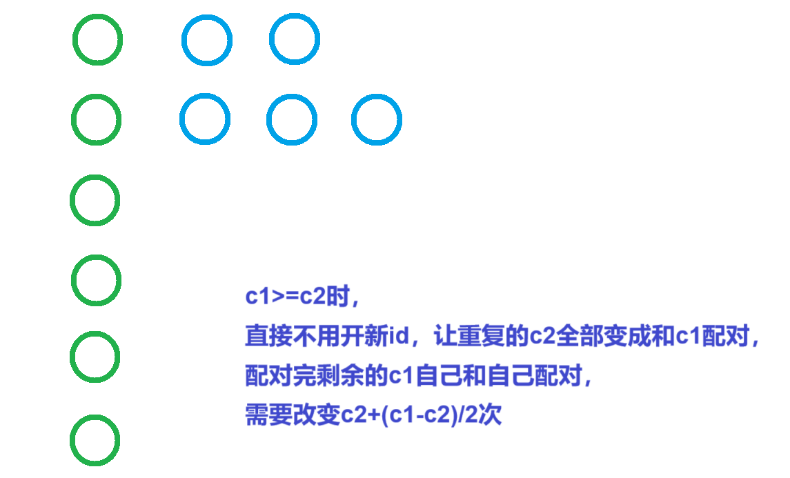
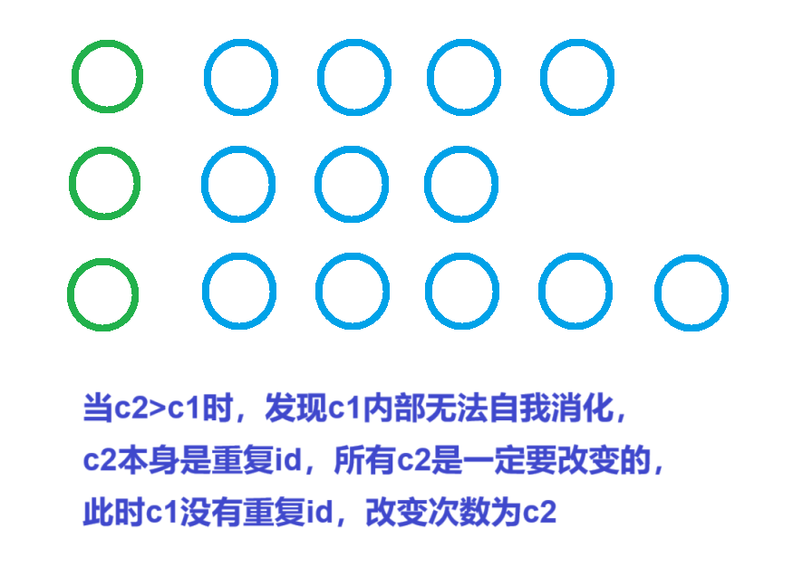

[0班级活动 - 蓝桥云课 (lanqiao.cn)](https://www.lanqiao.cn/problems/17153/learning/)


要求每个id有且仅有两个人，问至少需要修改多少人的id


分析：


用map统计原来每个id对应的人数，

c1记录当前id只有一个人的id数，c2记录当前有多少人和人共用>2个id


要求每个id有且仅有两个人，c1没有重复，c2全是重复，

当c1>=c2时，先让所有c2配c1，c1多的内部消化，`c2+(c1-c2)/2`

否则就让c2配c1，多的c2内部消化，`c2`


```cpp
void solve()
{
    cin>>n;

    for(int i=1;i<=n;i++)cin>>a[i],mp[a[i]]++;

    for(auto u:mp)
    {
        if(u.second==1)c1++; else if(u.second>2)c2+=u.second-1;
    }

    if(c2>c1)cout<<c2<<endl; else cout<<c2+(c1-c2)/2<<endl;
}
```





```cpp
#include <bits/stdc++.h>

using namespace std;

const int N = 1e5 + 10;

int n, a[N];
int c1, c2;
map<int, int>mp;

int main()
{
    cin >> n;

    for (int i = 1; i <= n; i++)
    {
        cin >> a[i];

        mp[a[i]]++;
    }

    for (auto [u, v] : mp)
    {
        if (v == 1)c1++;
        else if (v > 2)c2 += v - 2;
    }

    int ans = 0;

    if (c1 >= c2)
    {
        ans = c2 + (c1 - c2) / 2;
    }
    else ans = c2;

    cout << ans << endl;

    return 0;
}
```
