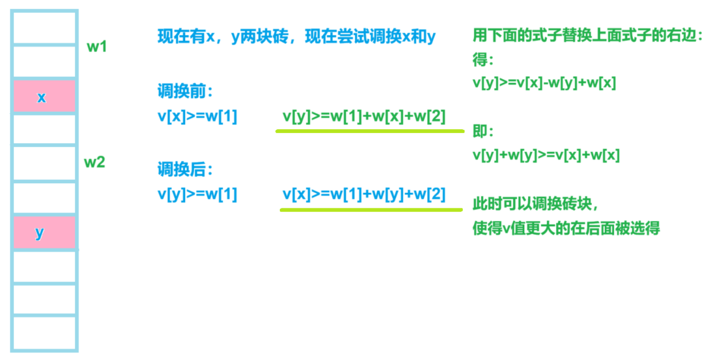

[Problem - A - Codeforces](https://codeforces.com/contest/2021/problem/A)


分析：


假设被除了k次，

第一次被加的数字权值为$\dfrac {a_1} {2^k}$，

第二次被加的数字权值为$\dfrac {a_2} {2^{(k-1)}}$，

第i次被加的数字权值为$\dfrac {a_i} {2^{(k-i+1)}}$


将数字从小到大排序，让最大的数字权值为$\dfrac {maxx} 2$，

最小的数字权值为$\dfrac {maxx} {2^{n}}$，所有数字权值之和最大


```cpp
#include <bits/stdc++.h>
#include <functional>

#define alls(a) a.begin(),a.end()
#define emb emplace_back
#define pub push_back
#define pob pop_back
#define puf push_front
#define pof pop_front
#define fi first
#define se second
#define No puts("No")
#define Yes puts("Yes")
#define NO puts("NO")
#define YES puts("YES")

using namespace std;
typedef long long ll;
//typedef __int128 lll; // G++(32位)不支持
typedef unsigned long long ull;
typedef pair<int, int> pii;

const int N = 2e5 + 10;
const int mo = 1e9 + 7;
const int inf = 2e9 + 10;

int n, a[N];
int cur;

// 数学

void solve()
{
	cin >> n;

	cur = 0;

	for (int i = 1; i <= n; i++)cin >> a[i];

	sort(a + 1, a + n + 1);

	for (int i = 1; i <= n; i++)
	{
		if (i == 1)cur = a[i];
		else
		{
			cur += a[i];

			cur /= 2;
		}
	}

	cout << cur << endl;
}

int main()
{
	int t;

	cin >> t;

	//t = 1;

	while (t--)solve();

	return 0;
}
```


[0搬砖 - 蓝桥云课 (lanqiao.cn)](https://www.lanqiao.cn/problems/2201/learning/)


问按要求堆砖块，总价值最大多少


分析：


`f[i][j]`表示当前遍历到第i块砖为止，当砖块总重量和为j时的最大价值

越靠前的重量越小，越靠后的价值越高



```cpp
struct node
{
    int w,v;

    bool operator<(const node& W)
    {
        if(w+v<W.w+W.v)return true; else return false;
    }
}a[N];

void solve()
{
    cin>>n;

    for(int i=1;i<=n;i++)
    {
        cin>>a[i].w>>a[i].v;
    }

    sort(a+1,a+n+1);

    for(int i=1;i<=n;i++)
    {
        for(int j=0;j<2e4+10;j++)  // 枚举用的所有重量总和
        {
            f[i][j]=f[i-1][j];  // 从上一个状态转移过来

            if(j>=a[i].w&&j-a[i].w<=a[i].v)f[i][j]=max(f[i][j],f[j-a[i].w]+a[i].v);

            // 当前能被接续在内
        }
    }

    for(int i=0;i<2e4+10;i++)ans=max(ans,f[n][i]);  // 更新遍历完后最大值

    cout<<ans<<endl;
}
```


```cpp
#include <bits/stdc++.h>

using namespace std;

const int N = 1e3 + 10, M = 20 * N;

struct node
{
    int w, v;

    bool operator<(const node& W)
    {
        if (w + v < W.w + W.v)return true;
        else return false;
    }
}a[N];

int n, ans;
int f[N][M];

int main()
{
    cin >> n;

    for (int i = 1; i <= n; i++)
    {
        cin >> a[i].w >> a[i].v;
    }

    sort(a + 1, a + n + 1);

    int w, v;

    for (int i = 1; i <= n; i++)
    {
        w = a[i].w, v = a[i].v;

        for (int j = 0; j < M; j++)
        {
            f[i][j] = f[i - 1][j];

            if (v >= j - w && j >= w)f[i][j] = max(f[i][j], f[i - 1][j - w] + v);
        }
    }

    for (int j = 0; j < M; j++)ans = max(ans, f[n][j]);

    cout << ans << endl;

    return 0;
}
```


[P8799 [蓝桥杯 2022 国 B] 齿轮 - 洛谷 | 计算机科学教育新生态 (luogu.com.cn)](https://www.luogu.com.cn/problem/P8799)


给定一组r，

问能否将这些轮子装起来，使得前后轮子转速之比为q


分析：


连接在一起的轮子线速度相同，$ω_1r_1=ω_2r_2$

$\dfrac {ω_j}{ω_i}=\dfrac {r_i}{r_j}$


`set`会超时

`unordered_set`，`count`和`find`平均时间复杂度为`O(n)`


用st记录当前q是否能达到，

stt数组记录当前已经被遍历的齿轮半径r


```cpp
void solve()
{
    cin>>n>>q;

    for(int i=1;i<=n;i++)cin>>r[i];

    sort(r+1,r+n+1);

    unordered_set<int>stt;

    for(int i=1;i<=n;i++)
    {
        for(int j=1;j<=r[i]/j;j++)  // 只枚举较小的因子，O(√n)
        {
            if(r[i]%j==0)
            {
                if(st[j])st[r[i]/j]=true;

                if(st[r[i]/j])st[j]=true;
            }
        }            

        st[r[i]]=true;
    }

    while(q--)
    {
        cin>>x;

        if(st[x])YES; else if(x==1&&n==1)YES; else NO;

        // 当只有一个轮子时，前轮和后轮转速相同，此时st[1]不被记录，需要特判
    }
}
```


```cpp
#include <bits/stdc++.h>

using namespace std;

const int N = 2e5 + 10;

int n, q;
int x, r[N];
bool st[N];
unordered_set<int>stt;

void solve()
{
    cin >> n >> q;

    for (int i = 1; i <= n; i++)cin >> r[i];

    sort(r + 1, r + n + 1);

    for (int i = 1; i <= n; i++)
    {
        for (int j = 1; j <= r[i] / j; j++)
        {
            if (r[i] % j == 0)
            {
                if (stt.count(j))  // 比值可以为r[i]/j
                {
                    st[r[i] / j] = true;
                }

                if (stt.count(r[i] / j))  // 比值可以为r[i]/j
                {
                    st[j] = true;
                }
            }
        }

        stt.insert(r[i]);
    }

    while (q--)
    {
        cin >> x;

        if (x == 1 && n == 1)puts("YES");
        else if (st[x])puts("YES");
        else puts("NO");
    }
}

int main()
{
    solve();

    return 0;
}
```


[D-探索的时光_牛客小白月赛92 (nowcoder.com)](https://ac.nowcoder.com/acm/contest/81126/D)


选定一个i作为x使得题给式子总和最小，输出最小值


分析：


$\sum {(x-i)}^2 {a_i}=x^2\sum a_i+\sum i^2 {a_i}-2x\sum ia_i$


先统计定值`s1,s2,s3`，

之后带入每个i作为x的值，从中取最小值


```cpp
void solve()
{
    cin>>n;

    for(int i=1;i<=n;i++)
    {
        cin>>a[i];

        s1+=a[i]; s2+=1ll*i*i*a[i]; s3+=1ll*i*a[i];
    }

    ans=inf;

    for(int i=1;i<=n;i++)
    {
        ans=min(ans,1ll*i*i*s1+s2-2ll*i*s3);
    }

    cout<<ans<<endl;
}
```


```cpp
#include <bits/stdc++.h>
#include <functional>

#define alls(a) a.begin(),a.end()
#define emb emplace_back
#define pub push_back
#define pob pop_back
#define puf push_front
#define pof pop_front
#define fi first
#define se second
#define No puts("No")
#define Yes puts("Yes")
#define NO puts("NO")
#define YES puts("YES")

using namespace std;
typedef long long ll;
//typedef __int128 lll; // G++(32位)不支持
typedef unsigned long long ull;
typedef pair<int, int> pii;

const int N = 1e5 + 10;
const int mo = 1e9 + 7;
const ll inf = 2e18 + 10;

int n, a[N];
ll ans;
ll s1, s2, s3;

void solve()
{
    cin >> n;

    for (int i = 1; i <= n; i++)
    {
        cin >> a[i];

        s1 += a[i], s2 += 1ll * i * i * a[i], s3 += 2ll * i * a[i];
    }

    //cout << s1 << ' ' << s2 << ' ' << s3 << endl;

    ans = inf;

    for (int i = 1; i <= n; i++)
    {
        ans = min(ans, s1 * i * i + s2 - s3 * i);
    }

    cout << ans << endl;
}

int main()
{
    int t;

    //cin >> t;

    t = 1;

    while (t--)solve();

    return 0;
}
```


[P1551 - [蓝桥杯2021初赛] 直线 - New Online Judge (ecustacm.cn)](http://oj.ecustacm.cn/problem.php?id=1551)


分析：


$y_1=kx_1+b$

$y_2=kx_2+b$


$k=\dfrac {y_1-y_2} {x_1-x_2}$，

由于精度问题，在求$b$时需要化为最简形式，$b=\dfrac {x_1y_2+x_2y_1} {x_1-x_2}$


相同x和相同y的任意两点都能做出平行于坐标轴的线段，

为避免重复，直接在最后进行统计合计


```cpp
void solve()
{
    for(int i=0;i<=19;i++)
    {
        for(int j=0;j<=20;j++)
        {
            v.push_back({i,j});
        }
    }

    for(int i=0;i<v.size();i++)
    {
        for(int j=i+1;j<v.size();j++)
        {
            x1=v[i].fi,y1=v[i].se,x2=v[i].fi,y2=v[i].se;

            if(x1==x2||y1==y2)continue;

            k=(1.0*y1-y2)/(x1-x2);

            b=(1.0*x1*y2-x2*y1)/(x1-x2);

            st.insert({k,b});
        }
    }

    cout<<st.size()+20+21<<endl;
}
```


```cpp
#include <bits/stdc++.h>

#define fi first
#define se second
#define alls(x) x.begin(),x.end()

using namespace std;
typedef pair<int, int> pii;

int main()
{
    vector<pii>v;

    set<pair<double,double>>st;

    for (int i = 0; i <= 19; i++)
    {
        for (int j = 0; j <= 20; j++)
        {
            v.push_back({ i,j });
        }
    }

    double k, b;

    int x1, y1, x2, y2;

    for (int i = 0; i < v.size(); i++)
    {
        for (int j = i + 1; j < v.size(); j++)
        {
            x1 = v[i].first, y1 = v[i].second, x2 = v[j].first, y2 = v[j].second;

            if (x1 == x2 || y1 == y2)continue;

            k = 1.0 * (y1 - y2) / (x1 - x2);

            b = (1.0 * x1 * y2 - 1.0 * x2 * y1) / (1.0 * (x1 - x2));  // 一定要化简为这个形式，提高精度

            st.insert({ k,b });
        }
    }

    cout << st.size() + 20 + 21 << endl;  // 加上与x轴，y轴平行的线

    return 0;
}
```


[D-小红的平滑值插值_牛客周赛 Round 38 (nowcoder.com)](https://ac.nowcoder.com/acm/contest/78292/D)


问至少需要在间隔插多少个值，能使得两两之间差值最多为k


分析：


如果差值>k，一定能将差值变为k和x(x<k)的间隔，

如果差值<k，一定能通过插入值使得其中一块间隔差值为k


```cpp
void solve()
{
    cin>>n>>k;

    for(int i=1;i<=n;i++)cin>>a[i];

    for(int i=2;i<=n;i++)
    {
        cur=abs(a[i]-a[i-1]);

        if(cur>=k)ans+=(cur-1)/k,f=true;
    }

    if(!f)ans++;  // 没有一个差值>=k的，需要插入一个数使得最大差值为k

    cout<<ans<<endl;
}
```


```cpp
#include <bits/stdc++.h>
#include <functional>

#define alls(a) a.begin(),a.end()
#define emb emplace_back
#define pub push_back
#define pob pop_back
#define puf push_front
#define pof pop_front
#define fi first
#define se second
#define No puts("No")
#define Yes puts("Yes")
#define NO puts("NO")
#define YES puts("YES")

using namespace std;
typedef long long ll;
//typedef __int128 lll; // G++(32位)不支持
typedef unsigned long long ull;
typedef pair<int, int> pii;

const int N = 1e5 + 10;
const int mo = 1e9 + 7;
const int inf = 2e9 + 10;

int n, k;
ll ans, cur;
int a[N];
bool f;

void solve()
{
    cin >> n >> k;

    for (int i = 1; i <= n; i++)cin >> a[i];

    for (int i = 2; i <= n; i++)
    {
        cur = abs(a[i] - a[i - 1]);

        if (cur >= k)f = true;

        if (cur > k)ans += (cur - 1) / k;
    }

    if (!f)ans++;

    cout << ans << endl;
}

int main()
{
    int t;

    //cin >> t;

    t = 1;

    while (t--)solve();

    return 0;
}
```
