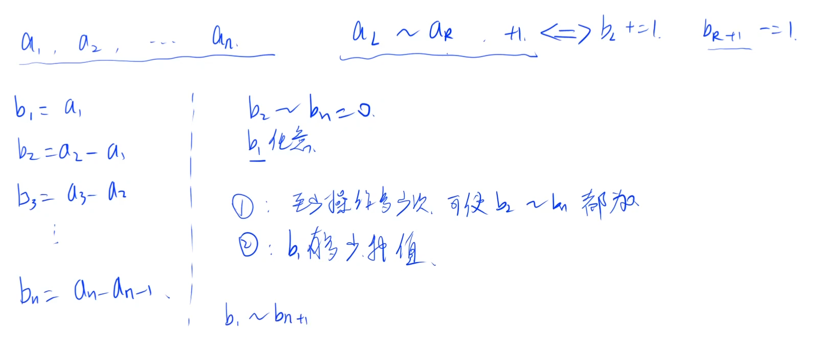
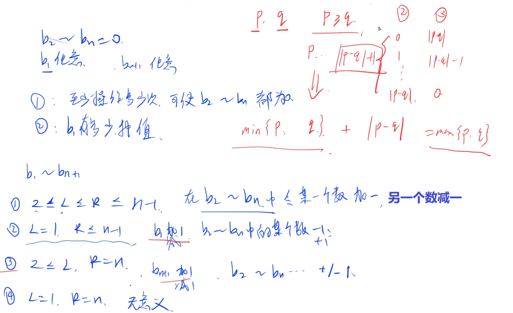
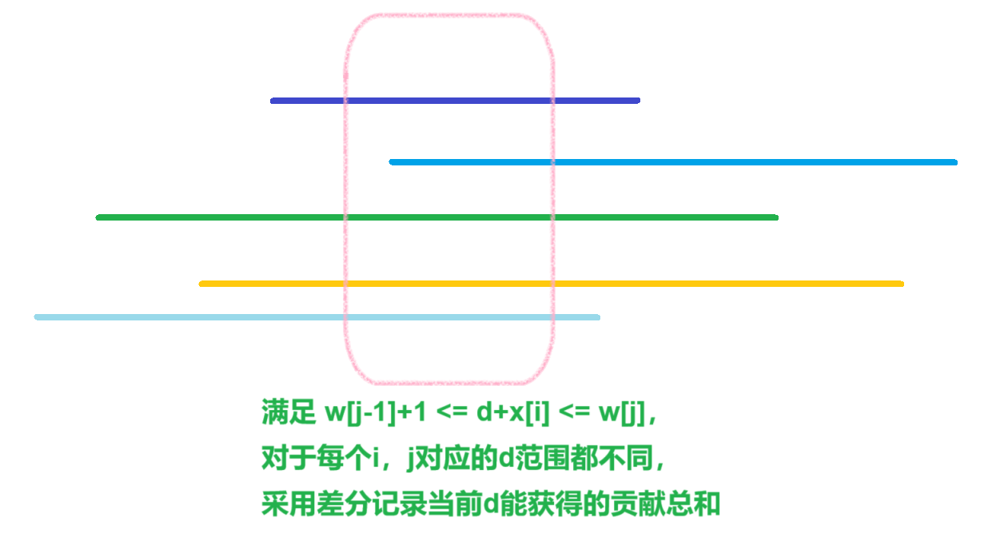

[100. 增减序列 - AcWing题库](https://www.acwing.com/problem/content/102/)


问至少需要多少次操作能让数列中的数都一样，

在此前提下一共有多少种序列


分析：


求差分数组b，`b[i] = a[i] - a[i-1]`，

当数列中的数都一样时，所有数字值为`b[1]`，`b[2] ~ b[n]`都为0


对一个区间`[l,r]`中的数字全+1时，`b[l]+=1,b[r+1]-=1`，

全-1时，`b[l]-=1,b[r+1]+=1`


每次都能选择只对一个`b[i]+=1`，

也能选择只对一个`b[i]-=1`，

也能选择对区间中`b[i]+=1,b[j]-=1`，`i!=j`


用p记录所有`b[i]>0`的值之和，q记录所有`b[i]<0`的值之和，

最少次数是$min(p,q)+|p-q|=max(p,q)$，

每次将p，q成对消除，落单的单独消除


能得到的序列种数为$b_1$种数，

$b_1$被操作+1的次数为$0\sim |p-q|$，一共有$1+|p-q|$


```cpp
void solve()
{
    cin>>n;

    for(int i=1;i<=n;i++)cin>>a[i],b[i]=a[i]-a[i-1];

    for(int i=2;i<=n;i++)
    {
        if(b[i]<0)q-=b[i]; else p+=b[i];    
    }

    cout<<max(p,q)<<endl; cout<<abs(p-q)+1<<endl;
}
```





```cpp
#include <bits/stdc++.h>

using namespace std;

typedef long long ll;

const int N = 1e5 + 10;

int n, a[N], b[N];
ll p, q;

void solve()
{
	cin >> n;

	for (int i = 1; i <= n; i++)cin >> a[i];

	for (int i = 1; i <= n; i++)b[i] = a[i] - a[i - 1];

	for (int i = 2; i <= n; i++)
	{
		if (b[i] < 0)p += -b[i];
		else q += b[i];
	}

	cout << max(p, q) << endl;		 // 能成对的尽量成对，成对不了的在区间之外修改
	cout << 1 + abs(p - q) << endl;  // +1操作让b[1]最多能取1+abs(p-q)种
}

int main()
{
	solve();

	return 0;
}
```


[F-快快乐乐剪羊毛_牛客小白月赛92 (nowcoder.com)](https://ac.nowcoder.com/acm/contest/81126/F)


问移动草皮能有多少种价值和


分析：


使用map记录从小到大d对应的区间差分值，

设草皮移动距离为d，

在`[ w[j-1]+1 , w[j] ]`区间，当前羊贡献为`v[i]`，

此时$w_{j-1}+1\le x_i+d\le w_j$，得：$w_{j-1}+1-x_i\le d\le w_j-x_i$，


用map遍历每个区间端点更新当前d对应的贡献总和


```cpp
void solve()
{
    cin>>n>>m;

    for(int i=1;i<=n;i++)cin>>w[i];

    for(int i=1;i<=n;i++)cin>>v[i];

    for(int i=1;i<=m;i++)cin>>x[i];

    map<int,vector<int>>mp;

    for(int i=1;i<=m;i++)
    {
        for(int j=1;j<=n;j++)
        {
            mp[w[j-1]+1-x[i]].emplace_back(v[i]);

            mp[w[j]-x[i]+1].emplace_back(-v[i]);
        }
    }

    for(auto [x,v]:mp)
    {
        for(auto u:v)cur+=u;

        st.insert(cur);
    }

    cout<<st.size()<<endl;
}
```



```cpp
#include <bits/stdc++.h>
#include <functional>

#define alls(a) a.begin(),a.end()
#define emb emplace_back
#define pub push_back
#define pob pop_back
#define puf push_front
#define pof pop_front
#define fi first
#define se second
#define No puts("No")
#define Yes puts("Yes")
#define NO puts("NO")
#define YES puts("YES")

using namespace std;
typedef long long ll;
//typedef __int128 lll; // G++(32位)不支持
typedef unsigned long long ull;
typedef pair<int, int> pii;

const int N = 2e5 + 10;
const int mo = 1e9 + 7;
const int inf = 2e9 + 10;

int n, m;
ll cur;
set<ll>st;

// mp记录当前偏移量为d时每个的贡献

void solve()
{
    cin >> n >> m;

    vector<ll>w(n + 1, 0), v(n + 1, 0), x(m + 1, 0);

    for (int i = 1; i <= n; i++)cin >> w[i], w[i] += w[i - 1];
    for (int i = 1; i <= n; i++)cin >> v[i];
    for (int i = 1; i <= m; i++)cin >> x[i];

    map<ll, vector<int>>mp;

    for (int i = 1; i <= n; i++)
    {
        for (int j = 1; j <= m; j++)
        {
            // w[i-1]+1 <= x[i]+d <= w[i]
            // w[i-1]+1-x[i] <= d <= w[i]+x[i] 

            // 当前移动草皮会对区间产生v[i]的贡献 

            // 是区间，很大可能覆盖长度不一致，因此需要cur+=vv每次消除影响

            mp[w[i - 1] + 1 - x[j]].push_back(v[i]);

            mp[w[i] - x[j] + 1].push_back(-v[i]);
        }
    }

    for (auto v : mp)
    {
        for (auto vv : v.second)
        {
            cur += vv;
        }

        st.insert(cur);  // 将当前区间贡献总和放入答案集合中
    }

    cout << st.size() << endl;
}

int main()
{
    int t;

    //cin >> t;

    t = 1;

    while (t--)solve();

    return 0;
}
```


[Problem - E - Codeforces](https://codeforces.com/contest/1955/problem/E)


分析：


用差分数组记录当前修改截止点，

从大到小枚举长度，枚举对于每个长度是否能成功修改


```cpp
void solve()
{
    cin>>n>>s;

    s=" "+s;

    for(int i=n;i>=1;i--)
    {
        for(int j=1;j<=n;j++)b[j]=0;

        f=0;  // 记录当前的异或情况

        ff=true;  // 记录是否能修改成功

        for(int j=1;j<=n;j++)
        {
            f^=b[j];  // 提取终止修改信息

            if((f^(s[j]-'0'))==0)
            {
                if(i+j>n){ff=false;break;}

                f^=1;

                b[j+i]^=1;  // 记录终止修改点
            }
        }

        if(ff){cout<<i<<endl;return;}
    }
}
```


```cpp
#include <bits/stdc++.h>
#include <functional>

#define alls(a) a.begin(),a.end()
#define emb emplace_back
#define pub push_back
#define pob pop_back
#define puf push_front
#define pof pop_front
#define fi first
#define se second
#define No puts("No")
#define Yes puts("Yes")
#define NO puts("NO")
#define YES puts("YES")

using namespace std;
typedef long long ll;
//typedef __int128 lll; // G++(32位)不支持
typedef unsigned long long ull;
typedef pair<int, int> pii;

const int N = 2e5 + 10;
const int mo = 1e9 + 7;
const int inf = 2e9 + 10;

int n;
bool f;
string s;
int b[N], cur;

void solve()
{
    cin >> n >> s;

    for (int i = n; i >= 1; i--)
    {
        for (int j = 0; j <= n; j++)b[j] = 0;

        cur = 0;

        f = true;

        for (int j = 0; j < n; j++)
        {
            cur ^= b[j];  // 碰到末尾，改变一次

            if (!((s[j] - '0') ^ cur))
            {
                cur ^= 1;  // 主动改变

                if (i + j > n)
                {
                    f = false;
                    break;
                }

                b[i + j] ^= 1;  // 标记末尾
            }
        }

        if (f)
        {
            cout << i << endl;

            return;
        }
    }
}

int main()
{
    int t;

    cin >> t;

    //t = 1;

    while (t--)solve();

    return 0;
}
```


[4262. 空调 - AcWing题库](https://www.acwing.com/problem/content/description/4265/)


每次能对一段区间进行+1或者-1操作，

问至少进行多少次操作能使得数组p变成数组t


分析：


p->t，每次可以对一段区间进行差分，先求出每个`p[i]-=t[i]`，差分`b[i]=p[i]-p[i-1]`


对一段区间`[l,r]`进行操作`++`，相当于对差分数组`b[l]++,b[r+1]--`，

操作`--`，相当于`b[l]--,b[r+1]++`


每次操作可以将任意一组`b[i]++,b[j]--`，

单个`b[i]++`，单个`b[j]--`（一直操作到了`p[n]`，此时`b[r+1]=b[n+1]`）


`ans=max(sum1,sum2)`，需要将所有`b[i]`变成`0`，多的可以带少的


```cpp
void solve()
{
    cin>>n;

    for(int i=1;i<=n;i++)cin>>p[i]; for(int i=1;i<=n;i++)cin>>t[i],p[i]-=t[i];

    for(int i=1;i<=n;i++)b[i]=p[i]-p[i-1];

    for(int i=1;i<=n;i++)if(b[i]>0)ans+=b[i]; else cur-=b[i];

    cout<<max(ans,cur)<<endl;
}
```


```cpp
#include <bits/stdc++.h>
#include <functional>

#define alls(a) a.begin(),a.end()
#define emb emplace_back
#define pub push_back
#define pob pop_back
#define puf push_front
#define pof pop_front
#define fi first
#define se second
#define No puts("No")
#define Yes puts("Yes")
#define NO puts("NO")
#define YES puts("YES")

using namespace std;
typedef long long ll;
//typedef __int128 lll; // G++(32位)不支持
typedef unsigned long long ull;
typedef pair<int, int> pii;

const int N = 1e5 + 10;
const int mo = 1e9 + 7;
const int inf = 2e9 + 10;

int n, a[N], b[N];
int ans, cur;

void solve()
{
    cin >> n;

    for (int i = 1; i <= n; i++)cin >> b[i];

    for (int i = 1; i <= n; i++)
    {
        cin >> a[i];

        b[i] -= a[i];
    }

    for (int i = n; i >= 1; i--)b[i] -= b[i - 1];  // 差分的差值

    for (int i = 1; i <= n; i++)
    {
        if (b[i] > 0)ans += b[i];
        else cur += b[i];
    }

    cout << max(ans, -cur) << endl;
}

int main()
{
    int t;

    //cin >> t;

    t = 1;

    while (t--)solve();

    return 0;
}
```
