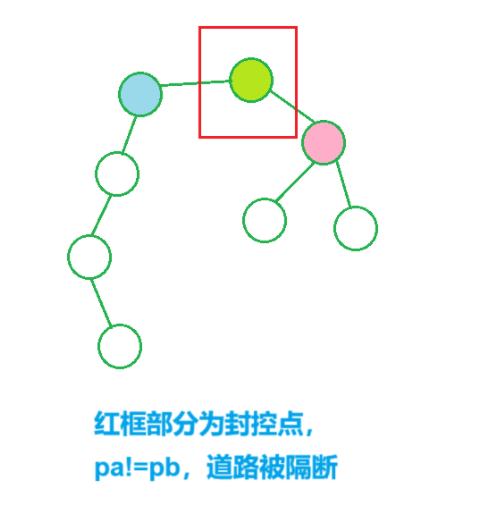

[L3-003 社交集群 - 团体程序设计天梯赛-练习集 (pintia.cn)](https://pintia.cn/problem-sets/994805046380707840/exam/problems/type/7?problemSetProblemId=994805053141925888&page=1)


一个“社交集群”是指部分兴趣爱好相同的人的集合。


分析：


用第一个兴趣表示每个人，将所有兴趣加入并查集，

查找祖宗节点个数，统计对数目大->小排序


```cpp
int find(int x)
{
    if(p[x]!=x)p[x]=find(p[x]);

    return p[x];
}

void merge(int a,int b)
{
    int pa=find(a),pb=find(b);

    if(pa!=pb)p[pa]=pb;
}

void solve()
{
    cin>>n;

    for(int i=1;i<=1000;i++)p[i]=i;

    for(int i=1;i<=n;i++)
    {
        cin>>k>>ch>>h[i];

        for(int j=1;j<=k-1;j++)
        {
            cin>>x;

            merge(x,h[i]);
        }
    }

    for(int i=1;i<=n;i++)cnt[find(h[i])]++,st.insert(find(h[i]));

    sort(cnt+1,cnt+1000+1;greater<int>());

    cout<<st.size()<<endl;

    for(int i=1;i<=st.size();i++)
    {
        cout<<cnt[i];
    
        if(i==st.size())break;
        
        cout<<' ';
    }
}
```


#### 并查集解决路径通断问题


[7-4 疫情防控 - 2021 RoboCom 世界机器人开发者大赛-本科组（初赛） (pintia.cn)](https://pintia.cn/problem-sets/1446838676759703552/exam/problems/type/7?problemSetProblemId=1446838732288094211&page=0)


给定可行机场的路径，

依次给定每天被封的机场和当天航线，

求每天有多少航线可行


分析：


并查集p[i]记录i的中间点，中间点不同说明没有通路，

防控点封控点是自己，防控点不作为中间点，不更新

p[i]不同不可达，否则可达


首先将所有被封的机场信息全部加入并查集，

从最后一天开始往前推，

每天计算完可达航线之后，将当日被封机场加入并查集


```cpp
int find(int x)
{
    if(x!=p[x])p[x]=find(p[x]);

    return p[x];
}

void solve()
{
    cin>>n>>m>>d;

    for(int i=1;i<=m;i++)
    {
        cin>>a>>b;

        e[a].emplace_back(b); e[b].emplace_back(a);
    }

    for(int i=1;i<=n;i++)p[i]=i;

    int pa,pb;

    for(int i=1;i<=d;i++)
    {
        cin>>c[i]>>q[i];

        st.insert(c[i]);

        for(int j=1;j<=q[i];j++)
        {
            cin>>a>>b;

            s[i].push_back({a,b});
        }
    }

    for(int i=1;i<=n;i++)
    {
        if(st.count(i))continue;

        pa=find(i);

        for(auto u:e[i])
        {
            if(st.count(u))continue;    // 当前机场被封控

            pb=find(u);

            if(pa!=pb)p[pb]=pa;
        }
    }

    for(int i=d;i>=1;i--)
    {
        for(auto it:s[i])
        {
            pa=find(it.fi); pb=find(it.se);

            if(pa!=pb)ans[i]++;    // 中间有路段被封控，无法到达
        }

        pa=find(c[i]);

        for(auto u:e[c[i]])
        {
            pb=find(u); 

            if(pa!=pb)p[pb]=pa;
        }    

        st.erase(c[i]);
    }

    for(int i=1;i<=d;i++)cout<<ans[i]<<endl;
}
```



```cpp
#include <bits/stdc++.h>

#define fi first
#define se second

using namespace std;

const int N = 5e4 + 10;

int n, m, d;
int a, b;

int p[N];
int c[N], q[N];

set<int>st;
vector<int>e[N];
vector<pair<int, int>>s[N];

int ans[N];

int find(int x)
{
    if (x != p[x]) p[x] = find(p[x]);

    return p[x];
}

int main()
{
    cin >> n >> m >> d;

    for (int i = 1; i <= m; i++)
    {
        cin >> a >> b;

        e[a].emplace_back(b);
        e[b].emplace_back(a);
    }

    for (int i = 1; i <= d; i++)
    {
        cin >> c[i] >> q[i];

        st.insert(c[i]);

        for (int j = 1; j <= q[i]; j++)
        {
            cin >> a >> b;

            s[i].push_back({ a,b });
        }
    }

    int pa, pb;

    for (int i = 1; i <= n; i++)p[i] = i;

    for (int i = 1; i <= n; i++)    // 先将所有路径全部删除
    {
        if (st.count(i))continue;

        for (auto u : e[i])
        {
            if (!st.count(u))
            {
                pa = find(i);
                pb = find(u);

                if (pa != pb)p[pb] = pa;
            }
        }
    }

    for (int i = d; i >= 1; i--)    // 从后往前遍历，将被删除的路线重新恢复
    {
        for (auto it : s[i])        // 查找有多少断路
        {
            pa = find(it.fi);
            pb = find(it.se);

            if (pa != pb)ans[i]++;
        }

        for (auto u : e[c[i]])
        {
            if (st.count(u))continue;

            pa = find(u);
            pb = find(c[i]);

            if (pa != pb)p[pa] = pb;
        }

        st.erase(c[i]);
    }

    for (int i = 1; i <= d; i++)
    {
        cout << ans[i];

        if (i == d)break;

        cout << endl;
    }

    return 0;
}
```


[D - New Friends (atcoder.jp)](https://atcoder.jp/contests/abc350/tasks/abc350_d)


问最多能操作几次


分析：


根据传递性，$(x,y),(y,z)$能变成$(x,z)$，至少有一个公共顶点就能连接一次，

只要两点之间有边就并入并查集，一个并查集中的所有点都能最终变为连通图


一共能连$1+\cdots+(n-1)=\frac {n(n-1)} {2}$条边，

所有连通图边数总和减去原来就有的m条边，就是能操作的总次数


```cpp
int find(int x)
{
    if(p[x]!=x)p[x]=find(p[x]);

    return p[x];
}

void add(int a,int b)
{
    int pa=find(a),pb=find(b);

    if(pa!=pb)
    {
        p[pa]=pb; sz[pb]+=sz[pa];
    }
}

void solve()
{
    cin>>n>>m;

    for(int i=1;i<=n;i++)sz[i]=1,p[i]=i;

    for(int i=1;i<=m;i++)
    {
        cin>>u>>v;

        add(u,v);
    }

    for(int i=1;i<=n;i++)
    {
        if(find(i)==i)ans+=1ll*sz[i]*(sz[i]-1)/2;
    }

    ans-=m;

    cout<<ans<<endl;
}
```


```cpp
#include <bits/stdc++.h>

using namespace std;

typedef long long ll;

const int N = 2e5 + 10;

int n, m;
int a, b;
int p[N], sz[N];
ll ans;

int find(int x)
{
    if (p[x] != x)p[x] = find(p[x]);

    return p[x];
}

void add(int a, int b)
{
    int pa = find(a), pb = find(b);

    if (pa != pb)
    {
        p[pa] = pb;

        sz[pb] += sz[pa];
    }
}

int main()
{
    cin >> n >> m;

    for (int i = 1; i <= n; i++)p[i] = i, sz[i] = 1;

    for (int i = 1; i <= m; i++)
    {
        cin >> a >> b;

        add(a, b);
    }

    for (int i = 1; i <= n; i++)
    {
        if (find(i) == i)
        {
            ans += 1ll * sz[i] * (sz[i] - 1) / 2;
        }
    }

    ans -= m;

    cout << ans << endl;

    return 0;
}
```


[L2-013 红色警报 - 团体程序设计天梯赛-练习集 (pintia.cn)](https://pintia.cn/problem-sets/994805046380707840/exam/problems/994805063963230208?type=7&page=1)


给定很多边，

问按照顺序删除结点是否会改变当前图连通性


分析：


st数组记录当前无法访问的、被删除的点，

curr记录当前连通块个数，

cur记录先前连通块个数，

每次判断`curr>cur`，连通块个数变多，孤立区域增加


```cpp
int find(int x)
{
    if(p[x]!=x)p[x]=find(p[x]);

    return p[x];
}

void add(int a,int b)
{
    int pa=find(a),pb=find(b);

    if(pa!=pb)p[pa]=pb;
}

void solve()
{
    cin>>n>>m;

    for(int i=1;i<=m;i++)
    {
        cin>>a>>b;

        e.push_back({a,b});
    }

    cin>>k;

    for(int i=0;i<n;i++)p[i]=i;

    for(auto u:e)
    {
        add(u.first,u.second);
    }

    cur=0;

    for(int i=0;i<n;i++)cur+=p[i]==i;

    for(int i=1;i<=k;i++)
    {
        cin>>x;

        st[x]=true;

        for(int j=0;j<n;j++)p[j]=j;

        for(auto u:e)
        {
            if(st[u.first]||st[u.second])continue;

            add(u.first,u.second);
        }

        curr=0;

        for(int j=0;j<n;j++)
        {
            if(!st[j]||p[j]==j)curr++;
        }

        if(curr>cur)printf("Red Alert: City %d is lost!\n",x);
        else printf("City %d is lost.\n",x);

        cur=curr;

        if(curr==0)printf("Game Over.");
    }
}
```


```cpp
#include <bits/stdc++.h>

using namespace std;

const int N = 510, M = 5010;

int n, m, k, x;
int cur, curr;
int p[N];
bool st[N];

struct node
{
    int a, b;
}e[M];

int find(int x)
{
    if (p[x] != x)p[x] = find(p[x]);

    return p[x];
}

int main()
{
    cin >> n >> m;

    for (int i = 0; i < n; i++)p[i] = i;

    int pa, pb;

    for (int i = 1; i <= m; i++)
    {
        cin >> e[i].a >> e[i].b;

        pa = find(e[i].a);
        pb = find(e[i].b);

        if (pa != pb)p[pa] = pb;
    }

    for (int i = 0; i < n; i++)if (p[i] == i)cur++;

    cin >> k;

    for (int i = 1; i <= k; i++)  // 通过统计剩下点的连通块个数，判断是否会改变连通性
    {
        for (int i = 0; i < n; i++)p[i] = i;  // 初始化并查集

        cin >> x;

        st[x] = true;

        for (int i = 1; i <= m; i++)  // 统计剩余边，将同一边的结点加入并查集
        {
            if (st[e[i].a] || st[e[i].b])continue;

            pa = find(e[i].a);
            pb = find(e[i].b);

            if (pa != pb)p[pa] = pb;
        }

        curr = 0;

        for (int i = 0; i < n; i++)
        {
            if (st[i] == false && p[i] == i)curr++;
        }

        if (curr > cur)printf("Red Alert: City %d is lost!", x);  // 连通块数目变多
        else printf("City %d is lost.", x);

        if (curr == 0)printf("\nGame Over.");

        cur = curr;

        if (i == k)break;

        puts("");
    }

    return 0;
}
```


[L2-010 排座位 - 团体程序设计天梯赛-练习集 (pintia.cn)](https://pintia.cn/problem-sets/994805046380707840/exam/problems/994805066135879680?type=7&page=1)


分析：


用并查集存放所有朋友，f数组存放当前两人是否为死对头


```cpp
void find(int x)
{
    if(p[x]!=x)p[x]=find(p[x]);

    return p[x];
}

void add(int a,int b)
{
    int pa=find(a),pb=find(b);

    p[pa]=pb;
}

void solve()
{
    cin>>n>>m>>k;

    for(int i=1;i<=n;i++)p[i]=i;

    for(int i=1;i<=m;i++)
    {
        cin>>a>>b>>op;

        if(op==1)
        {
            add(a,b);
        }
        else
        {
            f[a][b]=f[b][a]=-1;
        }
    }

    int pa,pb;

    while(k--)
    {
        cin>>a>>b;

        pa=find(a),pb=find(b);

        if(pa==pb&&f[a][b]==false)printf("No problem");
        else if(pa!=pb&&f[a][b]==false)printf("OK");
        else if(pa==pb&&f[a][b]==true)printf("OK but...");
        else printf("No way");

        if(k==0)break;

        puts("");
    }
}
```


```cpp
#include <bits/stdc++.h>

using namespace std;

const int N = 110;

int n, m, k;
int a, b, op;
int p[N];
bool f[N][N];

int find(int x)
{
    if (p[x] != x)p[x] = find(p[x]);

    return p[x];
}

void add(int a, int b)
{
    int pa = find(a), pb = find(b);

    p[pa] = pb;
}

int main()
{
    cin >> n >> m >> k;

    for (int i = 1; i <= n; i++)p[i] = i;

    for (int i = 1; i <= m; i++)
    {
        cin >> a >> b >> op;

        if (op == 1)
        {
            add(a, b);
        }
        else
        {
            f[a][b] = f[b][a] = true;
        }
    }

    for (int i = 1; i <= k; i++)
    {
        cin >> a >> b;

        if (find(a) == find(b) && !f[a][b])cout << "No problem";
        else if (find(a) != find(b) && !f[a][b])cout << "OK";
        else if (find(a) == find(b) && f[a][b])cout << "OK but...";
        else cout << "No way";

        if (i == k)break;

        puts("");
    }

    return 0;
}
```


[L2-007 家庭房产 - 团体程序设计天梯赛-练习集 (pintia.cn)](https://pintia.cn/problem-sets/994805046380707840/exam/problems/994805068539215872?type=7&page=1)


分析：


以最小id作为并查集祖先，

边读入边建立并查集，

a数组存放基础数据，b数组处理数据，c数组存放答案


b数组每次都找到祖宗节点，将所有值加在祖宗节点上，

c数组通过`b[i].f`来存放所有祖宗节点的数据，sort之后进行输出


```cpp
struct node
{
    int u,fa,ma,k;

    double sum,cnt;

    int son[10];
}a[N];

struct nodee
{
    int id;

    double sum,cnt;

    bool f;
}b[N];

struct nodeee
{
    double sum,cnt;

    int person,id;

    bool operator<(const nodeee&w)
    {
        if(sum>w.sum)return true;
        else if(sum==w.sum&&id<w.id)return true;
        else return false;
    }
}c[N];

int find(int x)
{
    if(p[x]!=x)p[x]=find(p[x]);

    return p[x];
}

void add(int a,int b)
{
    int pa=find(a),pb=find(b);

    if(pa<pb)p[pb]=pa; else if(pa>pb)p[pa]=pb;
}

void solve()
{
    cin>>n;

    for(int i=1;i<=n;i++)  // st数组用于存放被用的结点编号
    {
        cin>>a[i].u>>a[i].fa>>a[i].ma>>a[i].k;

        st[a[i].u]=true;

        if(a[i].fa!=-1)
        {
            add(a[i].fa,a[i].u);  // 并查集合并

            st[a[i].fa]=true;
        }

        if(a[i].ma!=-1)
        {
            add(a[i].ma,a[i].u);

            st[a[i].ma]=true;
        }

        for(int j=1;j<=a[i].k;j++)
        {
            cin>>a[i].son[j];

            st[a[i].son[j]]=true;

            add(a[i].son[j],a[i].u);
        }

        cin>>a[i].cnt>>a[i].sum;
    }

    int id;

    for(int i=1;i<=n;i++)
    {
        id=find(a[i].u);  // 找到祖先

        b[id].id=id;      // 放入祖先

        b[id].sum+=a[i].sum;  // 合并，求和
        b[id].cnt+=a[i].cnt;

        b[id].f=true;
    }

    for(int i=0;i<N;i++)
    {
        if(st[i])b[find(i)].person++;  // 计数家庭成员
    }

    for(int i=0;i<N;i++)
    {
        if(b[i].f)                     // 计算家庭中的平均面积和平均套数
        {
            b[i].sum=1.0*b[i].sum/b[i].person;

            b[i].cnt=1.0*b[i].cnt/b[i].person;
        }
    }

    int m=1;

    for(int i=0;i<N;i++)
    {
        if(b[i].f)  // 存放祖宗节点
        {    
            c[m].cnt=b[i].cnt;
            c[m].sum=b[i].sum;
            c[m].person=b[i].person;
            c[m].id=b[i].id;

            m++;
        }
    }

    sort(c+1,c+m);

    for(int i=1;i<m-1;i++)
    {
        printf("%04d %d %.3lf %.3lf\n",c[i].id,c[i].person,c[i].cnt,c[i].sum);
    }

    printf("%04d %d %.3lf %.3lf",c[m-1].id,c[m-1].person,c[m-1].cnt,c[m-1].sum);
}
```


```cpp
#include <bits/stdc++.h>

using namespace std;

const int N = 1e5 + 10;

struct node
{
    int u, fa, ma;

    int k;

    double cnt, sum;

    int son[10];
}a[N];

struct nodee
{
    double cnt, sum;

    int person;

    int u, id;

    bool f;
}b[N];

struct nodeee
{
    double cnt, sum;

    int person;

    int id;

    bool operator<(const nodeee& w)
    {
        if (sum > w.sum)return true;
        else if (sum == w.sum && id < w.id)return true;
        else return false;
    }
}c[N];

int n;
int p[N];
bool st[N];

int find(int x)
{
    if (p[x] != x)p[x] = find(p[x]);

    return p[x];
}

void add(int a, int b)
{
    int pa = find(a), pb = find(b);

    if (pa > pb)p[pa] = pb;
    else if (pa < pb)p[pb] = pa;
}

int main()
{
    cin >> n;

    for (int i = 0; i < N; i++)p[i] = i, st[i] = false;

    for (int i = 1; i <= n; i++)
    {
        cin >> a[i].u >> a[i].fa >> a[i].ma >> a[i].k;

        st[a[i].u] = true;

        if (a[i].fa != -1)
        {
            add(a[i].u, a[i].fa);

            st[a[i].fa] = true;
        }

        if (a[i].ma != -1)
        {
            add(a[i].u, a[i].ma);

            st[a[i].ma] = true;
        }

        for (int j = 1; j <= a[i].k; j++)
        {
            cin >> a[i].son[j];

            add(a[i].u, a[i].son[j]);

            st[a[i].son[j]] = true;
        }

        cin >> a[i].cnt >> a[i].sum;
    }

    int id;

    for (int i = 1; i <= n; i++)  // 找最小的结点作为根节点
    {
        id = find(a[i].u);

        b[id].id = id;

        b[id].sum += a[i].sum;  // 计算总和
        b[id].cnt += a[i].cnt;

        b[id].f = true;
    }

    for (int i = 0; i < N; i++)
    {
        if (st[i])b[find(i)].person++;  // 计算人数
    }

    for (int i = 0; i < N; i++)
    {
        if (b[i].f)  // 计算平均数目和平均面积
        {
            b[i].sum = 1.0 * b[i].sum / b[i].person;

            b[i].cnt = 1.0 * b[i].cnt / b[i].person;
        }
    }

    int m = 0;

    for (int i = 0; i < N; i++)   // 存家族信息
    {
        if (b[i].f)
        {
            c[m].cnt = b[i].cnt;

            c[m].person = b[i].person;

            c[m].sum = b[i].sum;

            c[m].id = b[i].id;

            m++;
        }
    }

    sort(c, c + m);

    cout << m << endl;

    for (int i = 0; i < m - 1; i++)
    {
        printf("%04d %d %.3lf %.3lf\n", c[i].id, c[i].person, c[i].cnt, c[i].sum);
    }

    printf("%04d %d %.3lf %.3lf", c[m - 1].id, c[m - 1].person, c[m - 1].cnt, c[m - 1].sum);

    return 0;
}
```


## 并查集能求连通块个数


[P1511 - [蓝桥杯2020初赛] 七段码 - New Online Judge (ecustacm.cn)](http://oj.ecustacm.cn/problem.php?id=1511)


分析：


每段都只能是连通的，范围为7，

st数组表示当前是否被选定，并查集记录当前被选定发光位置连通块信息，

`f[i][j]`记录当前`i,j`是否相邻


```cpp
int find(int x)
{
    if(p[x]!=x)p[x]=find(p[x]);

    return p[x];
}

void dfs(int u)
{
    if(u==8)
    {
        int pa,pb;

        for(int i=1;i<=7;i++)p[i]=i;

        for(int i=1;i<=7;i++)
        {
            for(int j=1;j<=7;j++)
            {
                if(st[i]&&st[j]&&f[i][j])
                {
                    pa=find(i),pb=find(j);

                    p[pa]=p[pb];  // 放入一个连通块中
                }
            }
        }

        int cur=0;

        for(int i=1;i<=7;i++)
        {
            if(st[i]&&p[i]==i)cur++;  // 被选中并且是一个连通块的祖先，标示一个连通块cur++
        }

        if(cur==1)ans++; return;  // 只有一个连通块，满足要求，ans++
    }

    st[u]=true; dfs(u+1);  // 选择当前这个灯，搜下一层

    st[u]=false; dfs(u+1);  // 当前灯不选
}

void solve()
{
    f[1][2]=f[1][6]=f[2][1]=f[6][1]=true;  // 记录点和点连通状态
    f[2][7]=f[2][3]=f[7][2]=f[3][2]=true;
    f[3][4]=f[3][7]=f[4][3]=f[7][3]=true;
    f[4][5]=f[5][4]=true;
    f[5][6]=f[5][7]=f[6][5]=f[7][5]=true;
    f[6][7]=f[7][6]=true;

    dfs(1);

    cout<<ans<<endl;
}
```


```cpp
#include <bits/stdc++.h>

using namespace std;

const int N = 10;

int ans;
int p[N];
bool f[N][N];
bool st[N];

int find(int x)
{
    if (p[x] != x)p[x] = find(p[x]);

    return p[x];
}

void dfs(int u)
{
    if (u == 8)
    {
        int pa, pb;

        for (int i = 1; i <= 7; i++)p[i] = i;

        for (int i = 1; i <= 7; i++)
        {
            for (int j = 1; j <= 7; j++)
            {
                if (st[i] && st[j] && f[i][j])
                {
                    pa = find(i), pb = find(j);

                    p[pa] = pb;
                }
            }
        }

        int cur = 0;

        for (int i = 1; i <= 7; i++)
        {
            if (st[i] && p[i] == i)
            {
                cur++;
            }
        }

        if (cur == 1)ans++;

        return;
    }

    st[u] = true;  // 开灯

    dfs(u + 1);  // 搜索开灯的情况

    st[u] = false;  // 关灯

    dfs(u + 1);
}

void solve()
{
    f[1][2] = f[1][6] = true;
    f[2][1] = f[2][3] = f[2][7] = true;
    f[3][2] = f[3][4] = f[3][7] = true;
    f[4][3] = f[4][5] = true;
    f[5][4] = f[5][6] = f[5][7] = true;
    f[6][5] = f[6][7] = f[6][1] = true;
    f[7][6] = f[7][3] = f[7][2] = f[7][5] = true;

    dfs(1);

    cout << ans << endl;
}

int main()
{
    solve();

    return 0;
}
```
