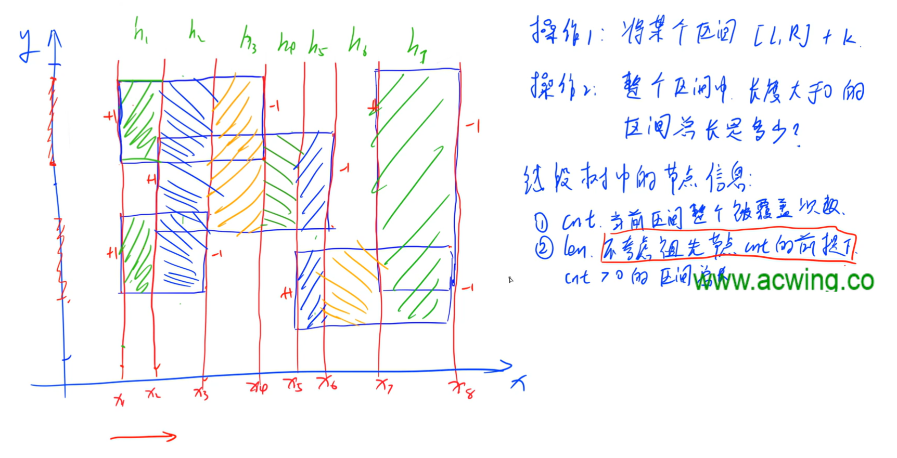
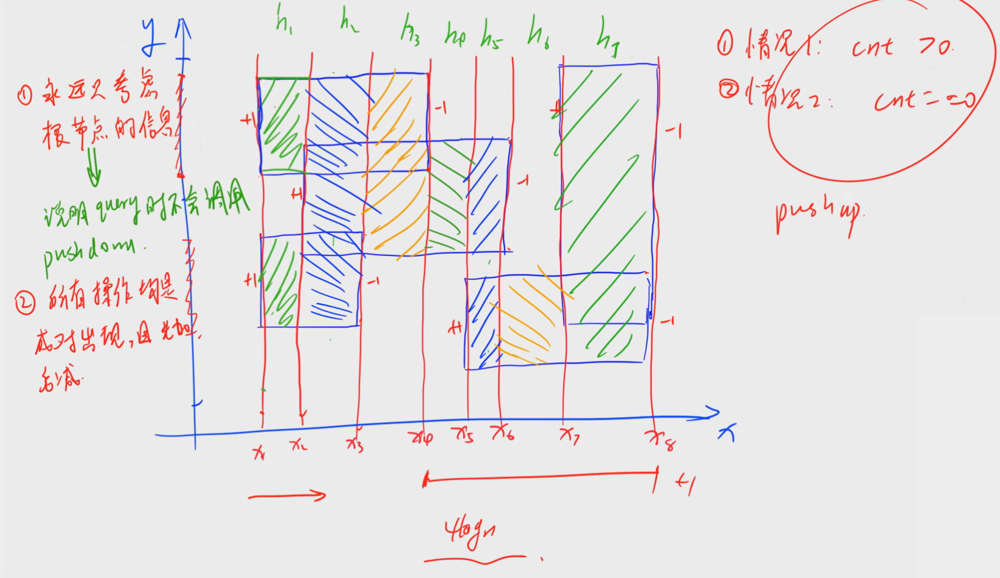
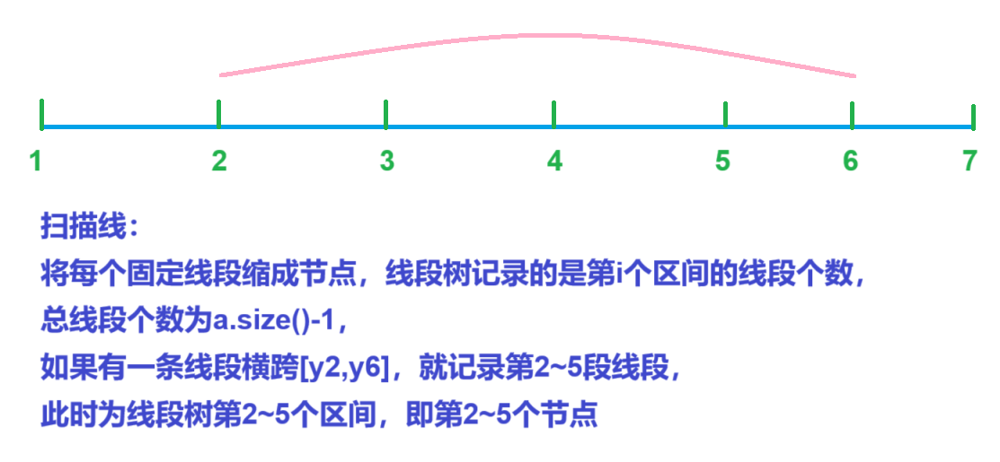
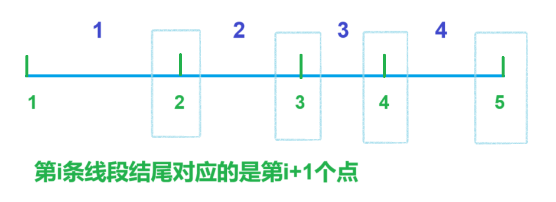

## 扫描线：

计算含有重复覆盖面积的总面积


[247. 亚特兰蒂斯 - AcWing题库](https://www.acwing.com/problem/content/249/)


给定n个矩形，可能互相覆盖，

问总面积为多少


分析：


将所有y排序后离散化，相邻y构成的线段处理成节点，

以第i个节点结尾的线段是第i-1条线段，

长线段分成多条相邻的子线段存储


node存储cnt和len，cnt是被覆盖次数，len是当前x对应的h


当区间线段都被覆盖cnt>0时，`tr[u].len=a[tr[u].r+1]-a[tr[u].l]`，

否则当前线段包含多条线段，即`tr[u].r!=tr[u].l`时，长度和子区间是否被覆盖有关，`tr[u].len=tr[u<<1].len+tr[u<<1|1].len`，

当cnt==0且tr[u].r==tr[u].l时，说明当前只有一条未被覆盖的线段，`tr[u].len=0`


```cpp
#define alls(x) x.begin(),x.end()

struct Seg
{
    double x,y1,y2;

    int k;

    bool operator<(const Seg& w)const
    {
        return x<w.x;
    }
}seg[2*N];

struct node
{
    int l,r;
    int cnt;
    double len;
}tr[2*N*4];

vector<double>a;

void get(int x)
{
    return lower_bound(alls(a),x)-a.begin();  // 获取离散后坐标
}

void pushup(int u)
{
    if(tr[u].cnt>0)tr[u].len=a[tr[u].r+1]-a[tr[u].l];  // 整个线段都能被取得
    else if(tr[u].r!=tr[u].l)tr[u].len=tr[u<<1].len+tr[u<<1|1].len;
    else tr[u].len=0;
}

void build(int u,int l,int r)
{
    if(l==r){ tr[u]={l,r,0,0}; }
    else
    {
        tr[u]={l,r,0,0};

        int mid=(l+r)/2;

        build(u<<1,l,mid); build(u<<1|1,mid+1,r);
    }
}

void modify(int u,int l,int r,int k)
{
    if(tr[u].l>=l&&tr[u].r<=r)tr[u].cnt+=k,pushup(u);  // 改变覆盖条数，改变当前len
    else
    {
        int mid=(tr[u].l+tr[u].r)/2;

        if(r<=mid)modify(u<<1,l,r,k);
        else if(mid<l)modify(u<<1|1,l,r,k);
        else
        {    
            modify(u<<1,l,mid);
            modify(u<<1|1,mid+1,r);
        }

        pushup(u);
    }
}

void solve()
{
    cin>>n;

    a.clear();

    double x1,x2,y1,y2;

    for(int i=0,j=0;i<n;i++)
    {    
        cin>>x1>>y1>>x2>>y2;

        seg[j++]={x1,y1,y2,1}; seg[j++]={x2,y1,y2,-1};

        a.emplace_back(y1); a.emplace_back(y2);
    }

    sort(alls(a)); a.erase(unique(alls(a)),a.end());

    sort(seg,seg+2*n);

    double ans=0;

    build(1,0,a.size()-2);  // 连在一起的所有线段一共a.size()-1条，节点编号从0开始

    for(int i=0;i<2*n;i++)
    {    
        if(i>0)
        {
            ans+=tr[1].len*(seg[i].x-seg[i-1].x);
        }

        modify(1,get(seg[i].y1),get(seg[i].y2)-1,seg[i].k);
    }

    cout<<ans<<endl;
}
```









```cpp
#include <bits/stdc++.h>

#define alls(x) x.begin(),x.end()

using namespace std;

const int N=1e5+10;

int n;
double ans;

struct Seg
{
    double x,y1,y2;
    int k;

    bool operator<(const Seg& t)const
    {
        return x<t.x;
    } 
}seg[2*N];

struct node
{
    int l,r;

    int cnt;

    double len;
}tr[2*N*4];

vector<double>a;

int get(double x)
{
    return lower_bound(alls(a),x)-a.begin();
}

void pushup(int u)
{
     if(tr[u].cnt>0)tr[u].len=a[tr[u].r+1]-a[tr[u].l];  // 线段全部被覆盖，第i条线段，结尾为第i+1个点 
     else if(tr[u].l!=tr[u].r)                        // 含多条线段，看子区间是否被覆盖，用子区间更新 
     {
        tr[u].len=tr[u<<1].len+tr[u<<1|1].len;
     }
     else tr[u].len=0;                                 // 当前仅含一个线段且未被覆盖 
}

void build(int u,int l,int r)
{
    if(l==r)tr[u]={l,r,0,0};
    else
    {
        tr[u]={l,r,0,0};

        int mid=(l+r)/2;

        build(u<<1,l,mid);
        build(u<<1|1,mid+1,r);  
    }
}

void modify(int u,int l,int r,int d)
{
    if(tr[u].l>=l&&tr[u].r<=r)
    {
        tr[u].cnt+=d;

        pushup(u);
    }
    else
    {
        int mid=(tr[u].l+tr[u].r)/2;

        if(l<=mid)modify(u<<1,l,r,d);

        if(r>mid)modify(u<<1|1,l,r,d);

        pushup(u);  // 用子区间更新当前区间 
    }
}

// 初始建立所有y区间，
// 对大区间操作变成对多段小区间操作 

void solve(int kase)
{
    a.clear();

    double x1,y1,x2,y2;

    for(int i=1,j=0;i<=n;i++)
    {
        cin>>x1>>y1>>x2>>y2;

        seg[j++]={x1,y1,y2,1};  // 区间[l,r) 
        seg[j++]={x2,y1,y2,-1};

        a.emplace_back(y1);
        a.emplace_back(y2);
    }

    sort(alls(a));
    a.erase(unique(alls(a)),a.end());

    build(1,0,a.size()-2);  // 两点一线，每两个点一条线，一共a.size()-1个区间 

    sort(seg,seg+2*n); 

    ans=0;

    for(int i=0;i<2*n;i++)
    {
        if(i>0)
        {
            ans+=tr[1].len*(seg[i].x-seg[i-1].x);  // len存当前y的总长 
        }

        //  节点代表区间，表示第几个区间
        //  纳入当前线段 
        modify(1,get(seg[i].y1),get(seg[i].y2)-1,seg[i].k);  // 包含第i~j条线段，加上权值 
    }

    printf("Test case #%d\n",kase);
    printf("Total explored area: %.2lf\n\n",ans);
}

int main()
{
    int t=0;

    while(cin>>n,n)
    {
        solve(++t);
    }

    return 0;
}
```
