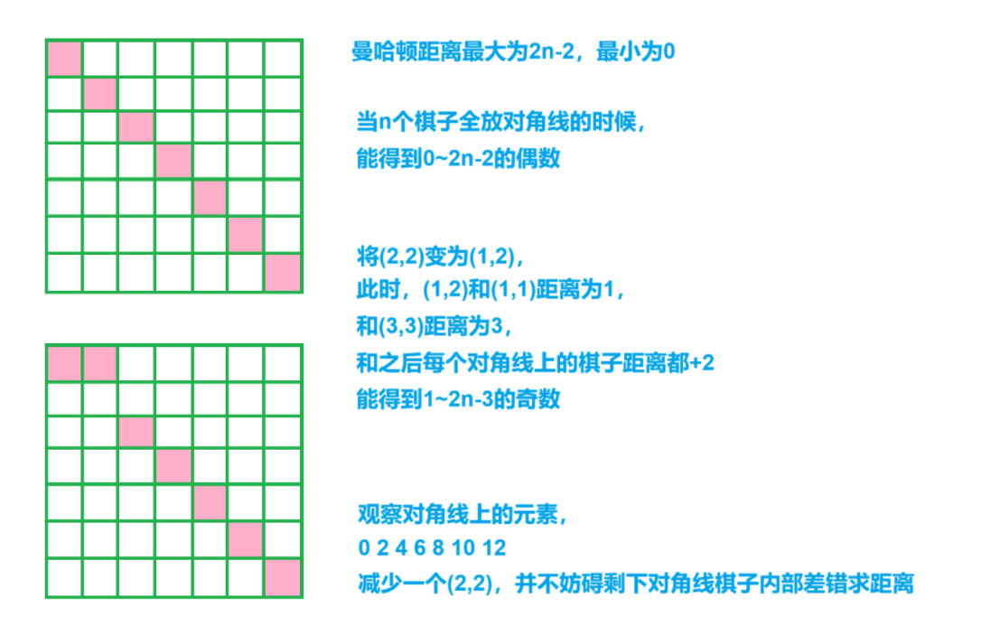

## 曼哈顿距离：

两点abs(dx)+abs(dy)


[Problem - 1968E - Codeforces](https://codeforces.com/problemset/problem/1968/E)


在n*n的方格中选定一个大小为n的点集，使得曼哈顿距离个数最多


分析：


发现全放对角线能得到0~2n-2之间的偶数，

改变一下距离，将`(2,2)`放到`(1,2)`，发现此时对角线依然能得到所有偶数，

并且`(1,2)`和对角线元素能得到1~2n-3之间的所有奇数，

根本原因是改变了奇偶性，将4变成了1，3



```cpp
void solve()
{
    cin>>n;

    for(int i=1;i<=n;i++)
    {
        if(i==2)continue; cout<<i<<' '<<i<<endl;
    }

    puts("1 2");
}
```


```cpp
#include <bits/stdc++.h>

using namespace std;

int n;

void solve()
{
	cin >> n;

	puts("1 2");

	for (int i = 1; i <= n; i++)
	{
		if (i == 2)continue;

		cout << i << ' ' << i << endl;
	}
}

int main()
{
	int t;

	cin >> t;

	while (t--)solve();

	return 0;
}
```
