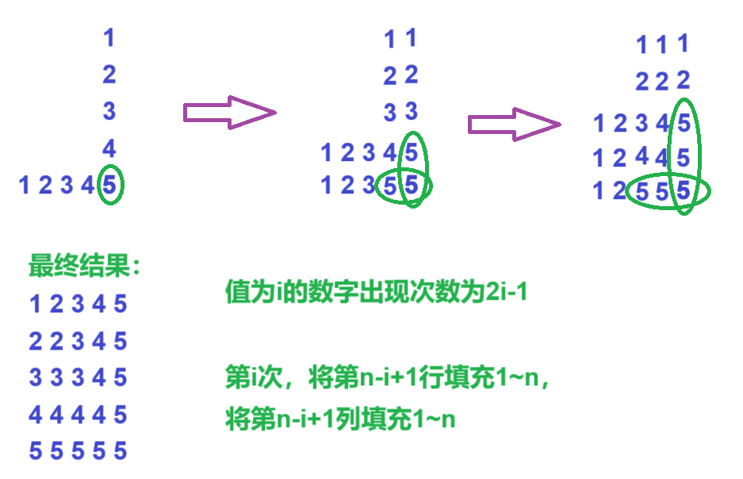

[Problem - C - Codeforces](https://codeforces.com/contest/1956/problem/C)


分析：


尽可能多的填大数，越大的延伸越外侧，个数越多，总值越大



```cpp
void solve()
{
    cin>>n;

    ans=0;

    for(int i=1;i<=n;i++)
    {
        ans+=(2ll*i-1)*i;
    }

    cout<<ans<<' '<<2*n<<endl;

    for(int i=1;i<=n;i++)
    {
        cout<<1<<' '<<n-i+1<<' ';

        for(int j=1;j<=n;j++)cout<<j<<' ';

        puts("");

        cout<<2<<' '<<n-i+1<<' ';

        for(int j=1;j<=n;j++)cout<<j<<' ';

        puts("");        
    }    
}
```


```cpp
#include <bits/stdc++.h>
#include <functional>
 
#define alls(a) a.begin(),a.end()
#define emb emplace_back
#define pub push_back
#define pob pop_back
#define puf push_front
#define pof pop_front
#define fi first
#define se second
#define No puts("No")
#define Yes puts("Yes")
#define NO puts("NO")
#define YES puts("YES")
 
using namespace std;
typedef long long ll;
//typedef __int128 lll; // G++(32位)不支持
typedef unsigned long long ull;
typedef pair<int, int> pii;
 
const int N = 5e2 + 10;
const int mo = 1e9 + 7;
const int inf = 2e9 + 10;
 
int n;
ll ans;
 
void solve()
{
	ans = 0;
 
	cin >> n;
 
	for (int i = 1; i <= n; i++)ans += (2ll * i - 1) * i;
 
	cout << ans << ' ' << 2 * n << endl;
 
	for (int i = 1; i <= n; i++)
	{
		cout << 1 << ' ' << n - i + 1 << ' ';
 
		for (int j = 1; j <= n; j++)cout << j << ' ';
 
		puts("");
 
		cout << 2 << ' ' << n - i + 1 << ' ';
 
		for (int j = 1; j <= n; j++)cout << j << ' ';
 
		puts("");
	}
}
 
int main()
{
	int t;
 
	cin >> t;
 
	//t = 1;
 
	while (t--)solve();
 
	return 0;
}
```


