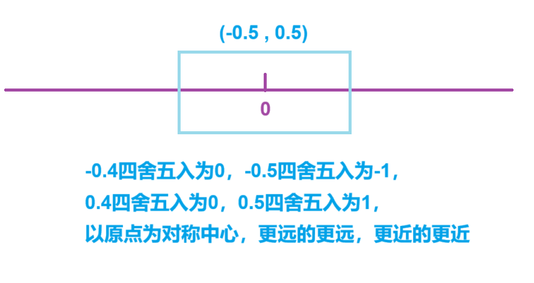
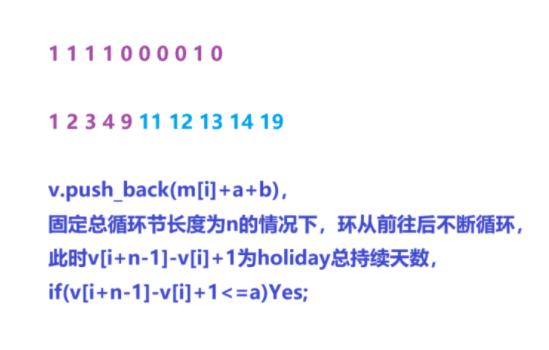
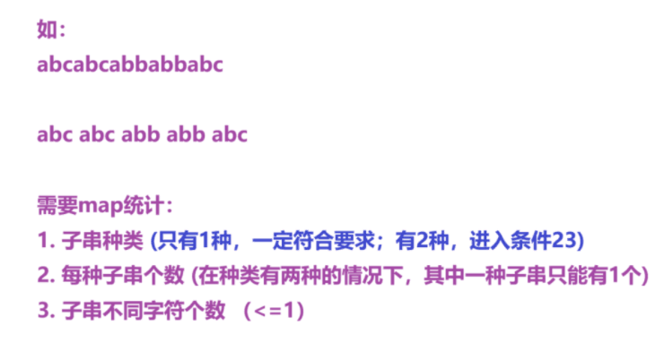

[B-江_牛客练习赛134](https://ac.nowcoder.com/acm/contest/101963/B)


可以交换任意两列，问从(1,1)到(2,n)最大值是多少


分析：


1. 不交换，选择哪行下去

2. 固定中间一列，两边交换

3. 中间列和左/右边交换

4. 下去的列在两边


```cpp
void main()
{
    cin>>n;

    ans=-inf;

    for(int i=1;i<=2;i++)for(int j=1;j<=n;j++)cin>>a[i][j];
    for(int i=1;i<=2;i++)for(int j=0;j<=n+1;j++)s[i][j]=0,max1[i][j]=max2[i][j]=-inf;

    for(int i=1;i<=n;i++)
    {
        s[1][i]=s[1][i-1]+a[1][j];
        max1[1][i]=max(max1[1][i-1],a[2][i]);
        max2[1][i]=max(max2[1][i-1],a[2][i]-a[1][i]);
    }

    for(int i=n;i>=1;i--)
    {
        s[2][i]=s[2][i+1]+a[2][i];
        max1[2][i]=max(max1[2][i+1],a[1][i]);
        max2[2][i]=max(max2[2][i+1],a[1][i]-a[2][i]);
    }

    for(int i=1;i<=n;i++)ans=max(ans,s[1][i]+s[2][i]);

    for(int i=2;i<=n-1;i++)
    {
        ans=max(ans,s[1][i]+s[2][i]+max2[1][i-1]+max2[2][i+1]);
        ans=max(ans,s[1][i]+s[2][i]+max1[1][i-1]-a[2][i]);
        ans=max(ans,s[1][i]+s[2][i]+max1[2][i+1]-a[1][i]);
    }

    ans=max(ans,s[1][1]+s[2][1]+max1[2][2]-a[1][1]);
    ans=max(ans,s[1][n]+s[2][n]+max1[1][n-1]-a[2][n]);

    cout<<ans<<endl;
}
```


[D - Strange Mirroring](https://atcoder.jp/contests/abc380/tasks/abc380_d)


分析：


每次复制一半，移动粘贴，

逆着过程来，每次砍掉一半，直到映射到初值s为止


```cpp
getline(cin,s);

cin>>n;

for(int i=0;i<n;i++)
{
    cin>>k;

    ans[i]=s[(k-1)%s.size()];

    cur=1;

    while(cur*s.size()<k)cur<<=1;    // 获取上界的字符串数量

    while(k>s.size())
    {
        k-=(cur>>1)*s.size();    // 砍掉一半的数量

        cur>>=1;

        if(islower(ans[i]))toupper(ans[i]); else tolower(ans[i]);
    }

    cout<<ans[i]<<' ';
}
```


[Problem - C1 - Codeforces](https://codeforces.com/contest/2021/problem/C1)


每个人放完这张可以随便插进队里


给定a数组记录第1~n位分别站的人，

给定b数组记录第1~m个幻灯片被哪个人放映，

问能不能实现放映


分析：


记录`id[b[i]]`，表示`b[i]`应该是第几个人，

每个人都必须前面人放完才能走


```cpp
void solve()
{
    cin>>n>>m>>q;

    for(int i=1;i<=n;i++)cin>>a[i],id[i]=0;

    for(int i=1;i<=m;i++)
    {
        cin>>b[i];

        if(id[b[i]]==0)id[b[i]]=i;    // 记录每个位置人最早应该出现的次序，后面次序可以任意调
    }

    bool f=true;

    for(int i=2;i<=n;i++)
    {
        cur=id[i],pre=id[i-1];

        if(pre==0&&cur||(pre&&cur&&cur<pre)){f=false; break;}

        // 1. 前面人没放，当前人不能放  2. 当前人和前面人都放，当前人必须在前面人之后放
    }

    if(f)puts("ya");
    else puts("tidak");
}
```


[L2-051 满树的遍历 - 团体程序设计天梯赛-练习集 (pintia.cn)](https://pintia.cn/problem-sets/994805046380707840/exam/problems/type/7?problemSetProblemId=1781658570803388426&page=1)


判断当前树节点是否均为k度，

并且按照字典序先序遍历该树，

根结点没有父结点，对应的父结点编号为 `0`


注：

树中结点的度是其拥有的子树的个数，

而树的度是树内各结点的度的最大值


分析：


拥有子树的个数，直接用`e[i].size()`记录当前子节点个数


先序遍历从父节点为0的根节点开始，根左右，

每个节点都有唯一的前驱，因此遍历各个节点的子节点不会重复（从上往下访问）


```cpp
void disp(int u)
{
    if(u)
    {
        if(cnt==0)cout<<u; else cout<<' '<<u;    // 输出格式

        cnt++;

        if(cnt==n)return;
    }

    for(auto v:e[u])disp(v);    // 从根节点开始遍历
}

void solve()
{
    cin>>n;

    for(int i=1;i<=n;i++)
    {    
        cin>>x;

        e[x].emplace_back(i);    // 记录每个父节点子节点
    }

    for(int i=1;i<=n;i++)
    {
        sort(alls(e[i]));        // 字典序最小

        if(maxx<e[i].size())
        {
            maxx=e[i].size();

            cnt++;    // 记录有多少种不同的k值
        }
    }

    if(cnt>1)cout<<maxx<<' '<<"no"<<endl;
    else cout<<maxx<<' '<<"yes"<<endl;    // 1. k>0 2. k==0，当前只有一个根节点

    cnt=0;    // 计数，控制输出格式和递归出口

    disp(0);
}
```


```cpp
#include <bits/stdc++.h>

#define alls(x) x.begin(),x.end()

using namespace std;

const int N = 1e5 + 10;

int n;
int x;
int cnt;
int maxx;
vector<int>e[N];

// 根左右

void disp(int u)
{
    if (u)    // 当前节点不是根节点父节点
    {
        if (cnt == 0)cout << u;        // 第一个节点
        else cout << ' ' << u;

        cnt++;

        if (cnt == n)return;        // 全部遍历完
    }

    for (auto v : e[u])
    {
        disp(v);
    }
}

int main()
{
    cin >> n;

    for (int i = 1; i <= n; i++)
    {
        cin >> x;

        e[x].emplace_back(i);
    }

    for (int i = 1; i <= n; i++)
    {
        sort(alls(e[i]));

        if (e[i].size() > maxx)
        {
            maxx = e[i].size();
            cnt++;
        }
    }

    cout << maxx << ' ';

    if (cnt > 1)cout << "no" << endl;    // 存在不同度的节点
    else cout << "yes" << endl;            // 1. 所有节点都k度，k>0 2. 只有一个节点，k==0

    cnt = 0;

    disp(0);    // 从根节点出发开始遍历

    return 0;
}
```


## 字符串滤空格：


```cpp
string s,cur;

getline(cin,s);

stringstream ss(s);    // 声明字符串流

while(ss>>cur)cout<<cur<<endl;  // 将字符串ss每个单词提取到cur中
```


[L2-050 懂蛇语 - 团体程序设计天梯赛-练习集 (pintia.cn)](https://pintia.cn/problem-sets/994805046380707840/exam/problems/type/7?page=1&problemSetProblemId=1781658570803388425)


分析：


使用map存放句子，&引用迭代器进行排序更改，

stringstream拆解首字母，进行查找


```cpp
void solve()
{
    cin>>n;

    getchar();

    for(int i=1;i<=n;i++)
    {
        getline(cin,s);

        cur="";

        stringstream ss(s);

        while(ss>>a)cur+=a[0];

        mp[cur].emplace_back(s);
    }

    for(auto& u:mp){ sort(alls(u.second)); }    // 引用变成地址传递才能改变u.second进行排序

    cin>>m;

    getchar();            // 过滤当前行换行符

    for(int i=1;i<=m;i++)
    {    
        getline(cin,s);

        cur="";

        stringstream ss(s);

        while(ss>>a)cur+=a[0];

        if(mp.count(cur))
        {
            for(int j=0;j<mp[cur].size();j++)
            {
                cout<<mp[cur][j];

                if(j==mp[cur].size()-1)break;

                cout<<'|';
            }    

            cout<<endl;
        }
        else cout<<s<<endl;
    }
}
```


```cpp
#include <bits/stdc++.h>

#define alls(x) x.begin(),x.end()

using namespace std;

int n, m;
bool f;
string s, a, cur;
map<string, vector<string>>mp;

int main()
{
    cin >> n;

    getchar();

    for (int i = 1; i <= n; i++)
    {
        getline(cin, s);

        stringstream ss(s);

        cur = "";

        while (ss >> a)cur += a[0];

        mp[cur].emplace_back(s);
    }

    for (auto& u : mp)        // 想要直接进行迭代器中元素排序，需要直接引用
    {
        sort(alls(u.second));
    }

    cin >> m;

    getchar();

    for (int i = 1; i <= m; i++)
    {
        getline(cin, s);

        stringstream ss(s);

        cur = "";

        while (ss >> a)cur += a[0];

        if (mp.count(cur) == 0)cout << s << endl;
        else
        {
            for (int j = 0; j < mp[cur].size(); j++)
            {
                cout << mp[cur][j];

                if (j == mp[cur].size() - 1)break;

                cout << '|';
            }

            cout << endl;
        }
    }

    return 0;
}
```


## 求交集、差集、并集：

`inserter(ans,ans.begin())`将求出的集合插入ans中


交集：`set_intersection(alls(v[a]),alls(v[b]),inserter(ans,ans.begin()));`

（inter互相，section选择，互相选择就是交集）

差集：`set_difference(alls(v[a]),alls(v[b]),inserter(ans,ans.begin()));`

并集：`set_union(alls(v[a]),alls(v[b]),inserter(ans,ans.begin()));`


[L2-049 鱼与熊掌 - 团体程序设计天梯赛-练习集 (pintia.cn)](https://pintia.cn/problem-sets/994805046380707840/exam/problems/type/7?page=1&problemSetProblemId=1781658570803388424)


给定q组询问，问同时有a和b的有多少人


分析：


存每个物品拥有者，对每个询问返回交集元素个数


```cpp
void solve()
{
    cin>>n>>m;

    for(int i=1;i<=n;i++)
    {
        cin>>k;

        for(int j=1;j<=k;j++)
        {
            cin>>x;

            v[i].emplace_back(x);
        }
    }

    cin>>q;

    while(q--)
    {
        cin>>a>>b;

        ans.clear();

        set_intersection(alls(v[a]),alls(v[b]),inserter(ans,ans.begin()));

        cout<<ans.size()<<endl;
    }
}
```


```cpp
#include <bits/stdc++.h>
#include <iterator>

#define alls(x) x.begin(),x.end()

using namespace std;

const int N = 1e5 + 10;

int n, m;
int a, b;
int cnt;
int k, x, q;
vector<int>v[N];

int main()
{
    cin >> n >> m;

    for (int i = 1; i <= n; i++)
    {
        cin >> k;

        for (int j = 1; j <= k; j++)
        {
            cin >> x;

            v[x].emplace_back(i);
        }
    }

    cin >> q;

    vector<int>ans;

    while (q--)
    {
        cin >> a >> b;

        set_intersection(alls(v[a]), alls(v[b]), inserter(ans, ans.begin()));

        cout << ans.size() << endl;

        ans.clear();
    }

    return 0;
}
```


[RC-u3 跑团机器人 - 2022 RoboCom 世界机器人开发者大赛-本科组（省赛） (pintia.cn)](https://pintia.cn/problem-sets/1546071017977008128/exam/problems/type/7?problemSetProblemId=1546071170892947457&page=0)


给定一串字符串，

要求分析所有出现面数骰子投了多少次，

结果的最大值和最小值


分析：


用栈op记录当前处理的值的正负，

起始压入'+'，循环处理权值


```cpp
void solve()
{
    cin>>s;

    s="+"+s;

    l=0;

    while(l<s.size())
    {
        op.push(s[l++]);

        num=0,idx=0;

        while(l<s.size()&&isdigit(s[l]))num*=10,num+=s[l++]-'0';

        c=op.top(),op.pop();

        if(l<s.size()&&s[l]=='d')
        {
            if(num==0)num=1;

            l++;

            while(l<s.size()&&isdigit(s[l]))idx*=10,idx+=s[l++]-'0';

            mp[idx]+=num;

            if(op=='+')minn+=num,maxx+=idx*num;
            else minn-=idx*num,maxx-=num;    
        }
        else 
        {
            if(op=='+')minn+=num,maxx+=num;
            else minn-=num,maxx+=num;
        }
    }

    for(auto it:mp)cout<<it.fi<<' '<<it.se<<endl;

    cout<<minn<<' '<<maxx;
}
```


```cpp
#include <bits/stdc++.h>

using namespace std;

const int N = 1e3 + 10;

string s;
int cur;
int l;
int num, idx;
char c;
stack<char>op;
map<int, int>mp;
int maxx, minn;

int main()
{
    cin >> s;

    s = '+' + s;

    while (l < s.size())
    {
        cur = 0;

        op.push(s[l++]);

        while (isdigit(s[l]))
        {
            cur *= 10;

            cur += s[l++] - '0';
        }

        num = cur;    // 记录骰子个数

        if (s[l] == 'd')    // 发现骰子
        {
            if (!isdigit(s[l - 1]))num = 1;    // 先前没有符号，默认为1

            cur = 0;

            l++;

            while (isdigit(s[l]))
            {
                cur *= 10;

                cur += s[l++] - '0';
            }

            idx = cur;    // 记录骰子面数

            c = op.top();    // 获取符号
            op.pop();

            mp[idx] += num;

            if (c == '+')
            {
                maxx += idx * num;
                minn += 1 * num;
            }
            else
            {
                minn -= idx * num;
                maxx -= 1 * num;
            }
        }
        else    // 发现数字
        {
            c = op.top();
            op.pop();

            if (c == '+')
            {
                minn += num;
                maxx += num;
            }
            else
            {
                minn -= num;
                maxx -= num;
            }
        }
    }

    for (auto u : mp)cout << u.first << ' ' << u.second << endl;

    cout << minn << ' ' << maxx;

    return 0;
}
```


[7-2 芬兰木棋 - 2021 RoboCom 世界机器人开发者大赛-本科组（初赛） (pintia.cn)](https://pintia.cn/problem-sets/1446838676759703552/exam/problems/type/7?problemSetProblemId=1446838732288094209&page=0)


每次攻击只能攻击一个方向相邻最近的任意k枚棋子，

问最多能赚到多少分，需要攻击多少次


分析：


$>1$的木桩进行一次攻击，$=1$的木桩尽可能变成一段攻击，

最多赚的分就是所有p的总和


用`x*x+y*y`表示距离，按照距离进行排序后判断攻击次数


`gcd(0,k)=k`


`d=abs(gcd(a,b))`


```cpp
void solve()
{
    cin>>n;

    for(int i=1;i<=n;i++)
    {
        cin>>x>>y>>p;

        d=abs(__gcd(x,y));    // 保留斜率符号

        mp[{x/d,y/d}].push_back({1ll*x*x+1ll*y*y,p});

        ans+=p;
    }

    for(auto it:mp)
    {
        sort(alls(it.second));

        for(int i=0;i<it.second.size();i++)
        {
            if(it.second[i].second>1)cnt++; 
            else if(i+1==it.second.size()||it.second[i+1].second>1)cnt++;
        }
    }

    cout<<ans<<' '<<cnt;
}
```


```cpp
#include <bits/stdc++.h>

#define alls(x) x.begin(),x.end()

#define fi first
#define se second

using namespace std;

typedef long long ll;

ll gcd(ll a, ll b)
{
    if (b == 0)return a;
    else return gcd(b, a % b);
}

ll n, d;
ll cur;
ll x, y, p;
ll ans, cnt;
map<pair<ll, ll>, vector<pair<ll, ll>>>mp;

int main()
{
    cin >> n;

    for (ll i = 1; i <= n; i++)
    {
        cin >> x >> y >> p;

        d = abs(gcd(x, y)); // 存方向，abs，gcd(0,k)=k

        mp[{x / d, y / d}].push_back({ x * x + y * y,p }); // 存到(0,0)距离，权值

        ans += p;
    }

    for (auto it : mp)
    {
        cur = 0;

        sort(alls(it.second));  // 距离从近到远排序，分段轰击

        for (ll i = 0; i < it.second.size(); i++)
        {
            if (it.second[i].second > 1)cur++;
            else if (i + 1 == it.second.size() || it.second[i + 1].second > 1)cur++;
        }

        cnt += cur;
    }

    cout << ans << ' ' << cnt;

    return 0;
}
```


[RC-u4 攻略分队 - 2022 RoboCom 世界机器人开发者大赛-本科组（省赛） (pintia.cn)](https://pintia.cn/problem-sets/1546071017977008128/exam/problems/type/7?problemSetProblemId=1546071170892947458&page=0)


当`v[i]==0`时，当前队伍视作不存在


问是否能分成满足要求的两队，

如果能，请输出最优方案


分析：


用dfs枚举所有方案，

在check函数中按规则顺序判断当前是否比ans更优，如果更优就直接更新


$O(n\cdot 2^n)=6\times 2^6=384$


注意：

1. dfs中即时计算所需变量更方便，有些变量初始化时并不会设置

2. 输出格式，行末不能有多余空格
   
   

```cpp
bool check()
{
    bool f1,f2,ff1,ff2,rr1,rr2,r1,r2;

    f1=f2=ff1=ff2=rr1=rr2=r1=r2=false;

    // 判断是否每队至少有个坦克

    for(auto u:t1)f1|=a[u]; for(auto u:t2)f2|=a[u];

    if((f1&&f2)==false)return false;

    // 规则1，2

    f1=ff1=f2=ff2=false;

    for(auto u:t1)f1|=b[u],ff1|=c[u];

    for(auto u:t2)f2|=b[u],ff2|=c[u];

    rr1=f1&&ff1&&f2&&ff2;
    rr2=ff1&&ff2;

    f1=ff1=f2=ff2=false;

    for(auto u:ans1)f1|=b[u],ff1|=c[u];

    for(auto u:ans2)f2|=b[u],ff2|=c[u];

    r1=f1&&ff1&&f2&&ff2;
    r2=ff1&&ff2;

    if(r1&&!rr1)return false;
    else if(!r1&&rr1){ans1=t1,ans2=t2; return true;}
    else
    {
        if(r2&&!rr2)return false;
        else if(!r2&&rr2){ans1=t1,ans2=t2; return true;}
    }

    if(ans1.empty()&&ans2.empty()){ans1=t1,ans2=t2; return true;}

    // 规则3

    int cur,curr;

    cur=curr=0;

    for(auto u:t1)cur+=v[u]; for(auto u:t2)cur-=v[u];

    cur=abs(cur);

    for(auto u:ans1)curr+=v[u]; for(auto u:ans2)curr-=v[u];

    curr=abs(curr);

    if(curr>cur){ans1=t1,ans2=t2; return true;}
    else if(curr<cur)return false;

    // 规则4

    cur=0,curr=0;

    for(auto u:t1)cur+=v[u]; for(auto u:t2)curr+=v[u];

    f1=(cur>=curr);

    cur=0,curr=0;

    for(auto u:ans1)cur+=v[u]; for(auto u:ans2)curr+=v[u];

    f2=(cur>=curr);

    if(f1&&!f2){ans1=t1,ans2=t2; return true;}
    else if(!f1&&f2)return false;

    // 规则5

    for(int i=0;i<min(ans1.size(),t1.size());i++)
    {
        if(ans1[i]>t1[i]){ans1=t1,ans2=t2; return true;}
        else if(ans1[i]<t1[i])return false;
    }

    return false;
}

void dfs(int cur)
{
    while(cur<=6&&v[cur]==0)cur++;

    if(cur>6)
    {
        check(); return;
    }

    t1.emplace_back(cur); dfs(cur+1); t1.pop_back();

    t2.emplace_back(cur); dfs(cur+1); t2.pop_back();
}

void solve()
{
    for(int i=1;i<=6;i++)cin>>v[i];

    for(int i=1;i<=6;i++)
    {
        cin>>s;

        if(v[i]==0)continue;

        if(s[0]-'0')a[i]=true,cnt++;
        if(s[1]-'0')b[i]=true;
        if(s[2]-'0')c[i]=true;
    }

    if(cnt<2)cout<<"GG";
    else
    {
        dfs(1);

        sort(alls(ans1)); sort(alls(ans2));

        for(int i=0;i<ans1.size();i++)
        {
            cout<<ans1[i];

            if(i==ans1.size()-1)break; // 注意格式！！

            cout<<' ';
        }

        cout<<'\n';

        for(int i=0;i<ans2.size();i++)
        {
            cout<<ans2[i];

            if(i==ans2.size()-1)break;

            cout<<' ';
        }
    }
}
```


```cpp
#include <bits/stdc++.h>

#define alls(x) x.begin(),x.end()

using namespace std;

const int N = 10;

int n = 6;
int cnt;
int v[N];
bool a[N], b[N], c[N];
string s;

vector<int>t1, t2, ans1, ans2;

bool r1, r2;
bool rr1, rr2;
int dx;

bool check()
{
    if (t1.empty() || t2.empty())return false;

    // check是否每队都有坦克

    bool f, ff;

    f = ff = false;

    for (auto u : t1)
    {
        f |= a[u];
    }

    for (auto u : t2)
    {
        ff |= a[u];
    }

    if ((f && ff) == false)return false;

    // check规则1,2

    bool f1, ff1, f2, ff2;
    bool rr1, rr2;

    f1 = ff1 = f2 = ff2 = false;

    for (auto u : t1)
    {
        f1 |= b[u];
        f2 |= c[u];
    }

    for (auto u : t2)
    {
        ff1 |= b[u];
        ff2 |= c[u];
    }

    rr1 = (f1 && ff1 && f2 && ff2);  // 规则1
    rr2 = (f2 && ff2);               // 规则2

    if (ans1.empty() || ans2.empty()) { ans1 = t1, ans2 = t2; r1 = rr1, r2 = rr2; return true; }

    if (rr1 && !r1) { ans1 = t1, ans2 = t2; r1 = rr1, r2 = rr2; return true; }        // 判断答案是否更优，是否更新
    else if (!rr1 && r1)return false;
    else if (!rr1 && !r1)
    {
        if (rr2 && !r2) { ans1 = t1, ans2 = t2; r1 = rr1, r2 = rr2; return true; }
        else if (!rr2 && r2)return false;
    }

    // 规则3

    int cur = 0, curr = 0;

    for (auto u : t1)cur += v[u];
    for (auto u : t2)cur -= v[u];

    cur = abs(cur);

    for (auto u : ans1)curr += v[u];
    for (auto u : ans2)curr -= v[u];

    curr = abs(curr);

    dx = curr;

    if (dx > cur)
    {
        dx = cur;

        r1 = rr1, r2 = rr2;

        ans1 = t1, ans2 = t2;

        return true;
    }
    else if (dx < cur)return false;

    // 规则4

    cur = curr = 0;

    for (auto u : t1)cur += v[u];
    for (auto u : t2)curr += v[u];

    f1 = (cur >= curr);

    cur = curr = 0;

    for (auto u : ans1)cur += v[u];
    for (auto u : ans2)curr += v[u];

    f2 = (cur >= curr);

    if (f1 && !f2) { ans1 = t1, ans2 = t2; r1 = rr1, r2 = rr2; return true; }
    else if (!f1 && f2)return false;

    // 规则5

    for (int i = 0; i < min(ans1.size(), t1.size()); i++)
    {
        if (ans1[i] < t1[i])return false;
        else if (ans1[i] > t1[i]) { ans1 = t1, ans2 = t2; r1 = rr1, r2 = rr2; return true; }
    }

    return false;
}

void dfs(int cur)
{
    while (v[cur] == 0 && cur <= 6)cur++;

    if (cur > 6)
    {
        check();

        return;
    }

    t1.emplace_back(cur);
    dfs(cur + 1);
    t1.pop_back();

    t2.emplace_back(cur);
    dfs(cur + 1);
    t2.pop_back();
}

int main()
{
    for (int i = 1; i <= 6; i++)cin >> v[i];

    for (int i = 1; i <= 6; i++)
    {
        cin >> s;

        if (v[i] == 0)continue;

        if (s[0] == '1')a[i] = true, cnt++;
        if (s[1] == '1')b[i] = true;
        if (s[2] == '1')c[i] = true;
    }

    if (cnt < 2)cout << "GG";
    else
    {
        dfs(1);

        sort(alls(ans1));
        sort(alls(ans2));

        for (int i = 0; i < ans1.size(); i++)
        {
            cout << ans1[i];

            if (i == ans1.size() - 1)break;

            cout << ' ';    // 注意格式，不能多加空格
        }

        cout << endl;

        for (int i = 0; i < ans2.size(); i++)
        {
            cout << ans2[i];

            if (i == ans2.size() - 1)break;

            cout << ' ';
        }
    }

    return 0;
}
```


[RC-u2 出院 - 2023 睿抗机器人开发者大赛CAIP-编程技能赛-本科组（省赛） (pintia.cn)](https://pintia.cn/problem-sets/1680597991209951232/exam/problems/type/7?problemSetProblemId=1680598077168017409&page=0)


已知等级的饮料，直接输出等级

对于一个新饮料，尝试拆成两种饮料的名字，能唯一拆分就输出等级组合，

否则直接输出D


分析：


用substr来进行字符串的拆解，

cnt判断拆解是否唯一


字符串100个，每个长度不超过30，规模$3000^2=9\times 10^6$，不会超时


```cpp
void solve()
{
    cin>>n>>m;

    for(int i=1;i<=n;i++)
    {
        cin>>s>>ss;

        mp[s]=ss;
    }

    for(int i=1;i<=m;i++)
    {
        cin>>s;

        if(mp.count(s))cout<<mp[s]<<endl;  // 已经有直接用
        else
        {
            cnt=0;

            for(auto it:mp)
            {
                if(s.substr(0,it.fi.size())==it.fi
                    && mp.count(s.substr(it.fi.size()))  // 能分成两个已知的字符串
                {
                    cnt++; ans=it.se+mp[s.substr(it.fi.size())];
                }
            }

            if(cnt==1)cout<<ans<<endl; else cout<<"D"<<endl;  // 判断是否能唯一分出
        }
    }
}
```


```cpp
#include <bits/stdc++.h>

#define fi first
#define se second

using namespace std;

int n, m;
int cnt;
string s, ss, ans;
map<string, string>mp;

int main()
{
    cin >> n >> m;

    for (int i = 1; i <= n; i++)
    {
        cin >> s >> ss;

        mp[s] = ss;
    }

    for (int i = 1; i <= m; i++)
    {
        cin >> s;

        if (mp.count(s))
        {
            cout << mp[s] << endl;

            continue;
        }

        cnt = 0;

        for (auto it : mp)
        {
            if (it.first == s.substr(0, it.first.size()))  // 当前可以作为前缀
            {
                if (mp.count(s.substr(it.first.size())))   // 当前后缀可以匹配到
                {
                    cnt++;

                    ans = it.second + mp[s.substr(it.first.size())];
                }
            }
        }

        if (cnt == 1)
        {
            cout << ans << endl;
        }
        else
        {
            cout << 'D' << endl;
        }
    }

    return 0;
}
```


[0钟表 - 蓝桥云课 (lanqiao.cn)](https://www.lanqiao.cn/problems/2188/learning/)


求满足要求的时刻，角度<=180度


分析：


**秒对分钟也有贡献，如：3.2min**

**分钟和秒对时也有贡献**


用对时钟的占比反映当前角度，

角度<=180，当>0.5时取`1-a`


```cpp
const double esp=1e-7;

void solve()
{
    for(double s=0;s<=6;s++)
    {
        for(double f=0;f<60;f++)
        {
            for(double m=0;m<60;m++)
            {
                if(s<esp&&f<esp&&m<esp)continue;

                ss=((m/60+f)/60+s)/12;

                ff=(m/60+f)/60;

                mm=m/60;       

                a=min(1-abs(ss-ff),abs(ss-ff));
                b=min(1-abs(mm-ff),abs(mm-ff));

                if(abs(a-2*b)<esp)
                {
                    cout<<s<<' '<<f<<' '<<m<<endl; return 0;
                }
            }
        }
    }

    return 0;
}
```


```cpp
#include <bits/stdc++.h>

using namespace std;

// 秒针对时针和分针都有贡献
// 分针对时针有贡献

const long double esp = 1e-7;

long double ss, ff, mm, a, b;

int main()
{
    for (long double s = 0; s <= 6; s++)
    {
        for (long double f = 0; f < 60; f++)
        {
            for (long double m = 0; m < 60; m++)
            {
                if (s < esp && f < esp && m < esp)continue;

                mm = m / 60;

                ff = (f + m / 60) / 60;

                ss = (s + (f + m / 60) / 60) / 12;

                a = abs(ff - ss);
                b = abs(ff - mm);

                if (a > 0.5)a = 1 - a;

                if (b > 0.5)b = 1 - b;

                if (abs(a - 2 * b) < esp)
                {
                    cout << s << ' ' << f << ' ' << m << endl;
                }
            }
        }
    }

    return 0;
}
```


[0双子数 - 蓝桥云课 (lanqiao.cn)](https://www.lanqiao.cn/problems/17105/learning/)


求区间内满足要求的数目


分析：


处理出所有pri，pri最大不超过`sqrt(23333333333333/4)`，

由于是质数乘积的平方，`l=sqrt(2333),r=sqrt(23333333333333)`，

枚举质数，两两乘积，求满足要求的个数


```cpp
void solve()
{
    l=sqrt(2333),r=sqrt(23333333333333);

    for(int i=2;i<N;i++)
    {
        if(!st[i])pri[cnt++]=i;

        for(int j=0;j<cnt&&pri[j]*i<N;j++)
        {
            st[pri[j]*i]=true;  if(i%pri[j]==0)break;
        }
    }

    for(int i=0;i<cnt;i++)
    {
        for(int j=i+1;j<cnt;j++)
        {
            d=pri[i]*pri[j];

            if(d>=l&&d<=r)ans++;

            if(d>r)break;
        }
    }

    cout<<ans<<endl;
}
```


```cpp
#include <bits/stdc++.h>

using namespace std;

typedef long long ll;

const int N = 2415229 + 10;

ll ans;
ll n, m;
int cnt, pri[N];
set<int>ss;
bool st[N];

int main()
{
    n = sqrt(2333), m = sqrt(23333333333333);

    for (int i = 2; i < N ; i++)
    {
        if (!st[i])pri[cnt++] = i;

        for (int j = 0; j < cnt && pri[j] * i < N; j++)
        {
            st[i * pri[j]] = true;

            if (i % pri[j] == 0)break;
        }
    }

    ll tem;

    for (int i = 0; i < cnt; i++)
    {
        for (int j = i + 1; j < cnt; j++)
        {
            tem = 1ll * pri[i] * pri[j];

            if (tem >= n && tem <= m)ans++;

            if (tem > m)break;
        }
    }

    cout << ans << endl;

    return 0;
}
```


[0子2023 - 蓝桥云课 (lanqiao.cn)](https://www.lanqiao.cn/problems/17104/learning/)


找2023的子序列个数


分析：


用f数组和ff数组记录区间0，3个数前缀和，

固定两个2，用中间0的个数乘上后缀3的个数求和


```cpp
void solve()
{
    for(int i=1;i<=2023;i++)
    {
        x=to_string(i);

        for(auto u:x)if(u=='2'||u=='0'||u=='3')s+=u;
    }

    s=" "+s;

    for(int i=1;i<s.size();i++)
    {
        f[i]=f[i-1]; ff[i]=ff[i-1];

        if(s[i]=='0')f[i]++;

        if(s[i]=='3')ff[i]++;
    }

    for(int i=1;i<s.size();i++)
    {
        for(int j=i+2;j<s.size();j++)
        {
            if(s[i]=='2'&&s[j]=='2')
            {
                ans+=(f[j-1]-f[i])*(ff[n]-ff[j]);  // 0 [i+1,j-1]  3 [j+1,n]
            }
        }
    }

    cout<<ans<<endl;
}
```


```cpp
#include <iostream>
using namespace std;
int main()
{
  printf("5484660609");
  return 0;
}
```


[L2-045 堆宝塔 - 团体程序设计天梯赛-练习集 (pintia.cn)](https://pintia.cn/problem-sets/994805046380707840/exam/problems/1649748772841508872?type=7&page=1)


分析：


用栈模拟，栈能直接获取`stk.size()`


```cpp
void solve()
{
    cin>>n;

    for(int i=1;i<=n;i++)
    {
        cin>>x;

        if(a.empty()||x<a.top())a.push(x);
        else
        {
            if(b.empty()||x>b.top())b.push(x);
            else
            {
                ans++; maxx=max(maxx,a.size());

                while(!a.empty())a.pop();

                while(b.top()>x)a.push(b.top()),b.pop();

                a.push(x);
            }
        }
    }

    if(!a.empty())
    {
        ans++; maxx=max(maxx,a.size());
    }

    if(!b.empty())
    {
        ans++; maxx=max(maxx,b.size());
    }

    cout<<ans<<' '<<maxx;
}
```


```cpp
#include <bits/stdc++.h>

using namespace std;

int n, x;
int cur;
int cnt, maxx;
stack<int>a, b;

int main()
{
    cin >> n;

    for (int i = 1; i <= n; i++)
    {
        cin >> x;

        if (a.empty()||x < a.top())
        {
            a.push(x);
        }
        else
        {
            if (b.empty() || x > b.top())b.push(x);
            else
            {
                cnt++;

                maxx = max(maxx, (int)a.size());  // stack能直接获取size()

                while (!a.empty())a.pop();

                while (!b.empty() && b.top() > x)
                {
                    a.push(b.top());  // 从大到小逆置

                    b.pop();
                }

                a.push(x);  // 放在满足要求的顶上
            }
        }
    }

    if (!a.empty())
    {
        cnt++;

        maxx = max(maxx, (int)a.size());
    }

    if (!b.empty())
    {
        cnt++;

        maxx = max(maxx, (int)b.size());
    }

    cout << cnt << ' ' << maxx;

    return 0;
}
```


[L2-046 天梯赛的赛场安排 - 团体程序设计天梯赛-练习集 (pintia.cn)](https://pintia.cn/problem-sets/994805046380707840/exam/problems/1649748772841508873?type=7&page=1)


分析：


模拟，用vector存当前需要额外开多少空闲教室


```cpp
void solve()
{
    cin>>n>>c;

    priority_queue<int>q;

    for(int i=1;i<=n;i++)
    {
        cin>>s>>x;

        cout<<s<<' '<<(x+c-1)/c<<endl;  // 上取整输出当前需要的教室个数

        ans+=x/c;

        if(x%c)q.push(x%c);  // 有余量，需要另外分配
    }

    while(!q.empty())
    {
        tem=q.top(),q.pop();

        f=false;

        for(auto &u:a)
        {
            if(u+tem<=c)  // 找到了塞进去的位置
            {
                u+=tem; f=true; break;
            }
        }

        if(!f)a.push_back(tem),ans++;  // 没找到，另外开一个位置
    }

    cout<<ans;
}
```


```cpp
#include <bits/stdc++.h>

using namespace std;

int x, ans;
string s;

int main()
{
    int n, c;

    cin >> n >> c;

    priority_queue<int>q;

    for (int i = 1; i <= n; i++)
    {
        cin >> s >> x;

        cout << s << ' ' << (x + c - 1) / c << endl; // 上取整输出考场数

        ans += x / c;  // 整数个考场

        if (x % c)q.push(x % c);  // 剩余人数统一分配
    }

    vector<int>a;  // 用a模拟额外考场

    int tem;

    bool f;

    while (!q.empty())
    {
        tem = q.top(); q.pop();

        f = false;

        for (auto &u : a)
        {
            if (tem + u <= c)  // 有余量能插
            {
                u += tem;

                f = true;

                break;
            }
        }

        if (!f)a.push_back(tem), ans++;  // 没有余量另开
    }

    cout << ans;

    return 0;
}
```


[L2-023 图着色问题 - 团体程序设计天梯赛-练习集 (pintia.cn)](https://pintia.cn/problem-sets/994805046380707840/exam/problems/994805057298481152?type=7&page=1)


给定一种颜色分配，判断是否是涂色问题的一个解


分析：


color数组记录颜色，在涂色时，用set记录当前颜色种数，

如果当前能满足要求相邻节点不同色，颜色种数==k即是一种合法方案，就Yes


```cpp
void solve()
{
    cin>>v>>e>>k;

    for(int i=1;i<=e;i++)
    {
        cin>>a>>b;

        g.push_back({a,b});
    }

    cin>>n;

    set<int>st;

    for(int i=1;i<=n;i++)
    {
        st.clear();

        for(int j=1;j<=v;j++)cin>>color[j],st.insert(color[j]);

        f=true;

        for(auto u:g)
        {
            if(color[u.fi]==color[u.se])continue; else {f=false;break;}
        }

        if(st.size()!=k)f=false;

        if(f)Yes; else No;
    }
}
```


```cpp
#include <bits/stdc++.h>

using namespace std;

const int N = 510;

int n;
int v, e, k;
int a, b;
int color[N];
vector<pair<int, int>>g;

int main()
{
    cin >> v >> e >> k;

    for (int i = 0; i < e; i++)
    {
        cin >> a >> b;

        g.push_back({ a,b });
    }

    cin >> n;

    bool f;

    while (n--)
    {
        set<int>st;

        f = true;

        for (int i = 1; i <= v; i++)
        {
            cin >> color[i];

            st.insert(color[i]);

            if (color[i]<1 || color[i]>v)f = false;
        }

        if (st.size() != k)f = false;

        for (auto u : g)
        {
            if (color[u.first] == color[u.second] || f == false)
            {
                f = false;

                break;
            }
        }

        if (f)printf("Yes");
        else printf("No");

        if (n == 0)break;

        puts("");
    }

    return 0;
}
```


[L2-018 多项式A除以B - 团体程序设计天梯赛-练习集 (pintia.cn)](https://pintia.cn/problem-sets/994805046380707840/exam/problems/994805060372905984?type=7&page=1)


分析：


$a^3+a+1$除以$a+1$时，每次拿多项式a的最高次项除以多项式b的首项，

列竖式，得到商$a^2-a+2$，余数为$-1$


多项式a和b相除就是把b看成常数


控制指数差值相同时，可以对系数进行操作，

c数组下标为指数次方，`c[i]`表示指数为`i`时系数


商的指数次方原多项式ab不一定有，`id1-id2`


```cpp
void show(double cn[],int x)
{
    int cnt=0;

    for(int i=x;i>=0;i--)
    {
        if(fabs(cn[i])>=0.05)cnt++;
    }

    printf("%d",cnt);

    if(cnt==0)printf(" 0 0.0\n");
    else
    {
        for(int i=x;i>=0;i--)
        {
            if(fabs(cn[i])>=0.05)printf(" %d %.1lf",i,cn[i]);
        }
    }
}

void solve()
{
    cin>>n;

    for(int i=1;i<=n;i++)
    {
        cin>>x

        cin>>a[x]; // 存放每个指数对应的系数

        id1=max(id1,x);
    }

    cin>>m;

    for(int i=1;i<=m;i++)
    {
        cin>>x;

        cin>>b[x];

        id2=max(id2,x);
    }

    cur=id1-id2;

    while(id1>=id2)  // 除法求商，当前多项式a的最高次幂能除以多项式b的首项
    {
        p=a[id1]/b[id2]; 

        c[id1-id2]=p;  // 商指数为id1-id2，存当前指数对应的系数

        for(int i=id1,j=id2;i>=0&&j>=0;i--,j--)  // 保证除数*当前指数项和多项式a整数次幂相同
        {
            a[i]-=b[j]*p;
        }

        while(id1>=0&&a[id1]==0)id1--;
    }

    show(c,cur);  // 从商式最高次项cur=id1-id2开始输出

    puts("");

    show(a,id1);  // 从余式最高次项id1开始不能被除，输出
}
```



```cpp
#include <bits/stdc++.h>

using namespace std;

const int N = 1e5 + 10;

int cur;
int n, m, x;
int max1, max2;
double a[N], b[N], c[N];

void show(double a[], int id)
{
    int cnt = 0;

    // -0.05 四舍五入为 -0.1，更负

    // -0.04，-0.03 四舍五入为 0.00

    for (int i = 0; i <= id; i++)
    {
        if (abs(a[i]) + 0.05 >= 0.1)cnt++;
    }

    printf("%d", cnt);

    if (cnt == 0)printf(" 0 0.0");

    for (int i = id; i >= 0; i--)
    {
        if (abs(a[i]) + 0.05 >= 0.1)printf(" %d %.1lf", i, a[i]);
    }
}

int main()
{
    cin >> n;

    for (int i = 1; i <= n; i++)
    {
        cin >> x;

        cin >> a[x];

        max1 = max(max1, x);
    }

    cin >> m;

    for (int i = 1; i <= m; i++)
    {
        cin >> x;

        cin >> b[x];

        max2 = max(max2, x);
    }

    cur = max1 - max2;

    double q;

    while (max1 - max2 >= 0)  // 保证被除数次方大于除数
    {
        q = a[max1] / b[max2];

        c[max1 - max2] = q;

        // 在相差次方相同时，系数作差

        for (int i = max1, j = max2; i >= 0 && j >= 0; i--, j--)
        {
            a[i] -= b[j] * q;
        }

        while (a[max1] == 0)max1--;
    }

    show(c, cur);

    puts("");

    show(a, max1);

    return 0;
}
```


[L2-014 列车调度 - 团体程序设计天梯赛-练习集 (pintia.cn)](https://pintia.cn/problem-sets/994805046380707840/exam/problems/994805063166312448?type=7&page=1)


分析：


类似栈，

大的先出去，小的接在后面


```cpp
void solve()
{
    cin>>n;

    set<int>st;

    for(int i=1;i<=n;i++)
    {
        cin>>x;

        // 有可以接上的铁轨
        if(st.upper_bound(x)!=st.end())st.erase(st.upper_bound(x)),st.insert(x);
        else st.insert(x); // 开辟新铁轨
    }

    cout<<st.size();
}
```


```cpp
#include <bits/stdc++.h>

using namespace std;

const int N = 1e5 + 10;

int n, x;
set<int>st;

int main()
{
    cin >> n;

    // 降序输出，小数字接在大数字之后

    for (int i = 1; i <= n; i++)
    {
        cin >> x;

        if (st.upper_bound(x) != st.end())st.erase(st.upper_bound(x));

        st.insert(x);
    }

    cout << st.size();

    return 0;
}
```


[L2-005 集合相似度 - 团体程序设计天梯赛-练习集 (pintia.cn)](https://pintia.cn/problem-sets/994805046380707840/exam/problems/994805070149828608?type=7&page=1)


分析：


$2000\cdot 50\cdot log50=2\cdot10^5$，不会超时


对每个集合进行模拟，

两个集合交集元素个数为$a$，两个集合并集元素个数为$sum$，

两个集合分别有的元素为$b,c$，则$sum=b+c-a$，减去重复加的两个集合中都有的元素


```cpp
void solve()
{
    cin>>n;

    for(int i=1;i<=n;i++)
    {
        cin>>m;

        while(m--)
        {
            cin>>x; st[i].insert(x);
        }
    }

    cin>>k;

    while(k--)
    {
        cur=0;

        cin>>a>>b;

        for(auto u:a)  // 找交集元素个数
        {
            if(b.count(u))
            {
                cur++;
            }
        }

        ans=1.0*cur/(st[a].size()+st[b].size()-cur);  // 计算百分比

        ans*=100;

        printf("%.2lf%%",ans);

        if(k!=0)puts("");
    }
}
```


```cpp
#include <bits/stdc++.h>

#define alls(x) x.begin(),x.end()

using namespace std;

const int N = 60;

int n, m;
int x, k;
int a, b;
set<int>st[N];

int main()
{
    cin >> n;

    for (int i = 1; i <= n; i++)
    {
        cin >> m;

        for (int j = 1; j <= m; j++)
        {
            cin >> x;

            st[i].insert(x);
        }
    }

    int cur, tem;

    double ans;

    cin >> k;

    while (k--)
    {
        cin >> a >> b;

        cur = 0;

        for (auto u : st[a])
        {
            if (st[b].count(u))cur++;
        }

        tem = st[a].size() + st[b].size() - cur;

        ans = 1.0 * cur / tem * 100;

        printf("%.2lf%%", ans);

        if (k == 0)break; else puts("");
    }

    return 0;
}
```


[L2-003 月饼 - 团体程序设计天梯赛-练习集 (pintia.cn)](https://pintia.cn/problem-sets/994805046380707840/exam/problems/994805071789801472?type=7&page=0)


分析：


排序，模拟拿月饼，

是double


```cpp
struct node
{
    double a,b,c;

    bool operator<(const node& w)
    {
        if(c>w.c)return true;
        else if(c==w.c&&b>w.b)return true;
        else return false;
    }
}a[N];

void solve()
{
    cin>>n>>d;

    for(int i=1;i<=n;i++)cin>>a[i].a;

    for(int i=1;i<=n;i++)cin>>a[i].b,a[i].c=1.0*a[i].b/a[i].a;

    sort(a+1,a+n+1);

    for(int i=1;i<=n;i++)
    {
        if(d>=a[i].a)
        {
            d-=a[i].a;

            ans+=a[i].b;
        }
        else
        {
            ans+=a[i].c*d;

            break;
        }
    }

    printf("%.2lf",ans);
}
```


```cpp
#include <bits/stdc++.h>

using namespace std;

const int N = 1e3 + 10;

struct node
{
    double a, b;
    double c;

    bool operator<(const node& w)const
    {
        if (c > w.c)return true;
        else if (c == w.c && b > w.b)return true;
        else return false;
    }
}a[N];

int n, d;
double ans;

int main()
{
    cin >> n >> d;

    for (int i = 1; i <= n; i++)
    {
        cin >> a[i].a;
    }

    for(int i=1;i<=n;i++)
    {
        cin >> a[i].b;

        a[i].c = a[i].b / a[i].a;
    }

    sort(a + 1, a + n + 1);

    for (int i = 1; i <= n; i++)
    {
        if (d >= a[i].a)
        {
            d -= a[i].a;

            ans += a[i].b;
        }
        else
        {
            ans += d * a[i].c;

            break;
        }
    }

    printf("%.2lf", ans);

    return 0;
}
```


[L2-002 链表去重 - 团体程序设计天梯赛-练习集 (pintia.cn)](https://pintia.cn/problem-sets/994805046380707840/exam/problems/994805072641245184?type=7&page=0)


分析：


分两个数组存，

如果满足要求就加入ans数组，否则加入del数组


最后输出时next直接输出后面一个元素


```cpp
void solve()
{
    cin>>s>>n;

    for(int i=1;i<=n;i++)
    {
        cin>>x;

        cin>>mp[x]>>ne[x];
    }

    cur=s;

    while(cur!="-1")  // 顺序摘结点
    {
        if(st[abs(mp[cur])])
        {
            del.push_back(cur);
        }
        else
        {
            st[abs(mp[cur])]=true; ans.push_back(cur);
        }

        cur=ne[cur];
    }

    for(int i=0;i<ans.size()-1;i++)
    {    
        cout<<ans[i]<<' '<<mp[ans[i]]<<' '<<ans[i+1]<<endl;
    }

    cout<<ans.back()<<' '<<mp[ans.back()]<<" -1";

    if(!del.empty())
    {
        puts("");

        for(int i=0;i<del.size()-1;i++)
        {
            cout<<del[i]<<' '<<mp[del[i]]<<' '<<del[i+1]<<endl;
        }

        cout<<del.back()<<' '<<mp[del.back()]<<" -1";
    }
}
```


```cpp
#include <bits/stdc++.h>

using namespace std;

const int N = 510;

int n, xx;
string x;
string h, cur;
map<string, string>ne;
map<string, int>w;
map<int, bool>st;
vector<string>ans, del;

int main()
{
    cin >> h >> n;

    for (int i = 1; i <= n; i++)
    {
        cin >> x;

        cin >> w[x] >> ne[x];
    }

    cur = h;

    while (cur != "-1")
    {
        xx = abs(w[cur]);

        if (!st[xx])
        {
            ans.emplace_back(cur);

            st[xx] = true;
        }
        else
        {
            del.emplace_back(cur);
        }

        cur = ne[cur];
    }

    if (!ans.empty())
    {
        for (int i = 0; i < ans.size() - 1; i++)
        {
            cout << ans[i] << ' ' << w[ans[i]] << ' ' << ans[i + 1] << endl;
        }

        cout << ans.back() << ' ' << w[ans.back()] << ' ' << "-1";
    }

    if (!del.empty())
    {
        puts("");

        for (int i = 0; i < del.size() - 1; i++)
        {
            cout << del[i] << ' ' << w[del[i]] << ' ' << del[i + 1] << endl;
        }

        cout << del.back() << ' ' << w[del.back()] << ' ' << "-1";
    }

    return 0;
}
```


[P2040 - [蓝桥杯2022初赛] 砍竹子 - New Online Judge (ecustacm.cn)](http://oj.ecustacm.cn/problem.php?id=2040)


分析：


首先单独计数，所有竹子单独砍完需要多少刀，

合并所有相邻可以一起砍的刀数


```cpp
void solve()
{
    cin>>n;

    for(int i=1;i<=n;i++)
    {
        cin>>h[i];

        while(h[i]>1)
        {
            e[i].push_back(h[i]);

            h[i]=(ll)sqrt(h[i]/2+1);

            ans++;
        }
    }

    for(int i=1;i<=n;i++)
    {
        for(auto u:e[i])
        {
            for(auto v:e[i-1])
            {
                if(u==v)ans--;
            }
        }
    }

    cout<<ans<<endl;
}
```


```cpp
#include <bits/stdc++.h>

using namespace std;

typedef long long ll;

const int N = 2e5 + 10;

int n, ans;
ll h[N];
vector<ll>a[N];

int main()
{
    cin >> n;

    for (int i = 1; i <= n; i++)
    {
        scanf("%lld", &h[i]);

        while (h[i] > 1)
        {
            a[i].push_back(h[i]);

            h[i] = (ll)sqrt(h[i] / 2 + 1);

            ans++;  // 计算所有树被单独砍的总次数
        }
    }

    for (int i = 1; i <= n; i++)
    {
        for (auto v : a[i])
        {
            for (auto u : a[i - 1])
            {
                if (v == u)ans--;  // 相邻位置相同高度可以一起砍
            }
        }
    }

    cout << ans << endl;

    return 0;
}
```


[P1565 - [蓝桥杯2021初赛] 双向排序 - New Online Judge (ecustacm.cn)](http://oj.ecustacm.cn/problem.php?id=1565)


初始数组为1~n的升序数组，

进行很多次操作，输出所有操作完后数组结果


分析：


初始为升序数组，

一开始的升序操作不用储存，一开始储存降序操作即可


用栈存储当前进行的最优操作，

当对应降序操作的时候进行后面升序的填充，

对应升序操作的时候进行前面降序的填充，

最后将剩余的进行填充


```cpp
void solve()
{
    cin>>n>>m;

    for(int i=1;i<=m;i++)
    {
        cin>>p>>q;

        if(p==0)  // 降序
        {
            while(top>=0&&stk[top].fi==0)q=max(q,stk[top--].se);

            while(top>=2&&stk[top-1].se<=q)top-=2;

            stk[++top]={0,q};
        }
        else if(top)  // 升序，只存降序之后的
        {
            while(top>=0&&stk[top].fi==1)q=min(q,stk[top--].se);

            while(top>=2&&stk[top-1].se>=q)top-=2;

            stk[++top]={1,q};
        }
    }

    cur=n,l=1,r=n;

    for(int i=1;i<=top;i++)
    {
        if(stk[i].fi==0)  // [1,stk[i].se-1]降序，后面升序
        {
            while(r>stk[i].se&&l<=r)ans[r--]=cur--;  // 后面升序
        }
        else  // [stk[i].se,n]升序，前面降序
        {
            while(l<stk[i].se&&l<=r)ans[l++]=cur--;  // 前面降序
        }

        if(l>r)break;
    }

    if(top&1)  // 继续前面降序
    {
        while(l<=r)ans[l++]=cur--;
    }
    else
    {
        while(l<=r)ans[r--]=cur--;  // 继续后面升序
    }

    for(int i=1;i<=n;i++)cout<<ans[i]<<' ';
}
```


```cpp
#include <bits/stdc++.h>

#define fi first
#define se second

using namespace std;

typedef pair<int, int> pii;

const int N = 1e5 + 10;

int n, m;
int p, q;
int top;
pii stk[N];
int ans[N];
int cur, l, r;

int main()
{
    cin >> n >> m;

    // 初始状态为升序，栈第一次有效操作为降序

    for (int i = 1; i <= m; i++)
    {
        scanf("%d%d", &p, &q);

        if (p == 0)  // 降序
        {
            while (top && stk[top].fi == 0)q = max(q, stk[top--].se);  // 合并相同操作

            while (top >= 2 && stk[top - 1].se <= q)top -= 2;  // 覆盖能覆盖的操作

            stk[++top] = { 0,q };  // 当前状态入栈
        }
        else if (top)  // 开头默认升序排列
        {
            while (top && stk[top].first == 1)q = min(q, stk[top--].se);

            while (top >= 2 && stk[top - 1].second >= q)top -= 2;

            stk[++top] = { 1,q };
        }
    }

    cur = n, l = 1, r = n;

    for (int i = 1; i <= top; i++)  // 通过操作进行数值填充
    {
        if (stk[i].fi == 0)
        {
            while (r > stk[i].se && l <= r)ans[r--] = cur--;  // 前段降序操作，后面一段升序，从后往前填末尾元素
        }
        else
        {
            while (l < stk[i].second && l <= r)ans[l++] = cur--;  // 后段升序操作，前面一段降序，从前往后填降序
        }

        if (l > r)break;
    }

    if (top & 1)  // 前一段降序
    {
        while (l <= r)ans[l++] = cur--;
    }
    else
    {
        while (l <= r)ans[r--] = cur--;  // 后一段升序
    }

    for (int i = 1; i <= n; i++)cout << ans[i] << ' ';

    return 0;
}
```


[P2084 - [蓝桥杯2023初赛] 整数删除 - New Online Judge (ecustacm.cn)](http://oj.ecustacm.cn/problem.php?id=2084)


分析：


l数组记录第i个位置左边的下标，r数组记录右边的下标

用优先队列取得当前最小值，模拟删除操作，

从`r[0]`开始输出，`for(int i=r[0];i<=n;i=r[i])cout<<a[i]<<' ';`


```cpp
void solve()
{
    cin>>n>>k;

    priority_queue<pii,vector<pii>,greater<pii>>q;

    for(int i=1;i<=n;i++)
    {
        cin>>a[i]; l[i]=i-1,r[i]=i+1;

        q.push({a[i],i});
    }

    r[0]=1,l[n+1]=n;  // 左右边界

    pii t;

    while(k--)
    {
        t=q.top(); q.pop();

        if(a[t.second]==t.first)  // 合法，进行删除操作
        {
            ll=l[a[t.second]],rr=r[a[t.second]];

            l[rr]=ll,r[ll]=rr;

            a[ll]+=t.first,a[rr]+=t.first;

            q.push({a[ll],ll}),q.push({a[rr],rr});
        }
        else  // 将当前节点修改为合法值，放入队列中进行后续操作
        {
            k++; // 删除失败

            q.push({a[t.second],t.first});
        }
    }

    for(int i=r[0];i<=n;i=r[i])cout<<a[i]<<' ';
}
```


```cpp
#include <bits/stdc++.h>
#include <functional>

#define alls(a) a.begin(),a.end()
#define emb emplace_back
#define pub push_back
#define pob pop_back
#define puf push_front
#define pof pop_front
#define fi first
#define se second
#define No puts("No")
#define Yes puts("Yes")
#define NO puts("NO")
#define YES puts("YES")

using namespace std;
typedef long long ll;
//typedef __int128 lll; // G++(32位)不支持
typedef unsigned long long ull;
typedef pair<ll, int> pii;

const int N = 5e5 + 10;
const int mo = 1e9 + 7;
const int inf = 2e9 + 10;

int n, k;
int l[N], r[N];
ll a[N];
priority_queue<pii, vector<pii>, greater<pii>>q;

// 为了避免节点中有多个重复下标，
// 队列中存放当前节点未更新的值
// 1. 当前节点为合法值，更改左右节点信息 2. 当前节点值不合法，将更新节点信息入队，没删除成功k++

void solve()
{
    cin >> n >> k;

    for (int i = 1; i <= n; i++)cin >> a[i], q.push({ a[i],i }), l[i] = i - 1, r[i] = i + 1;

    // 1. 存放从第一个数开始删掉时的起始元素（左边界）

    // 2. 存放右边界

    r[0] = 1, l[n + 1] = n;

    pii t;

    int ll, rr;

    while (k--)
    {
        t = q.top(), q.pop();

        if (t.first != a[t.second])  // 发现不一致时更新值即可
        {
            q.push({ a[t.second] ,t.second }); k++;  // 未成功删除
        }
        else
        {
            ll = l[t.second], rr = r[t.second];

            r[ll] = rr;
            l[rr] = ll;

            a[ll] += t.first;
            a[rr] += t.first;  // 更改左右节点值
        }
    }

    for (int i = r[0]; i <= n; i = r[i])  // 首元素是r[0]，开始删除时的第一个元素
    {
        cout << a[i] << ' ';
    }
}

int main()
{
    int t;

    //cin >> t;

    t = 1;

    while (t--)solve();

    return 0;
}
```


[Problem - B - Codeforces](https://codeforces.com/contest/1951/problem/B)


可以将第k个奶牛和任意奶牛交换，输出第k头奶牛最多赢的次数


分析：


每场比赛都要下一个人与上一场的获胜者进行较量，

如果第k个人前面有比他大的，则当前方案胜场为0


所以我们要让第k个人尽量靠前或将比k大的第一个人向后移，

**求出第k个人和第一个人交换**和**第k个人和第一个比它大的人交换**的方案取更优的即可


```cpp
void solve()
{
    cin>>n>>k;

    for(int i=1;i<=n;i++)cin>>a[i];

    swap(a[1],a[k]);

    ans=anss=0;

    for(int i=2;i<=n;i++)
    {
        if(a[i]>a[1])break; ans++;
    }

    swap(a[1],a[k]);

    cur=n+1;

    for(int i=1;i<=n;i++)
    {
        if(a[i]>a[k]){cur=i;break;}
    }

    if(cur<k)
    {
        if(cur>1)anss++;

        swap(a[cur],a[k]);

        for(int i=cur+1;i<k;i++)
        {
            if(a[i]>a[cur])break;

            anss++;
        }
    }

    cout<<max(ans,anss)<<endl;
}
```


```cpp
#include <bits/stdc++.h>
#include <functional>
 
#define alls(a) a.begin(),a.end()
#define emb emplace_back
#define pub push_back
#define pob pop_back
#define puf push_front
#define pof pop_front
#define fi first
#define se second
#define No puts("No")
#define Yes puts("Yes")
#define NO puts("NO")
#define YES puts("YES")
 
using namespace std;
typedef long long ll;
//typedef __int128 lll; // G++(32位)不支持
typedef unsigned long long ull;
typedef pair<int, int> pii;
 
const int N = 1e5 + 10;
const int mo = 1e9 + 7;
const int inf = 2e9 + 10;
 
int n, k, cur;
int ans, anss;
int a[N];
 
void solve()
{
    cin >> n >> k;
 
    for (int i = 1; i <= n; i++)cin >> a[i];
 
    ans = anss = 0;
 
    swap(a[1], a[k]);
 
    for (int i = 2; i <= n; i++)
    {
        if (a[1] > a[i])ans++;
        else break;
    }
 
    swap(a[1], a[k]);
 
    cur = n + 1;
 
    for (int i = 1; i < k; i++)
    {
        if (a[i] > a[k]) { cur = i; break; }
    }
 
    if (cur < k)
    {
        swap(a[cur], a[k]);
 
        if (cur > 1)anss++;
 
        for (int i = cur + 1; i < k; i++)
        {
            if (a[i] < a[cur])anss++;
            else break;
        }
    }
 
    cout << max(ans, anss) << endl;
}
 
int main()
{
    int t;
 
    cin >> t;
 
    //t = 1;
 
    while (t--)solve();
 
    return 0;
}
```


[E - Set Add Query (atcoder.jp)](https://atcoder.jp/contests/abc347/tasks/abc347_e)


分析：


 用dx记录直到现在为止的权值总和，

每当有集合中元素被删除时，就加上dx，

新加入元素的时候，为了适应当前标准，-dx


```cpp
void solve()
{
    cin>>n>>q;

    for(int i=1;i<=q;i++)
    {
        cin>>x;

        if(st.count(x))
        {
            ans[x]+=dx;

            st.erase(x);
        }
        else
        {
            ans[x]-=dx;  // 为了满足当前标准

            st.insert(x);
        }

        dx+=st.size();  // 当前累计dx
    }

    for(auto u:st)ans[u]+=dx;  // 最后残留的加上权值

    for(int i=1;i<=n;i++)cout<<ans[i]<<' ';

    puts("");
}
```


```cpp
#include <bits/stdc++.h>
#include <functional>

#define alls(a) a.begin(),a.end()
#define emb emplace_back
#define pub push_back
#define pob pop_back
#define puf push_front
#define pof pop_front
#define fi first
#define se second
#define No puts("No")
#define Yes puts("Yes")
#define NO puts("NO")
#define YES puts("YES")

using namespace std;
typedef long long ll;
//typedef __int128 lll; // G++(32位)不支持
typedef unsigned long long ull;
typedef pair<int, int> pii;

const int N = 2e5 + 10;
const int mo = 1e9 + 7;
const int inf = 2e9 + 10;

int n, q, x;
set<int>st;
ll ans[N], dx;

void solve()
{
    cin >> n >> q;

    while (q--)
    {
        cin >> x;

        if (st.count(x))
        {
            ans[x] += dx;  // 删除之前加上已经有的累计值

            st.erase(x);
        }
        else
        {
            ans[x] -= dx;  // 和基准值统一

            st.insert(x);
        }

        dx += st.size();
    }

    for (auto u : st)ans[u] += dx;

    for (int i = 1; i <= n; i++)cout << ans[i] << ' ';
}

int main()
{
    int t;

    //cin >> t;

    t = 1;

    while (t--)solve();

    return 0;
}
```


[C - Ideal Holidays (atcoder.jp)](https://atcoder.jp/contests/abc347/tasks/abc347_c)


分析：


发现日子可以循环和下一周连接，`v.push_back(d[i]%(a+b)+(a+b))`，

固定长度`n`，查看是否有满足要求的`v[n-1-i] - v[i] <= a - 1`


```cpp
void solve()
{
    cin>>n>>a>>b;

    for(int i=1;i<=a;i++)
    {
        cin>>d[i];

        v.push_back(d[i]%(a+b));
        v.push_back(d[i]%(a+b)+(a+b));
    }

    sort(alls(v));

    for(int i=0;i<n;i++)
    {
        if(v[i+n-1]-v[i]<=a-1){Yes; return;}    
    }

    No;
}
```



```cpp
#include <bits/stdc++.h>
#include <functional>

#define alls(a) a.begin(),a.end()
#define emb emplace_back
#define pub push_back
#define pob pop_back
#define puf push_front
#define pof pop_front
#define fi first
#define se second
#define No puts("No")
#define Yes puts("Yes")
#define NO puts("NO")
#define YES puts("YES")

using namespace std;
typedef long long ll;
//typedef __int128 lll; // G++(32位)不支持
typedef unsigned long long ull;
typedef pair<int, int> pii;

const int N = 2e5 + 10;
const int mo = 1e9 + 7;
const int inf = 2e9 + 10;

int n;
ll d[N];
ll a, b;
vector<ll>v;

void solve()
{
    cin >> n >> a >> b;

    for (int i = 1; i <= n; i++)
    {
        cin >> d[i];

        v.push_back(d[i] % (a + b));
        v.push_back(d[i] % (a + b) + (a + b));
    }

    sort(alls(v));

    for (int i = 0; i < n; i++)
    {
        if (v[n + i - 1] - v[i] <= a - 1)
        {
            Yes; 
            return;
        }
    }

    No;
}

int main()
{
    int t;

    //cin >> t;

    t = 1;

    while (t--)solve();

    return 0;
}
```


[Problem - E - Codeforces](https://codeforces.com/contest/1950/problem/E)


问k的最小值，

使得某个长度为k的子串作为循环节重复若干次后和原字符串只差<=0个字符


分析：


处理出所有因子，

枚举所有因子，check当前是否满足要求，如果满足要求就输出


用map统计当前有几种字符串，

每种字符串个数


1. 当前只能有<=2种字符串

2. 这两种字符串中至少有一种数量为1

3. 两种字符串的**不同字符只能有1个**
   
   

```cpp
void solve()
{
    cin>>n>>s;

    for(int i=1;i*i<=n;i++)  // 处理所有因子
    {
        if(n%i==0)
        {
            a.push_back(i); if(i!=n/i)a.push_back(n/i);
        }
    }

    sort(alls(a));

    for(auto x:a)
    {
        mp.clear();

        for(int i=0;i<n;i+=x)mp[s.substr(i,x)]++;  // 统计子串种类，数目

        if(mp.size()>2)continue;

        if(mp.size()==1){cout<<i<<endl;return;}

        s1="",s2="";

        for(auto v:mp)
        {
            if(v.second==1)s1=v.first;  // 判断是否有个数为1的子串
        }

        if(s1=="")continue;

        for(auto v:mp)
        {
            if(v.first!=s1)s2=v.first;
        }

        cnt=0;

        for(int i=0;i<x;i++)cnt+=(s1[i]!=s2[i]);  // 统计子串不同字符个数

        if(cnt<=1){cout<<i<<endl;return;}
    }
}
```



```cpp
#include <bits/stdc++.h>
#include <functional>

#define alls(a) a.begin(),a.end()
#define emb emplace_back
#define pub push_back
#define pob pop_back
#define puf push_front
#define pof pop_front
#define fi first
#define se second
#define No puts("No")
#define Yes puts("Yes")
#define NO puts("NO")
#define YES puts("YES")

using namespace std;
typedef long long ll;
//typedef __int128 lll; // G++(32位)不支持
typedef unsigned long long ull;
typedef pair<int, int> pii;

const int N = 2e5 + 10;
const int mo = 1e9 + 7;
const int inf = 2e9 + 10;

int n;
int c, c1, c2;
vector<int>a;
map<string, int>mp;
string s, s1, s2;

void solve()
{
    cin >> n >> s;

    a.clear();

    for (int i = 1; i * i <= n; i++)
    {
        if (n % i == 0)
        {
            a.pub(i);

            if (i != n / i)a.pub(n / i);
        }
    }

    sort(alls(a));

    for (auto u : a)
    {
        mp.clear();

        for (int i = 0; i < n; i += u)
        {
            mp[s.substr(i, u)]++;
        }

        if (mp.size() > 2)continue;

        if (mp.size() == 1)
        {
            cout << u << endl;

            return;
        }

        if (mp.size() == 2)
        {
            s1 = "", s2 = "";

            for (auto v : mp)  // 检查有无满足要求只有一个的子串
            {
                if (v.second == 1)s1 = v.first;
            }

            if (s1 == "")continue;

            for (auto v : mp)  // 记录两种子串
            {
                if (v.first != s1)s2 = v.first;
            }

            c = 0;

            for (int i = 0; i < u; i++)  // 检查两者有多少字符不同
            {
                c += s1[i] != s2[i];
            }

            if (c <= 1) { cout << u << endl; return; }
        }
    }
}

int main()
{
    int t;

    cin >> t;

    //t = 1;

    while (t--)solve();

    return 0;
}
```


[1262. 鱼塘钓鱼 - AcWing题库](https://www.acwing.com/problem/content/1264/)


当前一旦开始钓，每分钟鱼的条数就会均匀下降，

问最多能钓的鱼总数为多少


分析：


划定区间范围，在当前区间范围内总用时固定，

每钓一次，当前鱼塘花时++，

计算在当前时间范围内最多能钓多少鱼


```cpp
ll get(int cur)
{
    return max(0ll,a[cur]-1ll*d[cur]*spend[cur]);
}

ll work(int cur,int t)
{
    for(int i=1;i<=n;i++)spend[i]=0;

    cur=0;

    for(int i=1;i<=t;i++)
    {
        tem=1;

        for(int j=2;j<=n;j++)
        {
            if(get(j)>get(tem))tem=j;
        }

        cur+=get(tem); spend[tem]++;  // 该鱼塘又钓了一分钟
    }

    return cur;
}

void solve()
{
    cin>>n;

    for(int i=1;i<=n;i++)cin>>a[i];
    for(int i=1;i<=n;i++)cin>>d[i];
    for(int i=2;i<=n;i++)cin>>l[i],l[i]+=l[i-1];

    cin>>t;

    for(int i=1;i<=n;i++)
    {
        ans=max(ans,work(i,t-l[i]));  // 规定范围，扣除在过程中移动的总时间
    }

    cout<<ans<<endl;
}
```


```cpp
#include <bits/stdc++.h>
#include <functional>

#define alls(a) a.begin(),a.end()
#define emb emplace_back
#define pub push_back
#define pob pop_back
#define puf push_front
#define pof pop_front
#define fi first
#define se second
#define No puts("No")
#define Yes puts("Yes")
#define NO puts("NO")
#define YES puts("YES")

using namespace std;
typedef long long ll;
//typedef __int128 lll; // G++(32位)不支持
typedef unsigned long long ull;
typedef pair<int, int> pii;

const int N = 110;
const int mo = 1e9 + 7;
const int inf = 2e9 + 10;

int n, t;
int ans;
int a[N], d[N], l[N], spend[N];

int get(int k)
{
    return max(0, a[k] - d[k] * spend[k]);
}

int work(int cur, int t)
{
    int ans = 0, tem;

    for (int i = 1; i <= n; i++)spend[i] = 0;

    for (int i = 0; i < t; i++)  // 枚举查找每一分钟钓哪个最好
    {
        tem = 1;

        for (int j = 2; j <= cur; j++)
        {
            if (get(tem) < get(j))tem = j;
        }

        ans += get(tem);

        spend[tem]++;  // 这个池子又钓了一分钟
    }

    return ans;
}

void solve()
{
    cin >> n;

    for (int i = 1; i <= n; i++)cin >> a[i];
    for (int i = 1; i <= n; i++)cin >> d[i];
    for (int i = 2; i <= n; i++)cin >> l[i], l[i] += l[i - 1];

    cin >> t;

    for (int i = 1; i <= n; i++)
    {
        ans = max(ans, work(i, t - l[i]));  // 扣除在这么多个范围内移动总时间
    }

    cout << ans << endl;
}

int main()
{
    solve();

    return 0;
}
```


[F-小苯的回文询问_牛客周赛 Round 38 (nowcoder.com)](https://ac.nowcoder.com/acm/contest/78292/F)


分析：


用maxx数组存放直到下标`i`为止满足回文串的最大下标，

如果当前区间能构成回文串的话`maxx[r]>=l`，意味着当前能构成的回文串下标包含在区间内


```cpp
void solve()
{
    cin>>n>>q;

    for(int i=1;i<=n;i++)
    {
        cin>>a[i];

        pre[i]=id[a[i]];  // 记录当前位置前一个id[a[i]]

        if(pre[i]==i-1)  // aba，长度>2的回文串
        {
            maxx[i]=max(maxx[i-1],pre[pre[i]]);  // 最靠近当前位置的下标
        }
        else
        {
            maxx[i]=max(maxx[i-1],pre[i]);
        }
    }

    while(q--)
    {
        cin>>l>>r;

        if(maxx[r]>=l)YES; else NO;
    }
}
```


```cpp
#include <bits/stdc++.h>
#include <functional>

#define alls(a) a.begin(),a.end()
#define emb emplace_back
#define pub push_back
#define pob pop_back
#define puf push_front
#define pof pop_front
#define fi first
#define se second
#define No puts("No")
#define Yes puts("Yes")
#define NO puts("NO")
#define YES puts("YES")

using namespace std;
typedef long long ll;
//typedef __int128 lll; // G++(32位)不支持
typedef unsigned long long ull;
typedef pair<int, int> pii;

const int N = 1e5 + 10;
const int mo = 1e9 + 7;
const int inf = 2e9 + 10;

int n, q;
int maxx[N], pre[N];
map<int, int>id;
int a[N], l, r;

// maxx用于记录在当前位置之前能构成回文串的最大坐标

void solve()
{
    cin >> n >> q;

    for (int i = 1; i <= n; i++)
    {
        cin >> a[i];

        pre[i] = id[a[i]];

        if (pre[i] == i - 1)  // 回文串字符长度需要>2
        {
            maxx[i] = max(maxx[i - 1], pre[pre[i]]);
        }
        else
        {
            maxx[i] = max(maxx[i - 1], pre[i]);  // aba
        }

        id[a[i]] = i;
    }

    while (q--)
    {
        cin >> l >> r;

        if (maxx[r] >= l)YES;  // 最近的能满足要求的下标
        else NO;
    }
}

int main()
{
    int t;

    //cin >> t;

    t = 1;

    while (t--)solve();

    return 0;
}
```


[E-小苯的等比数列_牛客周赛 Round 38 (nowcoder.com)](https://ac.nowcoder.com/acm/contest/78292/E)


选择一些数字构成等比序列，

问等比序列最长长度为多少


分析：


相同数字可以构成q=1的等比序列，

任何数字都可以和1构成长度为2的等比序列，

公比q是当前数字的因子，枚举公比q进行长度计数，更新ans


```cpp
for(int i=1;i<=N;i++)
{
    for(int j=1;j*j<=i;j++)
    {
        if(i%j==0){...}  // 埃氏筛，复杂度为O(NlogN)，对于2e5可过
    }
}
```


```cpp
void solve()
{
    cin>>n;

    for(int i=1;i<=n;i++)cin>>a[i],mp[a[i]]++;

    for(int i=1;i<=2e5;i++)
    {
        if(!mp[i])continue;

        ans=max(ans,mp[i]);

        if(i>1)ans=max(ans,2);

        for(int j=2;j*j<=i;j++)
        {
            if(i%j==0)
            {
                cur=i,cnt=1,q=j;

                while(mp[cur/q]&&cur%q==0)cur/=q,cnt++;

                ans=max(ans,cnt);

                cur=i,cnt=1,q=i/j;

                while(mp[cur/q]&&cur%q==0)cur/=q,cnt++;

                ans=max(ans,cnt);
            }
        }
    }

    cout<<ans<<endl;
}
```


```cpp
#include <bits/stdc++.h>
#include <functional>

#define alls(a) a.begin(),a.end()
#define emb emplace_back
#define pub push_back
#define pob pop_back
#define puf push_front
#define pof pop_front
#define fi first
#define se second
#define No puts("No")
#define Yes puts("Yes")
#define NO puts("NO")
#define YES puts("YES")

using namespace std;
typedef long long ll;
//typedef __int128 lll; // G++(32位)不支持
typedef unsigned long long ull;
typedef pair<int, int> pii;

const int N = 2e5 + 10;
const int mo = 1e9 + 7;
const int inf = 2e9 + 10;

int n, a[N];
map<int, int>mp;
int ans, cnt, cur, q;

void solve()
{
    cin >> n;

    for (int i = 1; i <= n; i++)
    {
        cin >> a[i];

        mp[a[i]]++;
    }

    for (int i = 1; i <= 2e5; i++)
    {
        if (!mp[i])continue;

        ans = max(ans, mp[i]);  // 等比为1

        if (mp[1] && i > 1)ans = max(ans, 2); // 当前数字可以和1构成等比数列

        for (int j = 2; j * j <= i; j++)  // 枚举因子，可能的比值q
        {
            if (i % j == 0)
            {
                cnt = 1, cur = i, q = i / j;

                while (mp[cur / q] && cur % q == 0)cnt++, cur /= q;

                ans = max(ans, cnt);


                cnt = 1, cur = i, q = j;

                while (mp[cur / q] && cur % q == 0)cnt++, cur /= q;

                ans = max(ans, cnt);
            }
        }
    }

    cout << ans << endl;
}

int main()
{
    int t;

    //cin >> t;

    t = 1;

    while (t--)solve();

    return 0;
}
```


[E - Paint (atcoder.jp)](https://atcoder.jp/contests/abc346/tasks/abc346_e)


分析：


前面的一定会被后面覆盖，从后往前进行涂色，

如果当前行/列没被涂色就涂色，

用`h`和`w`分别记录当前还没被覆盖的行数和列数，

最后剩余的格子颜色都是0


所有能被输出的颜色要保证至少有一个格子


```cpp
void solve()
{
    cin>>h>>w>>m;

    for(int i=m;i>=1;i--)cin>>a[i].t>>a[i].a>>a[i].x;

    for(int i=1;i<=m;i++)
    {
        if(a[i].t==1)
        {    
            if(!stx[a[i].a])
            {
                stx[a[i].a]=true; if(w)mp[a[i].x]+=w; h--;

                // 当前行能被着色的又少了一行  当前行能被着色的列就直接着色
            }
        }
        else
        {
            if(!sty[a[i].a])
            {
                sty[a[i].a]=true; if(h)mp[a[i].x]+=h; w--;
            }
        }
    }

    if(h*w)mp[0]+=h*w;

    cout<<mp.size()<<endl;

    for(auto u:mp)cout<<u.fi<<' '<<u.se<<endl;
}
```


```cpp
#include <bits/stdc++.h>
#include <functional>

#define alls(a) a.begin(),a.end()
#define emb emplace_back
#define pub push_back
#define pob pop_back
#define puf push_front
#define pof pop_front
#define fi first
#define se second
#define No puts("No")
#define Yes puts("Yes")
#define NO puts("NO")
#define YES puts("YES")

using namespace std;
typedef long long ll;
//typedef __int128 lll; // G++(32位)不支持
typedef unsigned long long ull;
typedef pair<int, int> pii;

const int N = 2e5 + 10;
const int mo = 1e9 + 7;
const int inf = 2e9 + 10;

struct node
{
    int t, a, x;
}op[N];

int h, w, m;
bool stx[N], sty[N];
map<int, ll>mp;

void solve()
{
    cin >> h >> w >> m;

    for (int i = m; i >= 1; i--)cin >> op[i].t >> op[i].a >> op[i].x;

    for (int i = 1; i <= m; i++)
    {
        if (op[i].t == 1)
        {
            if (!stx[op[i].a])
            {
                if (w)mp[op[i].x] += w;

                h--;

                stx[op[i].a] = true;
            }
        }
        else
        {
            if (!sty[op[i].a])
            {
                if (h)mp[op[i].x] += h;

                w--;

                sty[op[i].a] = true;
            }
        }
    }

    if (h && w)mp[0] += (ll)h * w;

    cout << mp.size() << endl;

    for (auto u : mp)cout << u.first << ' ' << u.second << endl;
}

int main()
{
    int t;

    //cin >> t;

    t = 1;

    while (t--)solve();

    return 0;
}
```
