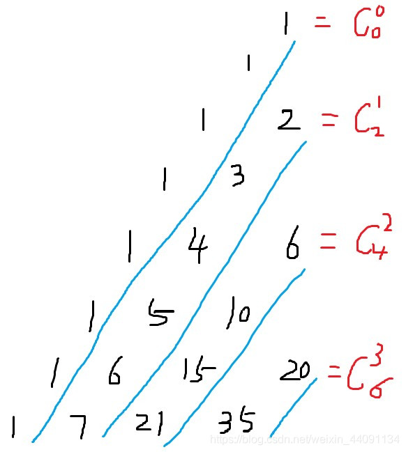

[P1524 - [蓝桥杯2020初赛] 平面切分 - New Online Judge (ecustacm.cn)](http://oj.ecustacm.cn/problem.php?id=1524)


分析：


发现加入一边并且当前边产生k个交点时，增加1+k个平面


每加入一个线段，如果没有重合线段就计算产生多少交点，

平行线不产生交点，

$x=\dfrac {b_2-b_1} {a_1-a_2}$

$y=\dfrac {a_1b_2-b_1a_2} {a_1-a_2}$


```cpp
void solve()
{
    cin>>n;

    ans=1;  // 一条线不加，初始是一个平面

    for(int i=1;i<=n;i++)
    {
        cin>>a>>b;

        if(st.count({a,b}))continue;  // 已经计算过了，不重复计算

        stt.clear();

        for(auto u:st)
        {
            if(u.a==a)continue;

            x=(u.b-b)/(a-u.a);
            y=(a*u.b-b*u.a)/(a-u.a);

            stt.insert({x,y});  // 存放相交交点坐标
        }

        st.insert({a,b});

        ans+=1+stt.size();
    }    

    cout<<ans<<endl;
}
```


```cpp
#include <bits/stdc++.h>

using namespace std;

const int N = 1010;

typedef pair<long double, long double> pii;
typedef long long ll;

int n;
long double a[N], b[N];
long double x, y;
ll ans;
set<pii>st;
bool f;

int main()
{
	cin >> n;

	ans = 1;

	for (int i = 1; i <= n; i++)
	{
		scanf("%Lf%Lf", &a[i], &b[i]);

		f = true;

		for (int j = 1; j < i; j++)
		{
			if ((a[i] == a[j]) && (b[i] == b[j]))  // 重合线，避免重复计算
			{
				f = false;
				break;
			}
		}

		if (f)
		{
			st.clear();  // 记录第i个点和交点个数

			for (int j = 1; j < i; j++)
			{
				if (a[i] == a[j])continue;

				x = (b[i] - b[j]) / (a[j] - a[i]);

				y = (b[i] * a[j] - b[j] * a[i]) / (a[j] - a[i]);

				st.insert({ x,y });
			}

			ans += st.size() + 1;
		}
	}

	cout << ans << endl;

	return 0;
}
```


[P1564 - [蓝桥杯2021初赛] 杨辉三角形 - New Online Judge (ecustacm.cn)](http://oj.ecustacm.cn/problem.php?id=1564)


分析：


标号从0开始，

发现图以中间轴为对称轴，左边元素总是比右边元素先出现


发现第k斜行，第一个最小元素值为$C_{2k}^k$，第i行对应的斜边元素为$C_{i}^{k}$，

$C_{2k}^k=\dfrac {2k!} {k!k!}$，求值发现最多只会枚举到$k=16$


枚举斜行标号，

二分查找合法位置元素$C_{l}^k$，

前面有$l$行，当前元素在同一行前有$k$个元素，

对应位置为$(l+1)\cdot l/2+k+1$



```cpp
ll C(int a,int b)
{
    ll res=1;

    for(int i=a,j=1;j<=b;i--,j++)
    {    
        res=res*i/j;

        if(res>n)return res;
    }

    return res;
}

bool check(int k)
{ 
    int l=2*k,r=max(l,n); 

    while(l<r) 
    { 
        mid=(l+r)/2; 

        if(C(mid,k)>=n)r=mid; else l=mid+1; 
    } 

    if(C(l,k)==n){cout<<(1ll+l)*l/2+k+1<<endl; return true;} 

    return false;
} 

void solve()
{ 
    cin>>n; 

    for(int i=16;i>=0;i--)if(check(n))break;
}
```


```cpp
#include <bits/stdc++.h>

using namespace std;
typedef long long ll;

int n;

ll C(int a, int b)
{
    ll res = 1;

    for (ll i = a, j = 1; j <= b; i--, j++)
    {
        res = res * i / j;

        if (res > n)return res;
    }

    return res;
}

bool check(int k)
{
    int l = k * 2, r = max(l, n), mid;

    while (l < r)
    {
        mid = (l + r) / 2;

        if (C(mid, k) >= n)r = mid;
        else l = mid + 1;
    }

    if (C(l, k) == n)
    {
        cout << 1ll * l * (l + 1) / 2 + k + 1 << endl;

        return true;
    }

    return false;
}

void solve()
{
    cin >> n;

    for (int i = 16; i >= 0; i--)
    {
        if (check(i))break;
    }
}

int main()
{
    int t;

    cin >> t;

    while (t--)solve();

    return 0;
}
```
