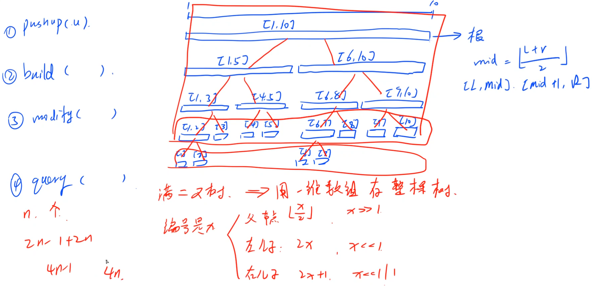
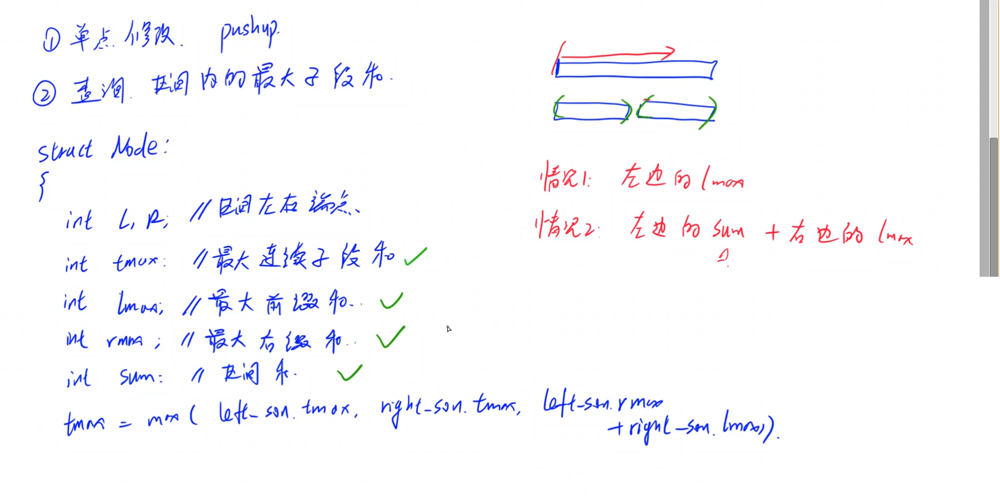
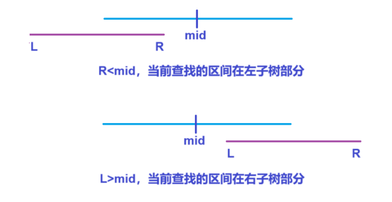
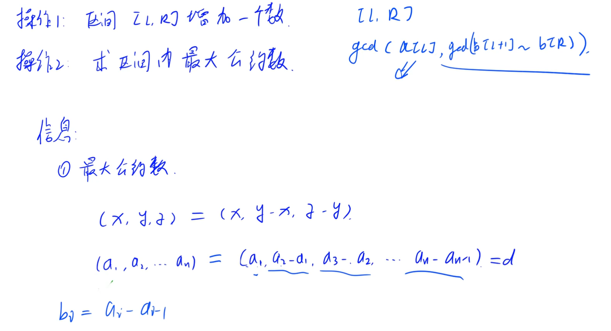
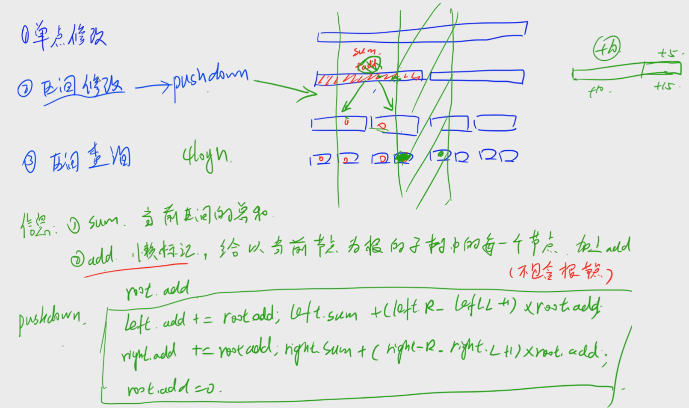
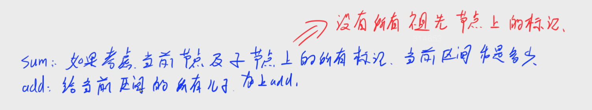
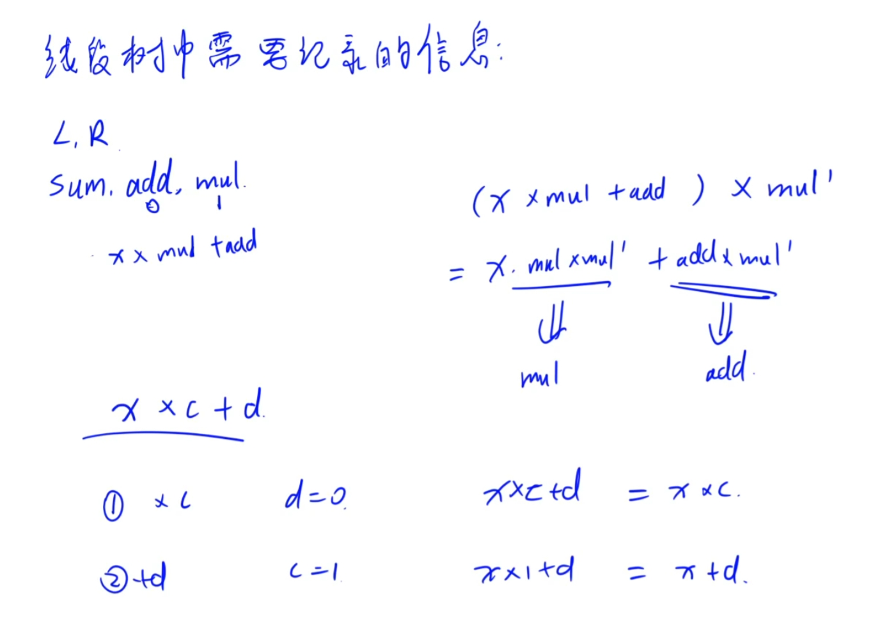
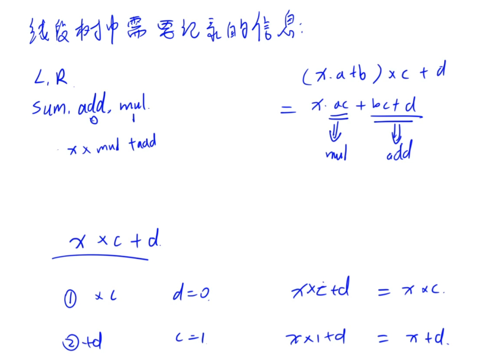

$1+\cdots+\dfrac n 2=n-1$

$n-1+n+2n=4n-1$，线段树空间需要开到$O(4N)$


建树时，先建子树，再用子树节点更新当前节点


[245. 你能回答这些问题吗 - AcWing题库](https://www.acwing.com/problem/content/246/)


要求动态修改数值，查询区间最大连续子段和


分析：


为了简化pushup函数，重载两个pushup函数，

一个用节点编号更新，一个用子节点更新父节点


```cpp
struct node
{
    int l,r;

    int lmax,rmax,tmax,sum;  // 最大前缀和 最大后缀和 最大区间和 区间总和
}tr[4*N];

void pushup(node& u,node& l,node& r)
{
    u.sum=l.sum+r.sum;

    u.lmax=max(l.lmax,l.sum+r.lmax); u.rmax=max(r.rmax,r.sum+l.rmax);

    u.tmax=max({l.tmax,r.tmax,l.rmax+r.lmax});
}

void pushup(int u){ pushup(tr[u],tr[u<<1],tr[u<<1|1]); }

// 当前节点编号是u，区间为[l,r]

void build(int u,int l,int r)
{
    if(l==r)tr[u]={l,r,a[l],a[l],a[l],a[l]};  // 当前区间值就是这个点
    else
    {
        tr[u]={l,r};  // 建立父区间

        int mid=(l+r)/2;

        build(u<<1,l,mid); build(u<<1|1,mid+1,r);  // 递归建立左右子区间

        pushup(u);  // 用子区间更新当前区间
    }
}

void modify(int u,int idx,int v)
{
    if(tr[u].l==idx&&tr[u].r==idx)tr[u]={idx,idx,v,v,v,v};
    else
    {
        int mid=(tr[u].l+tr[u].r)/2;

        if(idx<=mid)modify(u<<1,idx,v); else modify(u<<1|1,idx,v);

        // 要修改的分别在左/右区间

        pushup(u);
    }
}

node qury(int u,int l,int r)
{
    if(tr[u].l>=l&&tr[u].r<=r)return tr[u];
    else
    {
        int mid=(tr[u].l+tr[u].r)/2;

        if(r<=mid)qury(u<<1,l,r);
        else if(mid<l)qury(u<<1|1,l,r);
        else
        {
            node l_son=qury(u<<1,l,r);
            node r_son=qury(u<<1|1,l,r);

            node ans;

            pushup(ans,l_son,r_son);

            return ans;
        }
    }
}

void solve()
{
    cin>>n>>m;

    for(int i=1;i<=n;i++)cin>>a[i];

    build(1,1,n);

    while(m--)
    {
        cin>>k>>x>>y;

        if(k==1)
        {
            if(x>y)swap(x,y); cout<<qury(1,x,y).tmax<<endl;
        }
        else
        {
            modify(1,x,y);
        }
    }
}
```





```cpp
#include <bits/stdc++.h>

using namespace std;

typedef long long ll;

const int N=5e5+10;

int n,m;
int k,x,y;
int w[N];

struct node
{
    int l,r;
    int sum,lmax,rmax,tmax;  // 总和 最大前缀和 最大后缀和 最大区间和 
}tr[4*N];

void pushup(node &u,node &l,node &r)
{
    u.sum=l.sum+r.sum;

    u.lmax=max(l.lmax,l.sum+r.lmax);
    u.rmax=max(r.rmax,l.rmax+r.sum);

    u.tmax=max({l.tmax,r.tmax,l.rmax+r.lmax});
}

void pushup(int u)
{
    pushup(tr[u],tr[u<<1],tr[u<<1|1]);
}

void build(int u,int l,int r)
{
    if(l==r)tr[u]={l,r,w[l],w[l],w[l],w[l]};  // 当前分到最小节点 
    else
    {
        tr[u]={l,r};

        int mid=(l+r)/2;

        build(u<<1,l,mid);
        build(u<<1|1,mid+1,r);

        pushup(u);
    }
}

void modify(int u,int idx,int v)
{
    if(tr[u].l==idx&&tr[u].r==idx)tr[u]={idx,idx,v,v,v,v};
    else
    {
        int mid=(tr[u].l+tr[u].r)/2;

        if(idx<=mid)modify(u<<1,idx,v);  // 当前要修改的值在左区间 
        else modify(u<<1|1,idx,v);

        pushup(u);
    }
}

node qury(int u,int l,int r)
{
    if(tr[u].l>=l&&tr[u].r<=r)return tr[u];
    else
    {
        int mid=(tr[u].l+tr[u].r)/2;

        if(r<=mid)return qury(u<<1,l,r);    // 要找的区间在左子树 
        else if(l>mid)return qury(u<<1|1,l,r);  // 要找的区间在右子树 
        else    // 左右子树都包含这个区间 
        {
            node l_son=qury(u<<1,l,r);  // 找左子树对应的区间 
            node r_son=qury(u<<1|1,l,r);  // 找右子树对应的区间 

            node ans;

            pushup(ans,l_son,r_son);  // 用l和r更新节点ans 

            return ans;       // 返回查找结果 
        }
    }
}

int main()
{
    cin>>n>>m;

    for(int i=1;i<=n;i++)cin>>w[i]; // 输入每个节点的编号

    build(1,1,n);         // 递归建树 

    while(m--)
    {
        cin>>k>>x>>y;

        if(k==1)
        {
            if(x>y)swap(x,y);

            cout<<qury(1,x,y).tmax<<endl;
        }
        else
        {
            modify(1,x,y);
        }
    }

    return 0;
}
```


[1275. 最大数 - AcWing题库](https://www.acwing.com/problem/content/1277/)


给定一系列操作，

添加数字在序列末尾，

询问当前最后L个数中最大数字为多少


分析：


node中存区间max数值


```cpp
struct node
{
    int l,r;
    int v;
}tr[4*N];

void pushup(node& u,node& l,node& r)  // 用左右区间最大值更新总区间最大值
{
    u.v=max(l.v,r.v);
}

void pushup(int u){ pushup(tr[u],tr[u<<1],tr[u<<1|1]); }

void build(int u,int l,int r)  // 初始化每个节点区间范围
{
    if(l==r)tr[u]={l,l};
    else
    {
        int mid=(l+r)/2;

        tr[u]={l,r}; build(u<<1,l,mid),build(u<<1|1,mid+1,r);
    }
}

void modify(int u,int idx,int v)
{
    if(tr[u].l==idx&&tr[u].r==idx)tr[u].v=v;
    else
    {
        int mid=(tr[u].l+tr[u].r)/2;

        if(idx<=mid)modify(u<<1,idx,v);
        else modify(u<<1|1,idx,v);

        pushup(u);  // 更改完子区间后更新总区间
    }
}

int qury(int u,int l,int r)
{
    if(l<=tr[u].l&&tr[u].r<=r)return tr[u].v;
    else
    {
        int mid=(tr[u].l+tr[u].r)/2;

        int w=-inf;

        if(r<=mid)w=qury(u<<1,l,r);  // 所有的都包含在左区间
        else if(mid<l)w=max(w,qury(u<<1|1,l,r));  // 所有的都包含在右区间
        else     // 左右区间都有
        {
            w=max(w,qury(u<<1,l,mid)); w=max(w,qury(u<<1|1,mid+1,r));
        }

        return w;
    }
}

void solve()
{
    cin>>m>>p;

    char op; int x,a=0,n=0;

    build(1,1,m);

    while(m--)
    {
        cin>>op>>x;

        if(op=='A')
        {
            modify(1,++n,(1ll*x+a)%p);  // 4e9+10超int
        }
        else
        {
            a=qury(1,n-x+1,n);

            cout<<a<<endl;
        }
    }
}
```


```cpp
#include <bits/stdc++.h>

using namespace std;

const int N=2e5+10;

struct node
{
    int l,r;  // 当前节点区间范围

    int v;    // 当前节点负责的区间最大值 
}tr[4*N];

int n;
int a,x;
int m,p;

// 当前节点为u，初始化[l,r]的线段树 

void build(int u,int l,int r)
{
    tr[u]={l,r};

    if(l==r)return;

    int mid=(l+r)/2;

    build(u<<1,l,mid);
    build(u<<1|1,mid+1,r);
}

// 总查询区间为[l,r]，当前节点为u 

int qury(int u,int l,int r)
{
    if(tr[u].l>=l&&tr[u].r<=r)return tr[u].v;

    int mid=(tr[u].l+tr[u].r)/2;

    int v=0; //

    if(l<=mid)v=qury(u<<1,l,r);

    if(r>mid)v=max(v,qury(u<<1|1,l,r));

    return v;
}

// 将第idx个数改为v，当前节点为u 

void modify(int u,int idx,int v)
{
    if(tr[u].l==tr[u].r)tr[u].v=v;
    else
    {
        int mid=(tr[u].l+tr[u].r)/2;

        if(idx<=mid)modify(u<<1,idx,v);  // 按要求更新左右节点的数值 
        else modify(u<<1|1,idx,v);

        tr[u].v=max(tr[u<<1].v,tr[u<<1|1].v);  // 利用左右节点的数值更新根节点数值 
    }
}

int main()
{
    cin>>m>>p;

    build(1,1,m);

    char op;

    while(m--)
    {
        cin>>op>>x;

        if(op=='A')
        {
            modify(1,++n,(1ll*x+a)%p);
        }
        else
        {
            a=qury(1,n-x+1,n);

            cout<<a<<endl;
        }
    }

    return 0;
}
```


[246. 区间最大公约数 - AcWing题库](https://www.acwing.com/problem/content/247/)


每次操作要么给一段区间+x，要么求一段区间的gcd，

要求求gcd时进行输出


分析：


设$a_1,a_2,\cdots,a_n$公约数为$d$，

由%得，$a_1,a_2-a_1,\cdots,a_n-a_{n-1}$公约数也为$d$，


node中存，当前区间和sum，当前区间公约数d，

build初始化时，每个位置存`w[l]-w[l-1]`即对应的差分


```cpp
struct node
{
    int l,r;
    int sum,d;
}tr[4*N];

void pushup(node& u,node& l,node& r)
{
    u.sum=l.sum+r.sum;

    u.d=__gcd(l.d,r.d);
}

void pushup(int u){ pushup(tr[u],tr[u<<1],tr[u<<1|1]); }

void modify(int u,int idx,int v)
{
    if(tr[u].l==idx&&tr[u].r==idx){ tr[u].sum+=v,tr[u].d+=v; }
    else
    {
        int mid=(tr[u].l+tr[u].r)/2;

        if(mid<idx)modify(u<<1|1,idx,v); else modify(u<<1,idx,v);

        pushup(u);
    }
}

node qury(int u,int l,int r)
{
    if(tr[u].l>=l&&tr[u].r<=r)return tr[u];
    else
    {
        int mid=(tr[u].l+tr[u].r)/2;

        if(r<=mid)return qury(u<<1,l,r);  // [l,r]的查找范围被完全包含在左子区间
        else if(mid<l)return qury(u<<1|1,l,r);
        else
        {
            node l_son,r_son,ans;

            l_son=qury(u<<1,l,mid); r_son=qury(u<<1|1,mid+1,r);

            pushup(ans,l_son,r_son);

            return ans;
        }
    }
}

void build(int u,int l,int r)
{
    if(l==r)tr[u]={l,l,w[l]-w[l-1],w[l]-w[l-1]};
    else
    {
        tr[u]={l,r};

        int mid=(l+r)/2;

        build(u<<1,l,mid); build(u<<1|1,mid+1,r); pushup(u);
    }
}

void solve()
{
    cin>>n>>m;

    for(int i=1;i<=n;i++)cin>>w[i];

    build(1,1,n);

    while(m--)
    {
        cin>>op>>l>>r;

        if(op=='C')
        {
            cin>>d;

            modify(1,l,d);  // l +d

            if(r+1<=n)modify(1,r+1,-d);  // r+1 -d
        }
        else
        {
            node l_=qury(1,1,l);
            node r_={0,0,0,0};

            if(l+1<=r)r_=qury(1,l+1,r);

            cout<<abs(__gcd(l_.sum,r_.d))<<endl;
        }
    }
}
```



```cpp
#include <bits/stdc++.h>

#define int long long

using namespace std;

const int N=500000+10;

int n,m;
int a[N];

struct node
{
    int l,r;
    int sum,d;
}tr[4*N];

void pushup(node& u,node& l,node& r)
{
    u.sum=l.sum+r.sum;
    u.d=__gcd(l.d,r.d);
}

void pushup(int u)
{
    pushup(tr[u],tr[u<<1],tr[u<<1|1]);
}

void build(int u,int l,int r)
{
    if(l==r)tr[u]={l,l,a[l]-a[l-1],a[l]-a[l-1]};  // 差分 
    else
    {
        tr[u]={l,r};

        int mid=(tr[u].l+tr[u].r)/2;

        build(u<<1,l,mid);
        build(u<<1|1,mid+1,r);

        pushup(u);
    }
}

void modify(int u,int idx,int v)
{
    if(tr[u].l==idx&&tr[u].r==idx)  // 走到要修改的元素位置 
    {
        tr[u].d+=v;
        tr[u].sum+=v;
    }
    else
    {
        int mid=(tr[u].l+tr[u].r)/2;

        if(idx<=mid)modify(u<<1,idx,v);  // 左子区间 
        else modify(u<<1|1,idx,v);       // 右子区间 

        pushup(u);
    }
}

node qury(int u,int l,int r)
{
    if(tr[u].l>=l&&tr[u].r<=r)return tr[u];
    else
    {
        int mid=(tr[u].l+tr[u].r)/2;

        if(r<=mid)return qury(u<<1,l,r);
        else if(l>mid)return qury(u<<1|1,l,r);
        else
        {
            node l_son,r_son,ans;

            l_son=qury(u<<1,l,mid);
            r_son=qury(u<<1|1,mid+1,r);

            pushup(ans,l_son,r_son);

            return ans;
        }
    }
}

signed main()
{
    cin>>n>>m;

    for(int i=1;i<=n;i++)cin>>a[i];

    build(1,1,n);

    char op;

    int l,r,d;

    while(m--)
    {
        cin>>op;

        if(op=='C')
        {
            cin>>l>>r>>d;

            modify(1,l,d);

            if(r+1<=n)modify(1,r+1,-d);
        }
        else
        {
            cin>>l>>r;

            node l_son,r_son;

            l_son=qury(1,1,l);  // 求1~l的差分和，为当前的a[l] 

            if(l+1<=r)r_son=qury(1,l+1,r);  // 求l+1~r的差分gcd 
            else r_son.d=0;

            cout<<abs(__gcd(l_son.sum,r_son.d))<<endl;
        }
    }

    return 0;
}
```


[243. 一个简单的整数问题2 - AcWing题库](https://www.acwing.com/problem/content/description/244/)


有两种操作：

1. 将区间`[l,r]`每个数字加上d

2. 求`[l,r]`区间和
   
   

分析：


用lazy标记记录当前区间的子区间每个数字都需要加上的值


sum记录当前区间和，add作为lazy标记记录每个下放子区间元素都要加上的值


每次`pushup(u)`前需要`pushdown(u)`，

才能保证`tr[u].sum=tr[u<<1].sum+tr[u<<1|1].sum`正确，

并且因为已经`pushdown`，当前lazy标志置0，这样不会再次更新子区间


```cpp
struct node
{
    int l,r;
    int sum,add;
}tr[4*N];

void pushup(int u)
{
    tr[u].sum=tr[u<<1].sum+tr[u<<1|1].sum;
}

void pushdown(int u)
{
    node& fa=tr[u],& l=tr[u<<1],& r=tr[u<<1|1];  //

    if(fa.add==0)return;

    l.sum+=(l.r-l.l+1)*fa.add;
    l.add+=fa.add;

    r.sum+=(r.r-r.l+1)*fa.add;
    r.add+=fa.add;    

    fa.add=0;  // lazy=0
}

void modify(int u,int l,int r,int d)
{
    if(tr[u].l>=l&&tr[u].r<=r)
    {
        tr[u].add+=d; tr[u].sum+=(tr[u].r-tr[u].l+1)*d;
    }
    else
    {
        pushdown(u);

        int mid=(tr[u].l+tr[u].r)/2;

        // 分别在左右子区间内找满足要求的在[l,r]范围内的区间

        if(l<=mid)modify(u<<1,l,r,d);
        if(mid<r)modify(u<<1|1,l,r,d);

        pushup(u);  // 和上面的pushdown照应，用子区间和更新当前区间
    }
}

int qury(int u,int l,int r)
{
    if(tr[u].l>=l&&tr[u].r<=r)return tr[u].sum;
    else
    {
        pushdown(u);  // 要查询子区间和，为保证子区间sum正确，下放add

        int mid=(tr[u].l+tr[u].r)/2;

        int ans=0;

        if(l<=mid)ans+=qury(u<<1,l,r);
        if(mid<r)ans+=qury(u<<1|1,l,r);

        return ans;
    }
}

void build(int u,int l,int r)
{
    if(l==r)
    {
        tr[u]={l,l,w[l],0};
    }
    else
    {
        tr[u]={l,r};

        int mid=(tr[u].l+tr[u].r)/2;

        build(u<<1,l,mid); build(u<<1|1,mid+1,r);

        pushup(u);
    }
}

void solve()
{
    cin>>n>>m;

    for(int i=1;i<=n;i++)cin>>w[i];

    build(1,1,n);

    while(m--)
    {
        cin>>op>>l>>r;

        if(op=='C')
        {
            cin>>d;

            modify(1,l,r,d);
        }
        else
        {
            cout<<qury(1,l,r)<<endl;
        }
    }
}
```





```cpp
#include <bits/stdc++.h>

#define int long long

using namespace std;

const int N=1e5+10;

int n,m,w[N];

struct node
{
    int l,r;
    int sum,add;
}tr[4*N];

void pushup(int u)
{
    tr[u].sum=tr[u<<1].sum+tr[u<<1|1].sum;
}

void pushdown(int u)
{
    node& fa=tr[u],& l=tr[u<<1],& r=tr[u<<1|1];  //

    if(fa.add)
    {
        l.add+=fa.add;
        r.add+=fa.add;

        l.sum+=(l.r-l.l+1)*fa.add;
        r.sum+=(r.r-r.l+1)*fa.add;

        fa.add=0;
    }
}

void modify(int u,int l,int r,int v)
{
    if(tr[u].l>=l&&tr[u].r<=r)  // 当前区间完全被包含在范围内 
    {
        tr[u].sum+=(tr[u].r-tr[u].l+1)*v;

        tr[u].add+=v;
    }
    else
    {
        pushdown(u);  // 先将子区间值sum更新，保证pushup中区间sum能被正确计算 

        int mid=(tr[u].l+tr[u].r)/2;

        if(l<=mid)modify(u<<1,l,r,v);  // 更新子区间 

        if(r>mid)modify(u<<1|1,l,r,v);

        pushup(u);  // 用子区间更新当前区间 
    }
}

int qury(int u,int l,int r)
{
    if(tr[u].l>=l&&tr[u].r<=r)return tr[u].sum;
    else
    {
        pushdown(u);  // 保证子区间的sum都是正确的 

        int mid=(tr[u].l+tr[u].r)/2;

        if(r<=mid)return qury(u<<1,l,r);
        else if(mid<l)return qury(u<<1|1,l,r);
        else
        {
            int ans=qury(u<<1,l,mid)+qury(u<<1|1,mid+1,r);

            return ans;
        }
    }
}

void build(int u,int l,int r)
{
    if(l==r)tr[u]={l,l,w[l],0};
    else
    {
        tr[u]={l,r};

        int mid=(l+r)/2;

        build(u<<1,l,mid);
        build(u<<1|1,mid+1,r);

        pushup(u);
    }
}

signed main()
{
    cin>>n>>m;

    for(int i=1;i<=n;i++)cin>>w[i];

    build(1,1,n);

    char op;

    int l,r,d;

    while(m--)
    {
        cin>>op>>l>>r;

        if(op=='C')
        {
            cin>>d;

            modify(1,l,r,d);
        }
        else
        {
            cout<<qury(1,l,r)<<endl;
        }
    }

    return 0;
}
```


[1277. 维护序列 - AcWing题库](https://www.acwing.com/problem/content/1279/)


将一段区间的数字都乘上一个数，

将一段区间的数字都加上一个数，

求一段区间的数字和，进行多次上述操作


分析：


node有l，r，sum，add，mul


先将现有的add乘上mul，再加上add


```cpp
struct node
{
    int l,r;
    int sum,add,mul;
}tr[4*N];

void pushup(int u)
{
    tr[u].sum=tr[u<<1].sum+tr[u<<1|1].sum;  // 用子区间更新区间值
}

void eval(node& l,int add,int mul)
{
    l.sum=(l.sum*mul+(l.r-l.l+1)*add)%p;  // 区间先乘后加

    l.mul=(l.mul*mul)%p;
    l.add=(l.add*mul+add)%p;
}

void pushdown(int u)
{
    eval(u<<1,tr[u].add,tr[u].mul);  // 根节点下放
    eval(u<<1|1,tr[u].add,tr[u].mul);

    tr[u].add=0,tr[u].mul=1;
}

void build(int u,int l,int r)
{
    if(l==r)tr[u]={l,r,a[l],0,1};
    else
    {
        int mid=l+r>>1;

        tr[u]={l,r,0,0,1};

        build(u<<1,l,mid);
        build(u<<1|1,mid+1,r);

        pushup(u);  // 更新sum
    }
}

void modify(int u,int l,int r,int add,int mul)
{
    if(tr[u].l>=l&&tr[u].r<=r)
    {
        eval(tr[u],add,mul);   // 直接更新
    }
    else
    {
        pushdown(u);

        int mid=(tr[u].l+tr[u].r)/2;

        if(l<=mid)modify(u<<1,l,r,add,mul);
        if(mid<r)modify(u<<1|1,l,r,add,mul);

        pushup(u);
    }
}

int qury(int u,int l,int r)
{
    if(tr[u].l>=l&&tr[u].r<=r)return tr[u].sum%p;
    else
    {
        pushdown(u);

        int mid=(tr[u].l+tr[u].r)/2;

        int sum=0;

        if(l<=mid)sum+=qury(u<<1,l,r);
        if(mid<r)sum+=qury(u<<1|1,l,r);

        sum%=p;

        pushup(u);

        return sum;
    }
}

void solve()
{
    cin>>n>>p;

    for(int i=1;i<=n;i++)cin>>a[i];

    build(1,1,n);

    cin>>m;

    while(m--)
    {
        cin>>op>>t>>g;

        if(op==1)
        {
            cin>>c;

            modify(1,t,g,0,c);
        }
        else if(op==2)
        {
            cin>>c;

            modify(1,t,g,c,1);
        }
        else
        {
            cout<<qury(1,t,g)%p<<endl;
        }
    }
}
```





```cpp
#include <bits/stdc++.h>

#define int long long

using namespace std;

const int N=1e5+10;

int n,p,m;
int w[N];

struct node
{
    int l,r;
    int sum;
    int add,mul;
}tr[4*N];

void pushup(int u)
{
    tr[u].sum=(tr[u<<1].sum+tr[u<<1|1].sum)%p;
}

void eval(node &t,int add,int mul)
{
    t.sum=(t.sum*mul+(t.r-t.l+1)*add)%p;

    // 将之前的全部乘上mul，再将当前区间元素都加上add 

    t.mul=t.mul*mul%p;

    t.add=(t.add*mul+add)%p;
}

void pushdown(int u)
{
    eval(tr[u<<1],tr[u].add,tr[u].mul);
    eval(tr[u<<1|1],tr[u].add,tr[u].mul);

    tr[u].add=0;
    tr[u].mul=1;
}

void build(int u,int l,int r)
{
    if(l==r)tr[u]={l,l,w[l],0,1};
    else
    {
        int mid=(l+r)/2;

        tr[u]={l,r,0,0,1};

        build(u<<1,l,mid);
        build(u<<1|1,mid+1,r);

        pushup(u);
    }
}

void modify(int u,int l,int r,int add,int mul)
{
    if(tr[u].l>=l&&tr[u].r<=r)
    {
        eval(tr[u],add,mul);
    }
    else
    {
        pushdown(u);

        int mid=(tr[u].l+tr[u].r)/2;

        if(l<=mid)modify(u<<1,l,r,add,mul);
        if(mid<r)modify(u<<1|1,l,r,add,mul);

        pushup(u);
    }
}

int qury(int u,int l,int r)
{
    if(tr[u].l>=l&&tr[u].r<=r)return tr[u].sum%p;
    else
    {
        int mid=(tr[u].l+tr[u].r)/2;

        pushdown(u);

        int sum=0;

        if(r<=mid)sum=qury(u<<1,l,r);
        else if(l>mid)sum=qury(u<<1|1,l,r);
        else
        {
            sum=(qury(u<<1,l,mid)+qury(u<<1|1,mid+1,r))%p;
        }

        pushup(u);

        return sum;
    }
}

signed main()
{
    cin>>n>>p;

    for(int i=1;i<=n;i++)cin>>w[i];

    build(1,1,n);

    cin>>m;

    int op,t,g,c;

    while(m--)
    {
        cin>>op>>t>>g;

        if(op==1)
        {
            cin>>c;

            modify(1,t,g,0,c);
        }
        else if(op==2)
        {
            cin>>c;

            modify(1,t,g,c,1);
        }
        else
        {
            cout<<qury(1,t,g)<<endl;
        }
    }

    return 0;
}
```
