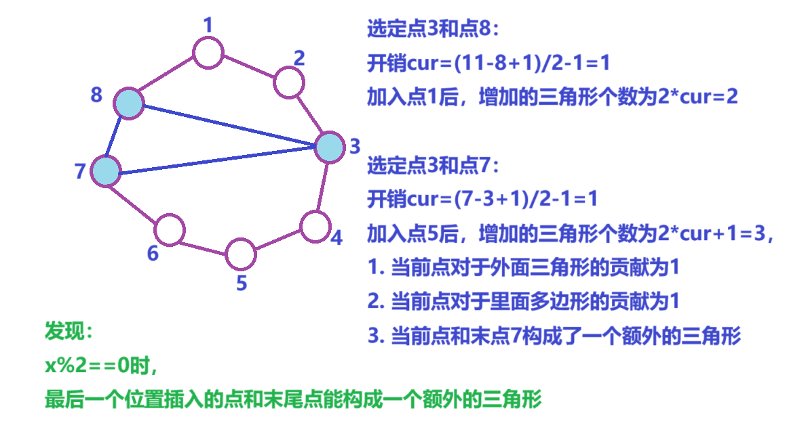
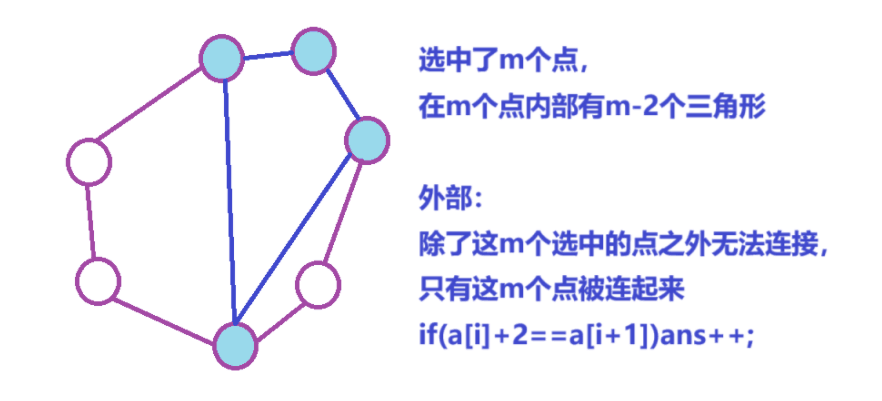

[0数三角 - 蓝桥云课 (lanqiao.cn)](https://www.lanqiao.cn/problems/17107/learning/)


分析：


`vector<map<ll,vector<int>>>v(n+1)`记录每个节点，距离节点为`d`的所有节点，

枚举当前每个节点作为顶点，三点不共线是一个合法等腰三角形


循环合并能加速，不合并会超时

$O(10^{6})$


```cpp
inline ll get(ll x1,ll x2,ll y1,ll y2)
{
    return (x1-x2)*(x1-x2)+(y1-y2)*(y1-y2);
}

bool check(pii a,pii b,pii c)
{
    if(a.first==b.first&&a.first==c.first)return false;
    else if(a.first==b.first)return true;
    else if(a.first==c.first)return true;

    double k1=(1.0*a.second-b.second)/(a.first-b.first);
    double k2=(1.0*a.second-c.second)/(a.first-c.first);

    return abs(k1-k2)<1e-6;
}

void solve()
{
    cin>>n;

    for(int i=1;i<=n;i++)cin>>a[i].x>>a[i].y;

    vector<map<ll,vector<int>>>v(n+1);

    for(int i=1;i<=n;i++)
    {
        for(int j=1;j<=n;j++)
        {
            if(a[i]==a[j])continue;

            d=get(a[i].x,a[j].x,a[i].y,a[j].y);

            v[i][d].emb(j);
        }

        for(const auto& mp:v[i])  // 常量引用，加速
        {
            for(int j=0;j<mp.second.size();j++)
            {
                for(int k=j+1;k<mp.second.size();k++)
                {
                    if(check(a[i],a[mp.second[j]],a[mp.second[k]]))ans++;
                }        
            }
        }
    }

    cout<<ans<<endl;
}
```


```cpp
#include <bits/stdc++.h>

#define fi first
#define se second

using namespace std;

typedef long long ll;
typedef pair<ll, ll> pii;

const int N = 2e3 + 10;

int n;
ll ans;
pii a[N];

ll get(ll x, ll xx, ll y, ll yy)
{
    return (x - xx) * (x - xx) + (y - yy) * (y - yy);
}

// check是否共线

bool check(pii a, pii b, pii c)
{
    if (a.first == b.first && a.first == c.first)return false;

    double k1 = (1.0 * a.second - b.second) / (a.first - b.first);
    double k2 = (1.0 * a.second - c.second) / (a.first - c.first);

    if (abs(k1 - k2) < 1e-6)return false;
    
    return true;
}

int main()
{
    cin >> n;

    for (int i = 1; i <= n; i++)cin >> a[i].fi >> a[i].se;

    vector<map<ll, vector<int>>>v(n + 1);

    ll d;

    for (int i = 1; i <= n; i++)
    {
        for (int j = 1; j <= n; j++)
        {
            if (a[i] == a[j])continue;

            d = get(a[i].first, a[j].first, a[i].second, a[j].second);

            v[i][d].emplace_back(j);
        }

        for (auto& [u, uu] : v[i])
        {
            for (int j = 0; j < uu.size(); j++)
            {
                for (int k = j + 1; k < uu.size(); k++)
                {
                    if (check(a[i], a[uu[j]], a[uu[k]]))ans++;
                }
            }
        }
    }

    cout << ans << endl;

    return 0;
}
```


[Problem - C2 - Codeforces](https://codeforces.com/contest/1942/problem/C2)


给定x个点，能额外选择至多y个点，

将这些点之间任意连线后总的n个点最多能有几个三角形


分析：


> `a[i+1]-a[i]`为奇数：
> 
> 
> 
> `cur=(a[i+1]-a[i])/2`，插入cur个点
> 
> 
> 
> 1. 给里面的k边形贡献1个三角形
> 
> 2. 给外面的边界贡献1个三角形


> `a[i+1]-a[i]`为偶数：
> 
> 
> 
> `cur=(a[i+1]-a[i])/2-1`，插入cur个点
> 
> 
> 
> 1. 给里面的k边形贡献1个三角形
> 
> 2. 给外面的边界贡献1个三角形
> 
> 3. 最后一个点和第`a[i+1]`个点构成三角形


```cpp
bool cmp(int x,int y)
{
    if(x%2==0&&y%2)return true;
    else if(x%2&&y%2==0)return false;
    else x<y;
}

void solve()
{
    cin>>n>>a>>b;

    for(int i=1;i<=a;i++)cin>>x[i];

    x[a+1]=a[1]+n;

    for(int i=1;i<=a;i++)
    {
        v.push_back(x[i+1]-x[i]);
    }

    sort(alls(v),cmp);

    for(auto u:v)
    {
        if(u&1)tem=u/2; else tem=u/2-1;

        cur=min(tem,b);

        ans+=cur*2;

        b-=cur;

        if(cur==tem&&tem%2==0)ans++;
    }

    cout<<ans<<endl;
}
```



```cpp
#include <bits/stdc++.h>
#include <functional>
 
#define alls(a) a.begin(),a.end()
#define emb emplace_back
#define pub push_back
#define pob pop_back
#define puf push_front
#define pof pop_front
#define fi first
#define se second
#define No puts("No")
#define Yes puts("Yes")
#define NO puts("NO")
#define YES puts("YES")
 
using namespace std;
typedef long long ll;
//typedef __int128 lll; // G++(32位)不支持
typedef unsigned long long ull;
typedef pair<int, int> pii;
 
const int N = 2e5 + 10;
const int mo = 1e9 + 7;
const int inf = 2e9 + 10;
 
int n, a, b;
int tem, cur;
int x[N], ans;
vector<int>v;
 
bool cmp(int x, int y)
{
    if (x % 2 == 0 && y % 2)return true;
    else if (x % 2 && y % 2 == 0)return false;
    else return x < y;
}
 
void solve()
{
    cin >> n >> a >> b;
 
    v.clear();
 
    ans = max(0, a - 2);
 
    for (int i = 1; i <= a; i++)cin >> x[i];
 
    sort(x + 1, x + a + 1);
 
    x[a + 1] = x[1] + n;
 
    for (int i = 1; i <= a; i++)
    {
        v.push_back(x[i + 1] - x[i]);
    }
 
    sort(alls(v), cmp);
 
    for (auto u : v)
    {
        cur = (u + 1) / 2 - 1; // 可以插入的节点数
 
        tem = min(cur, b);
 
        b -= tem;
 
        ans += 2 * tem;  // 1. 加入的顶点本身构成的外边的三角形 2. 里面增加的三角形
 
        if (tem == cur && u % 2 == 0)ans++;
    }
 
    cout << ans << endl;
}
 
int main()
{
    int t;
 
    cin >> t;
 
    //t = 1;
 
    while (t--)solve();
 
    return 0;
}
```


[Problem - C1 - Codeforces](https://codeforces.com/contest/1942/problem/C1)


给定x个点，

将这些点之间任意连线后总的n个点最多能有几个三角形


分析：


一个n边形最多能分成n-2个三角形，

`a[i+1]-a[i]==2`时，连`a[i]`和`a[i+1]`能增加一个三角形


```cpp
void solve()
{
    cin>>n>>a>>b;

    for(int i=1;i<=a;i++)cin>>x[i];

    sort(x+1,x+a+1);

    x[a+1]=x[1]+n;  // 将最后一个点和a[1]连起来构成循环

    ans=max(a-2,0);

    for(int i=1;i<=a;i++)
    {
        if(x[i+1]-x[i]==2)ans++;
    }

    cout<<ans<<endl;
}
```



```cpp
#include <bits/stdc++.h>
#include <functional>
 
#define alls(a) a.begin(),a.end()
#define emb emplace_back
#define pub push_back
#define pob pop_back
#define puf push_front
#define pof pop_front
#define fi first
#define se second
#define No puts("No")
#define Yes puts("Yes")
#define NO puts("NO")
#define YES puts("YES")
 
using namespace std;
typedef long long ll;
//typedef __int128 lll; // G++(32位)不支持
typedef unsigned long long ull;
typedef pair<int, int> pii;
 
const int N = 2e5 + 10;
const int mo = 1e9 + 7;
const int inf = 2e9 + 10;
 
int n, a, b;
int x[N], ans;
 
void solve()
{
    cin >> n >> a >> b;
 
    ans = a - 2;
 
    for (int i = 1; i <= a; i++)cin >> x[i];
 
    sort(x + 1, x + a + 1);
 
    x[a + 1] = x[1] + n;
 
    for (int i = 1; i <= a; i++)
    {
        if (x[i + 1] - x[i] == 2)ans++;
    }
 
    cout << ans << endl;
}
 
int main()
{
    int t;
 
    cin >> t;
 
    //t = 1;
 
    while (t--)solve();
 
    return 0;
}
```
