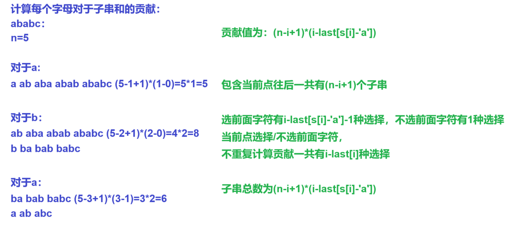

## 贡献计算：

计算一个元素对于所有包含当前元素的贡献，

加上所有元素的贡献就是答案


[P1523 - [蓝桥杯2020初赛] 子串分值和 - New Online Judge (ecustacm.cn)](http://oj.ecustacm.cn/problem.php?id=1523)


分析：


计算每个字母对于子串的贡献，只有不同的字母才会产生贡献，

用last数组记录当前字母上一次出现的位置，

计算当前包含当前字母不和前面字母重复的子串个数`(n-i+1)*(i-last[s[i]-'a'])`，

选/不选`i-last[s[i]-'a']`


```cpp
void solve()
{
    cin>>s;

    n=s.size();

    s=" "+s;

    for(int i=1;i<=n;i++)
    {
        ans+=(n-i+1ll)*(i-last[s[i]-'a']);
    }

    cout<<ans<<endl;
}
```



```cpp
#include <bits/stdc++.h>

using namespace std;

const int N = 30;

typedef long long ll;
typedef unsigned long long ull;

int n;
string s;
int last[N];
ll ans;

void solve()
{
    cin >> s;

    n = s.size();

    s = " " + s;

    for (int i = 1; i <= n; i++)
    {
        ans += (n - i + 1ll) * (i - last[s[i] - 'a']);  

        // 1. 前面的字母选择有i-last[s[i]-'a']-1种 
        // 2. 前面可以什么字符都不选

        last[s[i] - 'a'] = i;
    }

    cout << ans << endl;
}

int main()
{
    solve();

    return 0;
}
```
