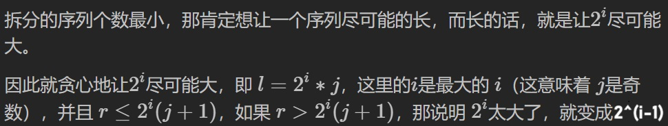
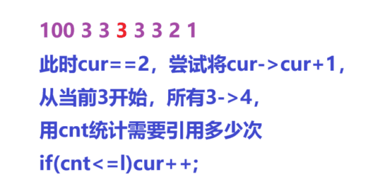

[D - Divide Interval (atcoder.jp)](https://atcoder.jp/contests/abc349/tasks/abc349_d)


要求将`[l,r]`分成若干段形如$2^ij\sim 2^i(j+1)$的序列，

问最少能分成多少段


分析：


每段长度为$2^i+1$，要使得拆分段数最小，需要让$2^i$尽可能大，

$l=2^ij$，当$i$最大时，$j$一定为奇数，

当$l+p>r$时，将`p>>=1,cur<<=1`，使得`j`增大，权重`2^i`减小


```cpp
void solve()
{
    cin>>l>>r;

    while(l<r)
    {
        p=1,cur=l;

        while(cur%2==0&&l+p<r)
        {
            cur>>=1; p<<=1;
        }

        while(l+p>r)
        {
            cur<<=1; p>>=1;
        }

        ans.push_back({l,l+p});

        l+=p;
    }

    cout<<ans.size()<<endl;

    for(auto u:ans)cout<<u.x<<' '<<u.y<<endl;
}
```



```cpp
#include <bits/stdc++.h>

#define x first
#define y second

using namespace std;

typedef long long ll;
typedef pair<ll, ll> pii;

ll l, r;
vector<pii>ans;

int main()
{
	cin >> l >> r;

	ll p = 1, cur;

	while (l < r)
	{
		p = 1;

		cur = l;

		while (cur % 2 == 0 && l + p < r)  // 找最大的i
		{
			p <<= 1;

			cur >>= 1;
		}

		while (l + p > r)
		{
			p >>= 1;

			cur <<= 1;
		}

		ans.push_back({ l,l + p });

		l += p;
	}

	cout << ans.size() << endl;

	for (auto u : ans)cout << u.x << ' ' << u.y << endl;

	return 0;
}
```


[L2-017 人以群分 - 团体程序设计天梯赛-练习集 (pintia.cn)](https://pintia.cn/problem-sets/994805046380707840/exam/problems/994805061056577536?type=7&page=1)


分析：


升序排序，后面值一定小于前面值，因此在`num2>=num1`前提下后缀和一定大于前缀和


保证数量差值最小的情况下，小的更小，大的更大，

当`n&1`时，`num1=n/2,num2=n/2+1`


```cpp
#include <bits/stdc++.h>

using namespace std;

typedef long long ll;

const int N = 1e5 + 10;

int n;
int out, in;
int a[N];
ll s[N], ans;

int main()
{
    cin >> n;

    for (int i = 1; i <= n; i++)cin >> a[i];

    sort(a + 1, a + n + 1);

    for (int i = 1; i <= n; i++)s[i] = s[i - 1] + a[i];

    if (n % 2 == 0)
    {
        out = n / 2, in = n - out;
    }
    else  // 多的更多，少的更少
    {
        out = (n + 1) / 2, in = n - out;
    }

    ans = (s[n] - s[in]) - s[in];

    printf("Outgoing #: %d\n", out);
    printf("Introverted #: %d\n", in);
    printf("Diff = %lld", ans);

    return 0;
}
```


[Problem - D - Codeforces](https://codeforces.com/contest/1951/problem/D)


A有n个金币，B要A买恰好k个珠宝，

A会从第一个商店开始走到第2个商店，

B最多能开60家店，

问B能否满足要求，能就输出每个店的单价


分析：


单价最小为1，k>n，钱不够不合法，

如果`n%k==0`，第一家店就能恰好买k个物品，

否则第一家店尝试买一个最昂贵的，然后剩余k-1个正好在第二家店买，单价1元


最昂贵的单价为n-(k-1)，最大可能走到第二家店并且第一家店就买了1个


```cpp
void solve()
{
    cin>>n>>k;

    if(k>n)NO;
    else if(n%k==0){YES; puts("1"); cout<<n/k<<endl;}
    else
    {
        cur=n-(k-1);

        if(n/cur>1){NO;return;}

        YES;

        puts("2");

        cout<<cur<<' '<<1<<endl;
    }
}
```


```cpp
#include <bits/stdc++.h>
#include <functional>

#define alls(a) a.begin(),a.end()
#define emb emplace_back
#define pub push_back
#define pob pop_back
#define puf push_front
#define pof pop_front
#define fi first
#define se second
#define No puts("No")
#define Yes puts("Yes")
#define NO puts("NO")
#define YES puts("YES")

using namespace std;
typedef long long ll;
//typedef __int128 lll; // G++(32位)不支持
typedef unsigned long long ull;
typedef pair<int, int> pii;

const int N = 2e5 + 10;
const int mo = 1e9 + 7;
const int inf = 2e9 + 10;

ll n, k, cur;

void solve()
{
    cin >> n >> k;

    if (n < k)NO;
    else if (n % k == 0)
    {
        YES;

        puts("1");

        cout << n / k << endl;
    }
    else
    {
        cur = k - 1;

        if (n / (n - cur) > 1)
        {
            NO; return;
        }

        YES;

        puts("2");

        cout << n - cur << ' ' << 1 << endl;
    }
}

int main()
{
    int t;

    cin >> t;

    //t = 1;

    while (t--)solve();

    return 0;
}
```


[Problem - F - Codeforces](https://codeforces.com/contest/1955/problem/F)


给定1 2 3 4的个数分别为a b c d，每次从中拿走一个1，2，3或4，

问一共有多少种状态异或值为0


分析：


1-001

2-010

3-011

4-100


4必须自己异或自己才能变成0，

1^2==3，并且偶数个k异或和为0，

于是a，b，c奇偶性一定相同


每种牌最后都会变为0，0是偶数，

保证a，b，c奇偶性相同情况下，每种牌的初始情况都从最大的偶数开始->0，

如果`a%2&&b%2&&c%2`，说明初始局面异或值为0，ans++


如：

3 5 3 4 

2 4 2 4

0 4 2 4

0 2 2 4

0 0 2 4

0 0 0 4

0 0 0 2


```cpp
void solve()
{
    cin>>a>>b>>c>>d;

    cout<<a/2+b/2+c/2+d/2+(a%2&&b%2&&c%2)<<endl;
}
```


```cpp
#include <bits/stdc++.h>
#include <functional>

#define alls(a) a.begin(),a.end()
#define emb emplace_back
#define pub push_back
#define pob pop_back
#define puf push_front
#define pof pop_front
#define fi first
#define se second
#define No puts("No")
#define Yes puts("Yes")
#define NO puts("NO")
#define YES puts("YES")

using namespace std;
typedef long long ll;
//typedef __int128 lll; // G++(32位)不支持
typedef unsigned long long ull;
typedef pair<int, int> pii;

const int N = 2e5 + 10;
const int mo = 1e9 + 7;
const int inf = 2e9 + 10;

int ans;
int a, b, c, d;

void solve()
{
    cin >> a >> b >> c >> d;

    ans = a / 2 + b / 2 + c / 2 + d / 2;

    if (a % 2 && b % 2 && c % 2)ans++;

    cout << ans << endl;
}

int main()
{
    int t;

    cin >> t;

    //t = 1;

    while (t--)solve();

    return 0;
}
```


[Problem - C - Codeforces](https://codeforces.com/contest/1951/problem/C)


分析：


每次选择x张票，都会对后面每张票增加x的花费，

时间拖得越久总增加花费越多，越分散`a[i]`分布越大，最小值越大，每组尽量都选m


`nn=(k+m-1)/m`，选取最小的nn个ai，

先计算总的不考虑变成mo的总开销，

模拟计算选择第i个位置变成mo的总花费，更新ans


```cpp
void solve()
{
    cin>>n>>m>>k;

    for(int i=1;i<=n;i++)cin>>a[i];

    nn=(k+m-1)/m,x=k-(nn-1)*m;

    cur=0;

    dx=0;

    for(int i=1;i<=n;i++)
    {
        cur+=(a[i]+dx)*m; dx+=m;
    }

    dx=0;

    for(int i=1;i<=n;i++)
    {
        cnt=i-1,cntt=n-i;

        tem=cur-(a[i])
    }
}
```


[3745. 牛的学术圈 I - AcWing题库](https://www.acwing.com/problem/content/3748/)


最多可以对L个`c[i]`加一，

每个`c[i]`只能被加一次，问最多能达到的h指数为多少


分析：


先对所有c[i]进行排序，找到第一个不满足`c[i]>=i`的cur，

因为每个数只能被加一次，因此h最多能被扩展为cur+1，

将cur扩展为cur+1，就是$1\sim cur+1$都要$\ge cur+1$，

判断`cnt<=l`


```cpp
void solve()
{
    cin>>n>>l;

    for(int i=1;i<=n;i++)cin>>c[i];

    sort(c+1,c+n+1,greater<int>());

    for(int i=1;i<=n;i++)
    {
        if(c[i]>=i)cur=i; else break;
    }

    if(c[cur+1]<h)cout<<cur<<endl;
    else
    {
        for(int i=1;i<=cur+1;i++)if(c[i]==cur)cnt++;

        if(cnt<=l)cur++;

        cout<<cur<<endl;    
    }
}
```



```cpp
#include <bits/stdc++.h>
#include <functional>

#define alls(a) a.begin(),a.end()
#define emb emplace_back
#define pub push_back
#define pob pop_back
#define puf push_front
#define pof pop_front
#define fi first
#define se second
#define No puts("No")
#define Yes puts("Yes")
#define NO puts("NO")
#define YES puts("YES")

using namespace std;
typedef long long ll;
//typedef __int128 lll; // G++(32位)不支持
typedef unsigned long long ull;
typedef pair<int, int> pii;

const int N = 1e5 + 10;
const int mo = 1e9 + 7;
const int inf = 2e9 + 10;

int n, l, cur, cnt;
int c[N];

void solve()
{
    cin >> n >> l;

    for (int i = 1; i <= n; i++)
    {
        cin >> c[i];
    }

    sort(c + 1, c + n + 1, greater<int>());

    for (int i = 1; i <= n; i++)
    {
        if (c[i] >= i)cur = i;
        else break;
    }

    if (c[cur + 1] < cur)cout << cur << endl;
    else
    {
        for (int i = 1; i <= cur + 1; i++)  // 尝试将cur->cur+1，此时1~cur+1所有为cur的都需要变成cur+1
        {
            if (c[i] == cur)cnt++;
        }

        if (l >= cnt)cur++;

        cout << cur << endl;
    }
}

int main()
{
    int t;

    //cin >> t;

    t = 1;

    while (t--)solve();

    return 0;
}
```
