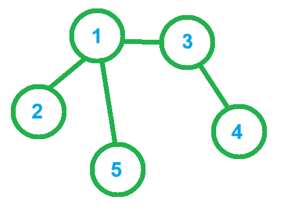

## tarjan：

dfsn数组记录当前节点dfs序，

low数组记录当前节点**不经过父节点**能到达的最小dfs序号，来判断是否成环


成环除去环中任意一点都不改变连通性


[0删边问题 - 蓝桥云课 (lanqiao.cn)](https://www.lanqiao.cn/problems/17108/learning/)


问删除一条割边让当前图剩余两个连通分量，

两个连通分量价值差值最小是多少


分析：


合法情况：

1. 只有一个连通块，并且有桥

2. 有两个连通块，不用操作
   
   

用cnt记录有多少连通块，num记录桥数目


每次遍历到当前点，先更新dfs序，

遍历相邻节点，发现没有遍历过就按照dfs遍历，

w数组记录当前点开始的连通块权值总和，

否则如果遍历过，并且不是父节点，就更新`low[u]=min(low[u],low[v])`


形如下图的环，1 — 2 — 3 — 4 — 1，

从1出发，不断递归走到4，用1的low更新4，4更新3，3更新2，

此时连通图中所有low值都是最小的dfs序，所有low值都相同，

从任意点出发同理


形如以下连通图，

从点1出发，得到：

low[1]=1  low[2]=2  low[5]=3  low[3]=4  low[4]=5，

任意删除一条边都会改变连通性



```cpp
void tarjan(int u,int id)
{
    dfsn[u]=low[u]=cur++;

    int v,idx;

    for(auto vv:e[u])
    {
        v=vv.first,idx=vv.second;

        if(!dfsn[v])
        {
            tarjan(v,idx);

            w[u]+=w[v];

            low[u]=min(low[u],low[v]);

            if(low[v]>dfsn[u])  // 1. 从v开始生成 2. 更晚出现的连通分量
            {
                ans=min(ans,abs(sum-2*w[v]));

                num++;
            }
        }
        else if(idx!=id)low[u]=min(low[u],low[v]);  // 不走父节点
    }
}

void solve()
{
    cin>>n>>m;

    for(int i=1;i<=n;i++)cin>>w[i],sum+=w[i];

    for(int i=1;i<=m;i++)
    {
        cin>>a>>b;

        e[a].push_back({b,i}); e[b].push_back({a,i});
    }

    ans=inf;

    for(int i=1;i<=n;i++)
    {
        if(!dfsn[i])
        {
            cnt++; tarjan(i,0);
        }
    }

    if(cnt==2)cout<<abs(sum-2*w[1]); else if(cnt==1&&num)cout<<ans;
    else cout<<"-1";
}
```


```cpp
#include <bits/stdc++.h>

using namespace std;

typedef long long ll;
typedef pair<int, int> pii;

const int N = 2e5 + 10;

int n, m;
ll w[N];
ll ans, sum;
int cnt, num, cur;
int dfsn[N], low[N];
vector<pii>e[N];

void tarjan(int u, int id)
{
    // dfsn记录当前节点的dfs编号 
    // low记录不经过父节点能到达的最小dfs序

    dfsn[u] = low[u] = ++cur;

    int v, idx;

    for (auto vv : e[u])
    {
        v = vv.first, idx = vv.second;

        if (!dfsn[v])
        {
            tarjan(v, idx);

            w[u] += w[v];  // w[u]记录以u为连通块的权值总和

            low[u] = min(low[u], low[v]);

            if (low[v] > dfsn[u])  // 割边u-v连接两个不同连通分量
            {
                num++;  // 割边数++

                ans = min(ans, abs(sum - 2ll * w[v]));  // v是个单独连通块
            }
        }
        else if (id != idx)  // 不经过父节点能走到的最小dfs序
        {
            low[u] = min(low[u], low[v]);
        }
    }
}

int main()
{
    ans = 2e18 + 10;

    cin >> n >> m;

    for (int i = 1; i <= n; i++)cin >> w[i], sum += w[i];

    int a, b;

    for (int i = 1; i <= m; i++)
    {
        cin >> a >> b;

        e[a].push_back({ b,i });
        e[b].push_back({ a,i });
    }

    for (int i = 1; i <= n; i++)
    {
        if (!dfsn[i])  // 新连通块
        {
            cnt++;

            tarjan(i, 0);
        }
    }

    if (cnt == 2)
    {
        cout << abs(sum - 2ll * w[1]) << endl;
    }
    else if (cnt == 1 && num)cout << ans << endl;
    else puts("-1");

    return 0;
}
```
