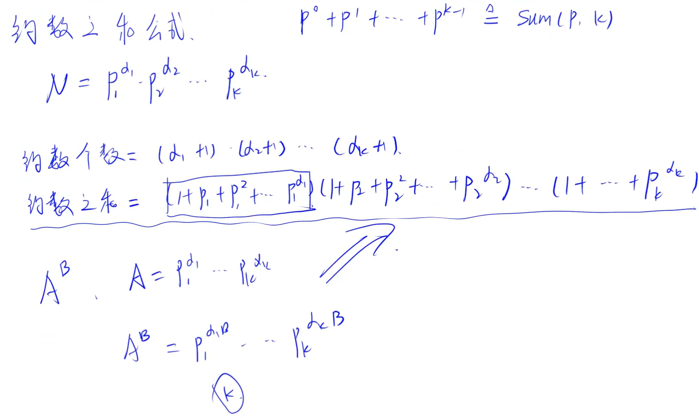
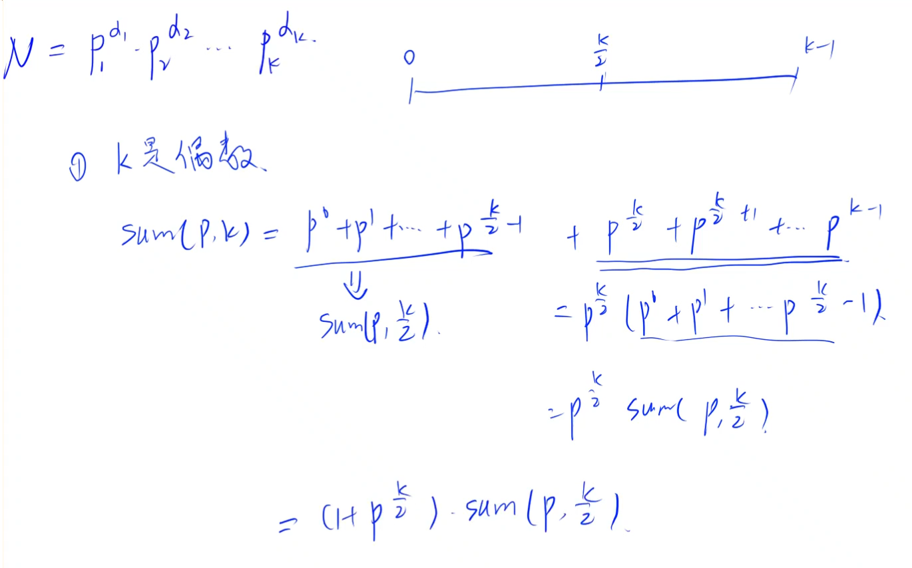
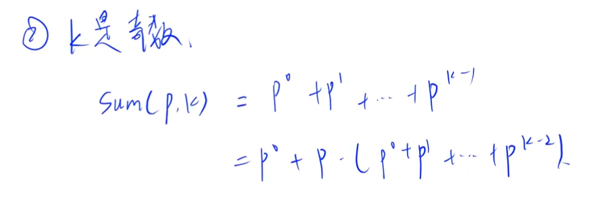

[95. 费解的开关 - AcWing题库](https://www.acwing.com/problem/content/97/)


每次按一下开关，上下左右都会改变状态

问能否在六步之内使得灯全亮


分析：


状压枚举对第一行进行的操作，

之后每一行都在前一行基础上进行操作，如果正上方为0就按一下当前开关

最后检查最后一行是否全亮


通过每一行上面一行能确定当前行开关是否按，

第一行由于没有上一行，因此枚举所有被按的状态


```cpp
const int dx[]={1,-1,0,0,0};
const int dy[]={0,0,1,-1,0};
const int inf=2e9+10;

void turn(int x,int y)
{
    int xx,yy;

    for(int i=0;i<5;i++)
    {
        xx=dx[i]+x,yy=dy[i]+y;

        if(xx>=1&&xx<=5&&yy>=1&&yy<=5)
        {
            a[xx][yy]^=1;
        }
    }
}

void solve()
{
    for(int i=1;i<=5;i++)scanf("%s",aa[i]+1);

    for(int i=1;i<=5;i++)
    {
        for(int j=1;j<=5;j++)a[i][j]=aa[i][j]-'0';
    }

    ans=inf;

    for(int i=0;i<32;i++)
    {
        memcpy(b,a,sizeof(a));

        cur=0;

        for(int j=0;j<5;j++)
        {
            if(i>>j&1)
            {    
                cur++; turn(1,j+1);
            }
        }

        for(int j=2;j<=5;j++)
        {    
            for(int k=1;k<=5;k++)
            {
                if(a[j-1][k])  // 如果上一行为0，需要我们按一下变成1
                {
                    turn(j,k); cur++;
                }
            }
        }

        bool f=true;

        for(int j=1;j<=5;j++)   // 检查最后一行是否全为1
        {
            if(!a[5][j]){f=false; break;}
        }

        if(f)ans=min(ans,cur);

        memcpy(a,b,sizeof(b));   // 恢复原状
    }

    if(ans<=6)cout<<ans<<endl; else cout<<-1<<endl;
}
```


```cpp
#include <bits/stdc++.h>

using namespace std;

typedef long long ll;

const int inf = 2e9 + 10;

const int dx[] = { 1,-1,0,0,0 };
const int dy[] = { 0,0,1,-1,0 };

int ans, cur;
bool f;
char aa[6][6];
bool a[6][6], b[6][6];

void turn(int x, int y)
{
	int xx, yy;

	for (int i = 0; i < 5; i++)
	{
		xx = x + dx[i], yy = y + dy[i];

		if (xx >= 1 && xx <= 5 && yy >= 1 && yy <= 5)
		{
			a[xx][yy] ^= 1;
		}
	}
}

void solve()
{
	ans = inf;

	for (int i = 1; i <= 5; i++)
	{
		scanf("%s", aa[i] + 1);
	}

	for (int i = 1; i <= 5; i++)
	{
		for (int j = 1; j <= 5; j++)
		{
			a[i][j] = aa[i][j] - '0';
		}
	}

	for (int i = 0; i < 32; i++)
	{
		memcpy(b, a, sizeof(a));

		cur = 0;

		for (int j = 0; j < 5; j++)
		{
			if (i >> j & 1)
			{
				turn(1, j + 1);

				cur++;
			}
		}

		for (int j = 2; j <= 5; j++)
		{
			for (int k = 1; k <= 5; k++)
			{
				if (!a[j - 1][k])  // 上一行为0，就按一下，让上一行变亮
				{
					turn(j, k);

					cur++;
				}
			}
		}

		f = true;

		for (int j = 1; j <= 5; j++)
		{
			if (!a[5][j])
			{
				f = false;
				break;
			}
		}

		if (f)ans = min(ans, cur);

		memcpy(a, b, sizeof(b));
	}

	if (ans <= 6)cout << ans << endl;
	else puts("-1");
}

int main()
{
	int t;

	cin >> t;

	while (t--)solve();

	return 0;
}
```


[97. 约数之和 - AcWing题库](https://www.acwing.com/problem/content/99/)


假设现在有两个自然数 A 和 B，S 是 $A^B$ 的所有约数之和。

请你求出 S mod 9901 的值是多少。


分析：


$a_i$为质因子， $a_i\ge 2$

$S=(a_1^0+a_1^1+\cdots+a_1^{α_1})(a_2^0+a_2^1+\cdots+a_2^{α_1})\cdots(a_k^0+a_k^1+\cdots+a_k^{α_k})$


$5\times 10^7$，不会超过 $2^{26}$，满足递归条件


`sum(p,k)`表示 $p^0+p^1+\cdots p^{k-1}$


当$k$为偶数，可以将区间分为一半，`(qmi(p,k/2)+1)*sum(p,k/2)`，

否则 $k$为奇数时，将第一项取出，`1+p*sum(p,k-1)`

基线条件， $k=1$时，返回1


```cpp
ll qmi(ll a,ll b)
{
    ll ans=1;

    a%=p;

    while(b)
    {
        if(b&1)ans*=a,ans%=p;

        b>>=1;

        a<<=1; a%=p;
    }

    return ans;
}

ll sum(ll p,ll k)
{
    if(k==1)return 1;
    else if(k%2==0)return qmi(p,k/2)*sum(p,k/2)%mo;  // 对半分
    else return (1+p*sum(p,k-1))%mo;  // 将第一项取出
}

void solve()
{
    cin>>a>>b>>p;

    ans=1;

    for(int i=2;i*i<=a;i++)
    {
        if(a%i==0)
        {
            cnt=0;

            while(a%i==0)a/=i,cnt++;

            ans*=sum(i,1+cnt*b);  // 当前质因数幂次可选 0 ~ cnt*b，最大指数乘方
            ans%=p;
        }    
    }

    if(a>1)ans*=sum(a,b+1);    // a最后还剩下一个质因子，cnt == 1，cnt*b+1 = b+1
    else if(a==0)ans=0;        // 特判为0的情况

    cout<<ans<<endl;
}
```







```cpp
#include <bits/stdc++.h>

using namespace std;

typedef long long ll;

const int mo = 9901;

ll a, b;
ll ans, cnt;

ll qmi(ll a, ll b)
{
    ll ans = 1;

    while (b)
    {
        if (b & 1)ans *= a, ans %= mo;

        b >>= 1;

        a *= a, a %= mo;
    }

    return ans;
}

ll sum(ll p, ll k)
{
    // 式子变形

    if (k == 1)return 1;
    else if (k % 2 == 0)return (1 + qmi(p, k / 2)) * sum(p, k / 2) % mo;
    else return (1 + p * sum(p, k - 1)) % mo;
}

int main()
{
    cin >> a >> b;

    ans = 1;

    for (ll i = 2; i * i <= a; i++)
    {
        if (a % i == 0)
        {
            cnt = 0;

            while (a % i == 0)a /= i, cnt++;

            ans *= sum(i, cnt * b + 1);
            ans %= mo;
        }
    }

    if (a > 1)ans *= sum(a, b + 1), ans %= mo;
    else if (a == 0)ans = 0;

    cout << ans << endl;

    return 0;
}
```
